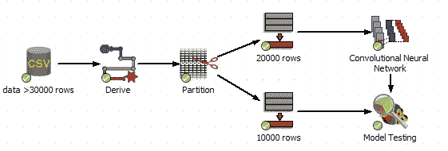

# 什么是自记录分析？

> 原文：<https://medium.com/geekculture/what-is-self-documenting-analysis-74d93d86d3f0?source=collection_archive---------0----------------------->

## 如何避免 GUI 框架的技术债务

Photo by [Joshua Aragon](https://unsplash.com/@goshua13?utm_source=medium&utm_medium=referral) on [Unsplash](https://unsplash.com?utm_source=medium&utm_medium=referral)

数据分析的一个典型烦恼是需要额外的工作来正确记录你所做的事情。尽管使他人能够从您停止的地方继续工作，或者帮助您重新访问您的工作并在以后仍然理解它有好处，但是适当的文档编制的单调乏味往往会导致很少或根本没有文档编制。随后，未记录形成**技术债务**。当你难以解释你的结果，难以重现发现时，你所获得的洞察力的价值就降低了。

# 什么是技术债？

技术债务是由于缺乏文档而产生的债务，它代表了在没有花时间解释过程的情况下分析数据的隐性成本。一旦分析目标发生变化或者必须重新进行分析时，这种债务才会出现。遇到一个“我在想什么？”时刻要求你折回你的脚步。所以基本上，它指的是由于没有解释作品而产生的问题。

# 避免技术债务

许多人认为避免技术债务的答案在于进行分析*自我记录*。当不需要额外的工作来生成分析的文档时，分析就成为自文档化的了。仅仅通过执行工作，文档就具体化了。实现这一点的一种方法是使用 GUI 框架，比如 Megaputer 的 PolyAnalyst。

Training a neural network in PolyAnalyst

当使用 GUI 框架生成分析结果时，会记录您工作的图形化日志。这意味着文件的需要不会给你带来额外的负担。间接来说，你在每一个分析步骤中，都在直接向他人解释你的工作。

通过将文档化的需求融入到方法中，您的工作自然会变得自文档化。我们认为这是分析产品设计中的一个重要特征。当你产生的见解易于解释和修改时，那么你的设计就考虑到了未来，让你更好地应对未来的分析任务，或者重温旧的分析任务，从你停下来的地方重新开始。

*原载于 2018 年 6 月 20 日*[*https://www.megaputer.com*](https://www.megaputer.com/value-of-self-documenting-analysis/)*。*