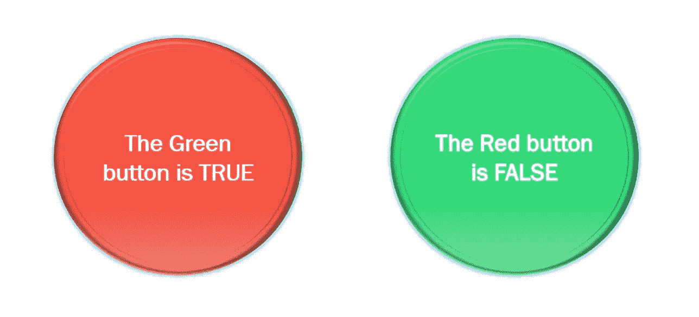

# 什么是案例研究悖论？

> 原文：<https://medium.com/geekculture/what-is-the-case-study-paradox-6c8cb38355a6?source=collection_archive---------34----------------------->

## 这个案例研究在一个奇怪的方法论的边缘存活了下来

> 与此同时，案例研究被广泛使用，并产生了规范的文本，可以看出，案例研究作为一种方法，在学术界普遍受到轻视，或者干脆被忽视

自从有历史记载以来，案例研究就一直存在，今天它们在心理学、人类学、社会学、历史学、政治学、教育学、经济学、管理学、生物学和医学的书籍和文章中占据了很大的比例。

例如，顶级政治科学期刊中大约一半的文章使用案例研究。我们所知道的关于经验世界的许多东西都是通过案例研究产生的，每个学科中许多最珍贵的经典都是案例研究。

> 许多最珍贵的经典都是案例研究

但这里有一个悖论。与此同时，案例研究被广泛使用，并产生了规范的文本，可以看出，案例研究作为一种方法，在学术界普遍受到轻视，或干脆被忽视。

例如，在美国排名前三十的政治学研究生项目中，只有两个项目需要专门的案例研究或定性方法研究生课程，而其中整整三分之一的项目甚至不提供这样的课程。

相比之下，所有排名前三十的项目都提供定量方法的课程，而且几乎所有的项目都需要这种方法的培训，通常是几门课程。

> 该案例研究在“奇怪的方法论困境”中存活了下来

在发现案例研究被广泛使用而不受重视这一悖论时，约翰·格林正确地指出，案例研究在“奇怪的方法论困境”中生存，原因是这种方法很少被理解。*

为了解决这一矛盾，帮助案例研究获得更广泛的使用和接受，我们需要更好地理解案例研究方法，它的优势和弱点，我们需要消除许多误解的案例研究。

要了解这是如何做到的，请点击这里继续:[https://bit.ly/3xfG53G](https://bit.ly/3xfG53G)

— — — — — -

*)完整参考资料请见:【https://bit.ly/3xfG53G