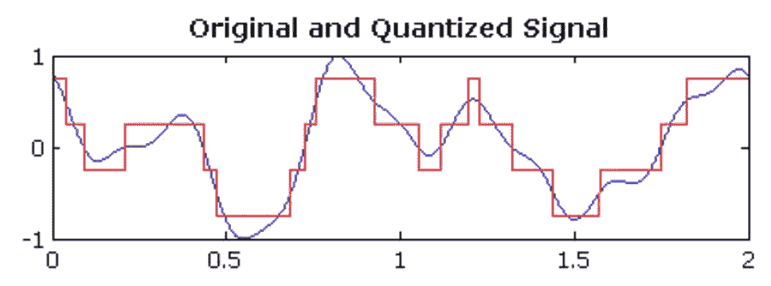

# 数字技术的未来是什么？

> 原文：<https://medium.com/geekculture/what-is-the-future-of-digital-technology-c4372a27b9b0?source=collection_archive---------16----------------------->

从*到比特*再回来:需要新一代的发明家

(在我看来)数字技术的未来终究不会如此数字化。想知道为什么，请跟我来几分钟。

数字技术诞生于一个噪音为敌、电子产品仍处于摇篮阶段的时代。在 20 世纪 40 年代早期，发送一条信息不是一件容易的事情，由于噪音的干扰，接收到的信息质量经常与原始信息有很大的不同。自然的解决方案是通过施加有限数量的幅度水平来减少由于波动引起的信号可变性。显然，最有效的简化是将它压缩到两个不同的层次:二进制表示法诞生了。

重要的是要记住，这种被称为 ***数字化*** 的减少，即旨在将连续(模拟)信号转换成离散(数字)信号的动作，是一种没有错误的操作。它主要由两个不同的程序组成:*采样*和*量化*。*采样*是信号的时间周期测量。根据瑞典裔美国电子工程师**哈利·奈奎斯特**(1889–1976)所做的工作，如果这个过程被正确地完成，原始信号的任何细节都不会丢失。*另一方面，量化*是将连续、平滑的信号转换成步进信号(见图 1)。这个操作不可能无错地完成，无论我们多么小心地执行，总会有错误。这意味着数字化的信号总是与原始信号不同，或者，按照信息论之父 Claude Shannon(1916–2001)的说法，一些信息总是会在这个过程中丢失。

Figure 1: Original (blue )and quantized signal (red). The difference is evident. Source [Wikipedia](https://en.wikipedia.org/wiki/Quantization_(signal_processing).

尽管有这样的限制，科学家们还是在广泛使用数字工具的基础上，利用数字化建设了一个巨大的社会进步。毫无疑问，其中最受欢迎的是数字计算机。此外，我们还拥有数字通信系统，如数字电话、数字收音机和数字电视，以及数字工业机器和目前在制造业中使用的大多数机器人。走向数字化已经成为新的口号，大多数国家已经投入大量资金来推动所谓的数字化转型，即将这些工具大量引入我们的日常生活。

为了执行它们的任务，这些数字*工具*需要输入数据，这些数据是通过数字化程序从物理世界捕获的，由称为 ADC(模数转换器)的特殊设备执行。当今社会的数据生产已经变得非常庞大，大量可用的数据引发了对其维护、所有权、控制和使用的一些关注(例如，参见[模拟社会*对*数字社会](https://lucagammaitoni.medium.com/analog-society-vs-digital-society-6d977e547eac.))。

数字技术的影响不仅影响了我们工作和交流的方式，也影响了我们对周围世界的理解。拉尔夫·兰道尔(1927-1999)在香农和 T2·约翰·冯·诺依曼(1903-1957)的工作基础上，首先提出了计算机内存中存储的信息量(通常以比特表示，即二进制数字)可以在计算本身的物理过程中发挥作用，可以解释为计算机熵的一部分。*信息是物理的*，这是推广这一观点的格言，由兰道尔在一篇有争议的论文中首次提出，题为*计算过程中的不可逆性和发热* (IBM 研究与发展杂志，5，183–191。1961).虽然这种说法在物理学界争论了很久，我和其他人一起努力证明他的结论是错误的( [*计算研究驳斥了著名的“信息是物理的*](https://phys.org/news/2016-07-refutes-famous-physical.html) *”)但*信息论范式的应用，即其背后的数字视角，是解释宇宙基本定律的潜在有用的关键，这一观点盛行起来。这个想法最著名的代表可能是约翰·阿奇博尔德·惠勒(1911-2008)，这位物理学家在 1967 年为神秘的天体发明了“黑洞”这个名字，最近*观察到了*。1989 年春天，惠勒在圣达菲研究所举行的一次会议上提出了一个短语“ *It from Bit* ”，来举例说明我们处理现实事物时所经历的过程。在惠勒的想法中，也表达在“[信息、物理、量子:寻找联系](https://philpapers.org/archive/WHEIPQ.pdf)”(Proc。第三国际。症状。《量子力学基础》,东京，1989 年，第 354–368 页)我们的经验是我们在每次观察中采取的二元决策(因此用比特表示:0 或 1)的结果。宇宙的基本结构是基于这些决定的，其本质是数字的。

最近，麻省理工学院的塞斯·劳埃德提出了一个类似的观点。你可以看看他在 Youtube 上的一段有趣的对话，题为“[,信息是现实的基础吗？](https://www.youtube.com/watch?v=a35bKt1nuBo)”。他还出版了一本名为《宇宙编程》(2006)的畅销书，在书中他讨论了这个问题。就在几年前，我去麻省理工学院拜访他时，他带我去吃午饭，我们就信息作为一种物理量的作用进行了一次愉快的交谈。在午餐结束时，我可以说我们礼貌地不同意，但很高兴与 Seth 交谈。

我的观点是，尽管信息论是处理计算机编程的一个很好且有用的理论框架，但它实际上并没有给我们对物理学的理解增加多少。在某些情况下，它可能会提供一个有趣的视角，但物理基本定律仍然需要一个更普遍的观点，而不是那些基于一切最终都只是计算行为的观点。就这样结束了吗？不完全是。人工智能(AI)研究的最新进展为我们的数字*工具产生的大量数据找到了一个有利可图的应用。* *深度学习* (DL)算法，非常强大的统计分类方案，被证明在图像和语音识别中非常有用。尽管人工智能在其他方面的进展仍然落后，但一些科学家正在将 DL 应用于猜测新的物理定律和新的科学计划。在最近的一篇文章([如果你不知道你在找什么为什么很难找到东西](/geekculture/why-it-is-difficult-to-find-something-if-you-do-not-know-what-you-are-looking-for-1e7ca2f69da5))中，我讨论了人工智能的最近目标是如何被一些可能限制其在该领域效率的基本问题所困扰的。

总的来说，毫无疑问，数字技术通过广泛传播的去物质化过程促进了体重的逐渐减轻，从而彻底改变了我们的社会。例如，让我们看看我们欣赏音乐的方式。在十八世纪，一个想听音乐的富人必须在他/她的房子里主持一个四重奏。19 世纪末，多亏了**爱迪生**的发明，拥有一个涂蜡纸板圆筒的留声机就足够了:毫无疑问，这是一个比四重奏轻得多的设备。随后的发明都在这种非物质化的道路上前进，目前，数字音乐作为电磁辐射被下载到几克的便携式设备中。如今，人们普遍认为，专用的数字*工具*也将报纸、电影、书籍、绘画、雕塑，当然还有金钱非物质化了。

这种体重的逐渐减轻并不是突然发生的。著名的 [*下一个千年的六个备忘录之一*](https://en.wikipedia.org/wiki/Six_Memos_for_the_Next_Millennium) 作者**伊塔洛·卡尔维诺**(1923–1985)，可能是最好的，是专门写*的。这篇演讲原定于 1985 年秋季在哈佛大学举行的查尔斯·埃里奥特·诺顿讲座上发表，但由于卡尔维诺在那年 9 月 19 日意外去世，所以没有发表。在这第一讲，致力于轻和重之间的对立，作者坚持轻的优点。这并不意味着我认为体重的优点不那么令人信服，只是因为我对体重轻有更多的话要说。(……)我的工作方法通常是减去体重。我曾试图移除重量，有时是从人身上，有时是从天体上，有时是从城市上；最重要的是，我试图从故事的结构和语言中去除重量。*

*卡尔维诺宣布的工作计划受到了那些在接下来的几年中设计、制造和分发数字工具的人的高度重视，这些工具今天被我们广泛使用，带来了让我们淹没在海量数字数据中的意想不到的结果。*

*在过去的四十年里，我们目睹的非物质化过程旨在从原子中移除信息，并将其以比特形式传输。依我拙见，是时候改变了。如果我们想要阻止*的数据洪流和与之相关的风险，如果我们想要维护我们的民主和自由，现在是时候逆转这个过程，捍卫原子的理由，反对比特的理由。值得注意的是，3D 打印的先驱们已经朝着这个方向迈出了很少的第一步。在 2008 年一本名为 *Fab:即将到来的桌面革命——从个人电脑到个人制造*，**麻省理工学院比特和原子中心主任尼尔·格申菲尔德**的书中，讨论了制造者的潜力，新一代的书呆子们对制造东西感兴趣:真实的东西，而不是虚拟的东西。这是原子复仇开始的明显标志。**

**那么，数字技术的未来会是什么样的呢？为了回答这个问题，我们再次求助于**伊塔洛·卡尔维诺**。在同一个讲座中，卡尔维诺谈到了罗马诗人卢克莱修(约公元前 99 年至约公元前 55 年)的重要遗产，并引用了他描述物质世界时的一句优美诗句:*在黑暗的房间里，在一束阳光中旋转的微尘*(ii . 114-124)。对轻而不空的东西是多么美好的描述。在这纷飞的尘埃中有着无限的信息来源，不可能包含在有限的数字表示中，但在我们对现实的描述中却是如此的基本。*波动*是我听这样的描述想到的词。波动和噪音:这正是我们在数字化进程之初想要摆脱的。如果未来真的属于那些可以想象的人，我们需要更多的噪音和波动来把握我们生活的这个不简单的现实。没有任何数字表示能够接受它。克服它。模拟技术最终将取代数字技术，我们将需要新一代的发明家。**