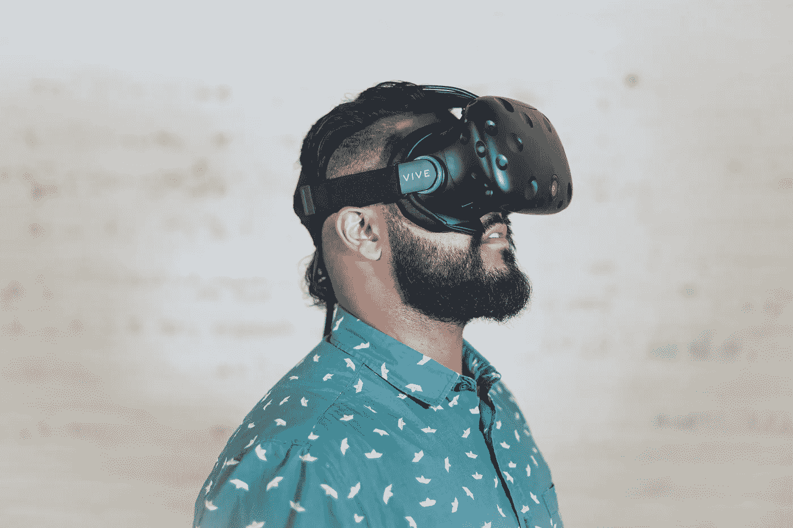
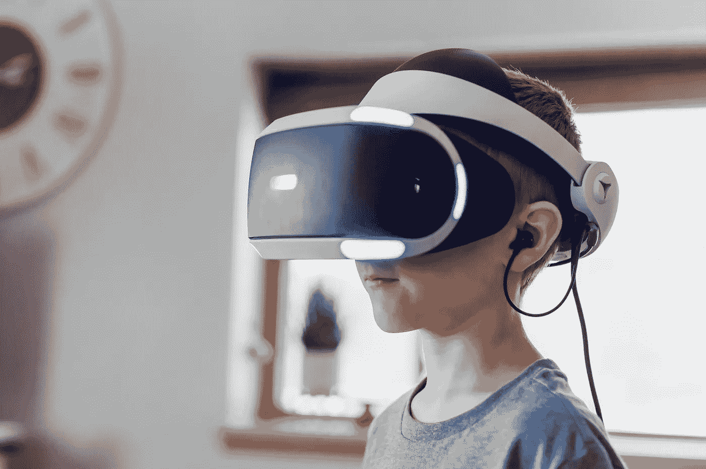

# 营销技术的未来是什么？

> 原文：<https://medium.com/geekculture/what-is-the-future-of-marketing-technology-b31e53269b49?source=collection_archive---------6----------------------->

## 探索营销中的未来技术趋势(区块链、VR/AR 等等！)

Photo by [Burst](https://www.pexels.com/@burst?utm_content=attributionCopyText&utm_medium=referral&utm_source=pexels) from [Pexels](https://www.pexels.com/photo/man-wearing-black-vr-goggles-373905/?utm_content=attributionCopyText&utm_medium=referral&utm_source=pexels)

世界在快速变化，我们的每一项技术进步都以全新的方式塑造着未来。

像其他行业一样，营销也无法逃脱技术进步的影响，正如我们在过去已经看到的那样，这使得我们有必要问这样一个问题:营销技术的未来是什么？

本文将讨论营销和技术之间的关系，预计将在这十年中改变营销的新兴技术，以及一些更令人兴奋的未来事物。

让我们开始吧！

# 营销和技术的关系

技术已经成为现代营销的基石，自过去十年以来，技术和营销之间的爱情故事越来越浓。

从根本上说，营销和技术之间的关系是为了让营销人员的生活更加轻松，营销过程更加无缝。

这两个领域的联姻，催生了营销的数字化。

数字营销是利用数字技术来执行营销职能。

根据维基百科的说法，[数字营销](https://en.wikipedia.org/wiki/Digital_marketing)是利用互联网和基于在线的数字技术(如电脑、手机和其他数字媒体和平台)来推广产品和服务的营销组成部分

数字营销在过去十年中取得了广泛的成功，预计到 2020 年底，全球数字营销支出将达到[3080 亿美元](https://www.statista.com/statistics/587208/digital-marketing-spending/)。

[Gartner 的 CMO 支出调查](https://www.gartner.com/en/marketing/insights/articles/gartner-cmo-2020-2021-tech-digital-channels-withstand-budget-cuts)报告显示，首席营销官仍然看好技术，技术占营销预算的比例最大，为 26.2%。

Gartner 的研究还显示，营销人员仅使用了 58%的现有技术能力，这意味着营销部门需要更多的技术。

在这十年中，随着技术的进步，更多的品牌将寻求提高标准，并将视野从传统的数字营销扩展到如何利用新兴技术来扰乱营销格局——这可能会改变我们所知的数字营销。

# 市场营销中的新兴技术趋势

技术的进步向我们介绍了新的和令人兴奋的发展，这些发展可能会破坏工业。

几个新兴的技术趋势可以改变营销的方式，这不仅让营销技术人员感到兴奋，也让他们的目标受众感到兴奋，他们应该获得全新的体验。

# 以下是十年来可能改变营销的新兴技术趋势；

# 区块链

Photo by [Terry](https://unsplash.com/@blueskin?utm_source=unsplash&utm_medium=referral&utm_content=creditCopyText) on [Unsplash](https://unsplash.com/s/photos/blockchain?utm_source=unsplash&utm_medium=referral&utm_content=creditCopyText)

区块链是推动加密货币的底层技术，但它不仅仅停留在金融革命上，区块链有几个用例扩展到扰乱包括营销在内的其他行业。

在我们开始讨论区块链如何改变营销格局之前，让我们先讨论一下区块链的核心。

区块链是一个公开分布的计算机网络，这些计算机协作维护一个共享的安全数据库。

可以把区块链想象成一个由几页链接在一起的账本，每当一个条目被输入到一页上时，它也必须被输入到每一页上，并且在任何条目被输入之前，所有的页面都必须一致。

现在，网络中的每台计算机或分类帐中的每一页都称为一个节点，每个节点或页面都有来自上一个节点或页面的数据库(加密哈希)的副本。

这项技术使得区块链系统难以操纵或更改，不像常规的集中式数据库，新信息只能添加到[分布式共识](https://www.geeksforgeeks.org/distributed-consensus-in-distributed-systems/)上。

区块链的特点是:

*   不变性:区块链上的数据不可更改
*   安全性:每个块中的数据都经过加密编码，并且所有块都在一个对等网络上链接在一起，使得区块链几乎不可能被黑客攻击。
*   匿名性:区块链上的交易可以被验证，但是用户的身份仍然是匿名的，只由生成的地址来表示。
*   去中心化:它的分布式账本技术(DLT)允许网络中的对等点共享控制权，而不需要一个中央数据存储系统。
*   透明度:区块链上的交易很容易验证，因为区块链上的数据可以通过公共地址来验证。

在市场营销中，区块链科技可以改变人们对信任的感知方式。

每个营销人员都明白，在数字时代，信任已经成为一种重要的[社会货币](https://tkprincewill.medium.com/building-trust-the-new-social-currency-1c1baeb2be5)，人们只会和他们信任的人做生意。

区块链通过创造一个透明的环境，让一方不会感到被剥削，从而增强了营销人员和目标受众之间的信任。

以下是区块链科技革新营销的几种方式:

**数据隐私**

区块链技术完美地给了营销中的数据隐私问题一个解决方案。利用区块链技术，数据被加密，使个人能够控制自己的数据，并授权谁可以访问这些数据。

*   **靶心瞄准**

区块链技术将使营销人员能够在点对点网络上与他们的受众互动，这可以使企业准确地锁定他们的受众。

*   **分权**

分散账本技术解决了中间商问题，品牌可以通过区块链技术完全避开中间商，直接与受众互动。

这意味着品牌将不再依赖于应用商店，他们可以创建分散的应用程序( [Dapps](https://www.investopedia.com/terms/d/decentralized-applications-dapps.asp) )，品牌也不再需要每年更新域名托管——分散的虚拟主机服务，如[unstopped Domains](https://unstoppabledomains.com/)只需要一次性费用，你的域名可以存储在你的加密钱包中。

*   **广告欺诈**

根据 [Invesp](https://www.invespcro.com/blog/online-ad-fraud-statistics/) 的一项调查，数字广告欺诈占数字广告支出的 1/3，2016 年全球在线广告商估计损失 72 亿美元。

Statista 的另一项调查显示，2020 年，广告欺诈在全球范围内造成了 350 亿美元的经济损失。

区块链技术解决了营销中的广告欺诈问题，因为它促进了透明度。

广告客户可以验证谁看到了他们的广告，并提高他们的目标定位的准确性。

区块链的去中心化也意味着省去中间商，让广告直接展示给你的目标受众。

# 无人机灯光秀

[https://www.youtube.com/watch?v=oZnExW4UOSg](https://www.youtube.com/watch?v=oZnExW4UOSg)

无人机灯光秀在这十年越来越受欢迎，尤其是在亚洲。

营销领域的这一新兴趋势可能会改变游击营销的方式。

游击营销通常使用非常规的方法来提高品牌知名度和增加销售额。

在这个十年里，首席营销官们正在积极寻找新的方法来吸引目标受众的注意力，以增加口碑，无人机灯光秀可能是答案。

2017 年，[英特尔在 Lady Gaga 的超级碗表演中使用了 500 架 shooting star 无人机](https://newsroom.intel.com/news-releases/intel-drones-light-lady-gaga-performance-pepsi-zero-sugar-super-bowl-li-halftime/)让观众眼花缭乱，但自那以后，各品牌进一步采取了这一举措。

2021 年 4 月，豪华汽车品牌 Genesis 打破了单次无人机灯光秀使用无人机数量的世界纪录。

创世纪派出 3281 架无人机点亮上海国际邮轮码头的夜空。

随着该公司进入中国市场，它需要做一些非常规的事情来传播品牌意识和促进销售——有什么比天空中成千上万的轻型无人机更非常规的呢？

同样在 4 月，中国娱乐公司哔哩哔哩在上海上空放飞了大约 1500 架无人机，庆祝一款日本电子游戏在中国上市一周年。

令人惊叹的无人机表演带来了游戏角色“*公主连线！Re: Dive"* 到生活，并叙述了游戏如何工作。

哔哩哔哩将该展会提升了一个档次，它推出了其他无人机展会从未做过的东西，无人机在空中形成了一个巨大的可扫描二维码，提示观众扫描并在智能手机上安装游戏。

这种趋势只是展示了技术如何改变游击营销的方式。

世界不同国家的品牌采用无人机表演可以促进主流采用这种技术作为游击营销的方法，这甚至可能改变广告牌的使用方式。

# 虚拟现实/增强现实

Photo by [Jessica Lewis](https://unsplash.com/@thepaintedsquare?utm_source=unsplash&utm_medium=referral&utm_content=creditCopyText) on [Unsplash](https://unsplash.com/s/photos/augmented-reality?utm_source=unsplash&utm_medium=referral&utm_content=creditCopyText)

据 [Investopedia](https://www.investopedia.com/terms/v/virtual-reality.asp) 报道，虚拟现实(VR)指的是一种计算机生成的模拟，其中一个人可以使用电子设备在人工三维环境中进行交互，例如带有屏幕的特殊护目镜或装有传感器的手套。

另一方面，增强现实是一种身临其境的数字体验，其中数字对象被放置在现实世界的对象之上，想想 Snapchat 过滤器。

与 AR 不同，VR 创建了一个模拟的人工环境，让用户通过使用技术获得近乎真实的体验。

虚拟现实和增强现实有许多用例，但我们对这些技术的营销用例特别感兴趣。

自 2010 年代末以来，虚拟现实营销一直在兴起，但在这十年里，它将被更多地纳入品牌营销战略。

一些品牌已经在积极地将这些技术融入他们的营销策略中。

以慈善工作而闻名的鞋品牌 [T](https://vrscout.com/news/toms-virtual-reality-giving-trips/) OMS 最近将虚拟现实营销纳入他们的战略——他们让走进他们商店的用户使用虚拟现实耳机体验他们的慈善活动。

参观零售店的顾客体验了 [TOMS 虚拟捐赠之旅](https://vrscout.com/news/toms-virtual-reality-giving-trips/)——向秘鲁的贫困儿童捐赠鞋子，这为他们的顾客创造了独特的第一手体验。

这是一个完美的例子，说明品牌可以通过虚拟现实实现什么，以及在向客户传递情感联系和共鸣方面有什么可能。

奢侈品牌古驰最近也开始在他们的营销中使用这种独特的 AR 技术，古驰让他们应用程序的用户将相机对准他们的脚，看看他们的运动鞋会有怎样不同的风格。

该应用程序跟踪运动，因此他们可以从多个角度看到鞋子，这减少了顾客购买后退货的需求。

家具品牌宜家也采用了增强现实营销，允许顾客在购买前使用他们的应用程序来查看家具是否适合他们的空间——采用这项技术对顾客的用户体验产生了积极影响。

另一个有趣的观点是，未来广告将成为虚拟世界的一部分，如[分散的土地](https://vrscout.com/news/toms-virtual-reality-giving-trips/)或[第二人生](https://secondlife.com/)，因为品牌将为虚拟世界中的广告空间付费。

这个十年迎来了虚拟现实平台的崛起，如果你曾经看过电影《玩家一号》，那么你应该会感到兴奋。

这意味着营销可以在现实世界和虚拟世界中进行，改变了我们所知道的整个营销模式。

从根本上说，随着虚拟现实在未来的不断发展，营销人员将找到一种方法来利用这种技术，通过非常规的技术方法来吸引观众的注意力，也许是通过虚拟广告牌，甚至是交互式头像。

# 人工智能

Photo by [Markus Winkler](https://unsplash.com/@markuswinkler?utm_source=unsplash&utm_medium=referral&utm_content=creditCopyText) on [Unsplash](https://unsplash.com/s/photos/artificial-intelligence?utm_source=unsplash&utm_medium=referral&utm_content=creditCopyText)

根据人工智能之父约翰·麦卡锡教授的说法，人工智能是制造智能机器，尤其是智能计算机程序的科学和工程。它与使用计算机理解人类智能的类似任务有关。

人工智能利用计算机和机器来模仿人脑解决问题和做出决策的能力。

在科幻电影的推动下，人工智能在我们脑海中是一个未来主义的想法，但今天人工智能正在彻底改变行业，并融入我们生活的不同领域。

Statista 的一项研究显示，全球人工智能市场收入预计将从 2018 年的 74 亿美元增长到 2025 年的 898.5 亿美元——这意味着我们正生活在人工智能崛起的十年。

人工智能营销使用机器学习算法，根据收集和分析的数据自动化流程，为客户创造量身定制的体验。

自过去十年以来，人工智能营销一直处于上升趋势，在这十年中，我们将看到更多的品牌在其战略中采用这一技术，因为 CMO 的目标是使营销过程更加无缝。

人工智能在营销中已被成功用于电子邮件营销、社交媒体营销的自动化流程，使营销人员能够加快工作进度，消除人工决策的压力。

在这十年中，随着人工智能在营销中的扩散，我们将看到更多的技术被用于以下方面；

*   **聊天机器人**

聊天机器人(chatbot)是一种基于人工智能的计算机程序，它模拟人类对话，通过语音或文本通信，使用自然语言处理将用户的文本或语音输入转换为结构化数据，这些数据进一步用于选择相关答案。

在 2020 年代，更多的品牌将在其战略中实施聊天机器人，以处理客户请求，并在一天中的任何时间提供即时回答，以减少营销人员或客户服务团队的工作量，并对客户做出更快的响应。

*   **内容自动化**

内容自动化是使用人工智能技术来自动化内容营销中的手动流程。

人工智能提高了营销团队的生产力，使他们能够将注意力集中在需要人工干预的流程上，而由人工智能驱动的内容营销软件则负责其余的工作。

人工智能驱动的内容自动化软件可以帮助内容营销团队确定要写的主题，生成内容，校对，甚至更新内容。

*   **了解消费者行为**

人工智能在营销中的扩散将允许营销人员以更高的效率和准确性预测其受众的行为模式。

了解客户在买家旅程每个阶段的行为对营销团队来说至关重要，随着人工智能和机器学习算法在营销策略中的实施，营销团队可以更好地了解他们的受众。

# 结论

技术正在改变一切，每个领域的品牌都必须保持灵活性，以适应未来十年的快速发展。

在市场营销中，新兴技术是每个营销人员的梦想，因为它将你的营销工作效率提升到一个新的水平。

我们已经确定，区块链技术将帮助营销人员在没有中间人的情况下与他们的受众建立信任关系。

而无人机灯光秀正在用未来的游击营销技术彻底改变品牌抓住观众不断减少的注意力的方式。

我们还发现，在营销中使用虚拟现实和增强现实技术可以让客户更接近品牌计划，并改变消费者的购物体验。

人工智能正在使营销变得更加智能，机器学习和自然语言处理算法分析和处理数据的速度比普通人脑更快，从而使营销过程超级无缝。

最终，技术是现在和未来，它将继续改变全球的产业。

其他迅速改变工业格局的新兴技术包括: [IOT](https://www.oracle.com/internet-of-things/what-is-iot/) 、 [3D 打印](https://3dprinting.com/what-is-3d-printing/)、[量子计算](https://www.digitaltrends.com/computing/what-is-quantum-computing/)等等。

这十年是我们过去谈论过的未来——为令人兴奋的下一代技术做好准备，这些技术将永远改变我们的行业。