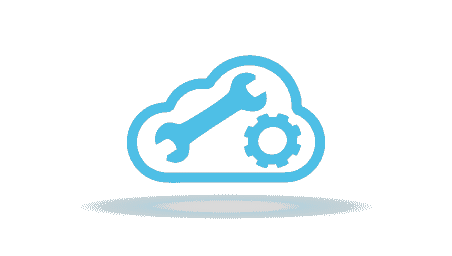
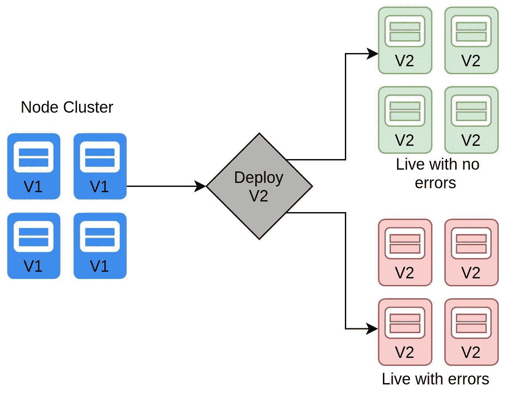
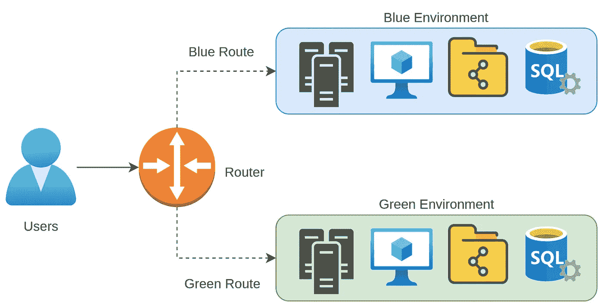
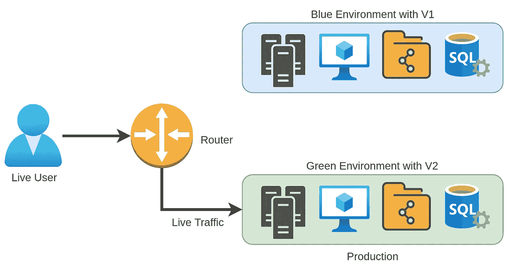
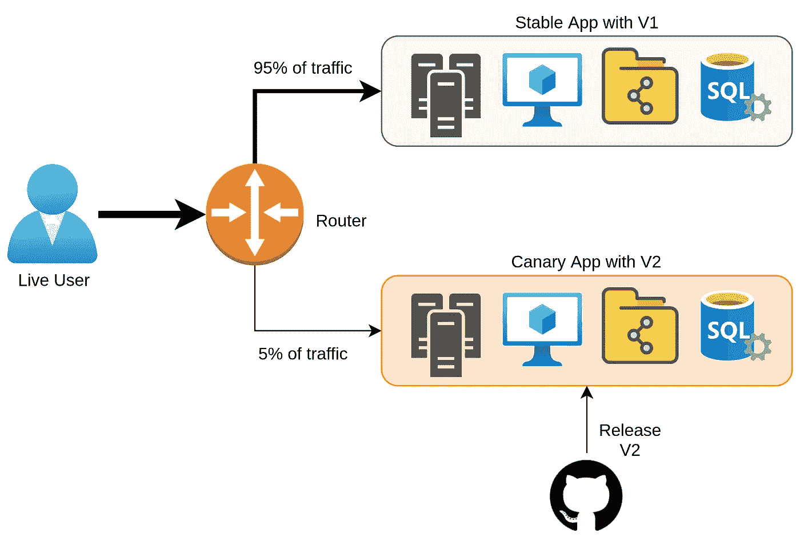

# 你的部署策略是什么？

> 原文：<https://medium.com/geekculture/what-is-your-deployment-strategy-51811b4ed973?source=collection_archive---------37----------------------->

在 DevOps 生命周期中，部署是一个主要阶段。我们使用许多策略在生产环境中部署我们的软件工件。在这篇博客中，我将讨论应用程序部署策略。从应用程序部署策略清单中，我选择了**基本**、**滚动**、**蓝绿色**和**淡黄色**部署策略，用于今天的讨论。

## 基本部署

在这个策略中，我们同时为集群中的所有节点部署新的应用程序版本。因此，这种策略不能保证部署不会中断。群集中的服务将在几秒钟、几分钟或几个小时内对最终用户不可用，这取决于我们将在新版本中推出的更改数量。这种策略简单、快速且廉价。但是这是最危险的策略，因为你不能保证新版本的应用程序会正确无误地运行。因此，您的实时用户会因为长时间的服务中断或看到系统中的故障而不高兴。如果我们需要回滚部署，这也需要时间。不建议在生产环境中使用这种策略。您可以在非工作时间在较低的环境中使用此策略。

## 滚动部署

在此策略中，我们使用新的应用程序版本来增量更新集群节点。你可以自己决定一次更新的批量大小。当第一批更新无误后，我们将更新下一批。我们将继续这样做，直到所有节点都成功更新。如果第一批出现故障，我们可以立即将部署回滚到以前的版本。这种策略比基本部署策略风险更小。

## 蓝绿色部署

在这个策略中，我们维护两个相同的环境，蓝色和绿色。两个相同环境之间的分离类型将取决于您的业务场景。通常，服务器、虚拟机、文件共享和数据库会在两个环境之间复制。或者，有时可以使用 kubernetes 集群中的名称空间来实现这种分离。像数据库这样的一些资源可以在两个环境之间共享。由您来决定您将与您的业务场景保持何种类型的分离。最常见的形式是，蓝绿色复制了应用程序依赖的所有资源。并且您的设置应该具有在两个环境之间切换流量的机制。它可以是负载平衡器、反向代理或云解决方案。

在任何给定的时间，只有一个环境将服务于实时流量。假设蓝色正在为实时流量提供服务，那么您可以将应用程序的下一个版本部署到绿色环境中，并对其进行彻底的测试。此时，蓝色是您的生产环境，绿色是您的试运行环境。

如果绿色部署运行良好，您可以将实时流量切换到绿色部署。

通过使用这种策略，我们可以无缝地将我们的应用程序部署到生产环境中。这种策略中的回滚非常简单，您只需要将流量切换到具有先前应用程序版本的环境中。如果您适应了这种策略，实时用户会因为最小的停机时间而感到高兴，您的部署团队也会高兴地度过休息时间和周末。成本和实现复杂性是这种策略的一些缺点。

## 金丝雀部署

在这个策略中，我们以比蓝绿色部署更可控的方式向用户发布新的应用程序版本。应用程序的两个版本将同时运行。我们将在应用程序的这两个版本之间分配实时流量。首先，我们将选择一小组实时用户，并将他们的流量路由到新版本的应用程序。其他用户的流量将被路由到旧版本的应用程序。然后，我们将监控新应用程序版本的错误、性能问题和用户反馈。如果一切顺利，我们将增加路由到新应用程序版本的用户权重。这将持续下去，直到我们将所有实时用户路由到新的应用程序版本部署。如果我们得到负面反馈或错误，我们可以很容易地回滚新的应用程序版本。

当我们计划养一只金丝雀时，我们应该决定以下因素。

*   几个阶段？
*   每个阶段持续多长时间？
*   我们将在每个阶段监控什么指标？
*   我们将使用什么标准来确定阶段的成功？
*   用于迁移用户的策略是什么？是随机的、区域明智的还是早期采用者？

这种部署的优势包括无停机、轻松回滚、容量测试和无冷启动。canary 部署的缺点包括使用 canary 的第一个用户组的挫折感、实现设置的复杂性、时间和成本。

您需要明智地选择部署策略，因为它取决于您的业务场景。例如，如果您更多地考虑正常运行时间、准确测试、可靠性，并且您的应用程序是任务关键型的，那么您可以在生产环境中使用蓝绿色部署策略。但是对于性能测试环境中的同一个应用程序，您可以使用滚动部署。要决定选择哪一个，首先您需要很好地理解部署策略及其优缺点。然后，您需要根据您的业务场景评估这些部署策略，并选择最佳选项。

好吧。就是这样。希望您对各种应用程序部署策略有所了解。