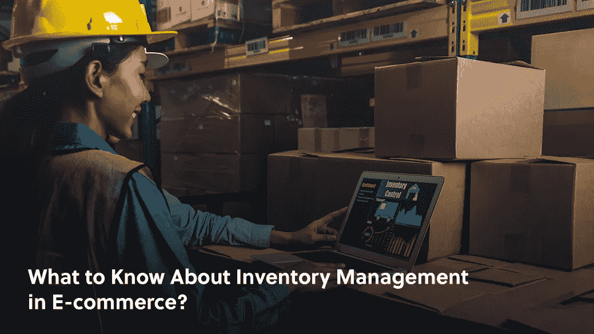
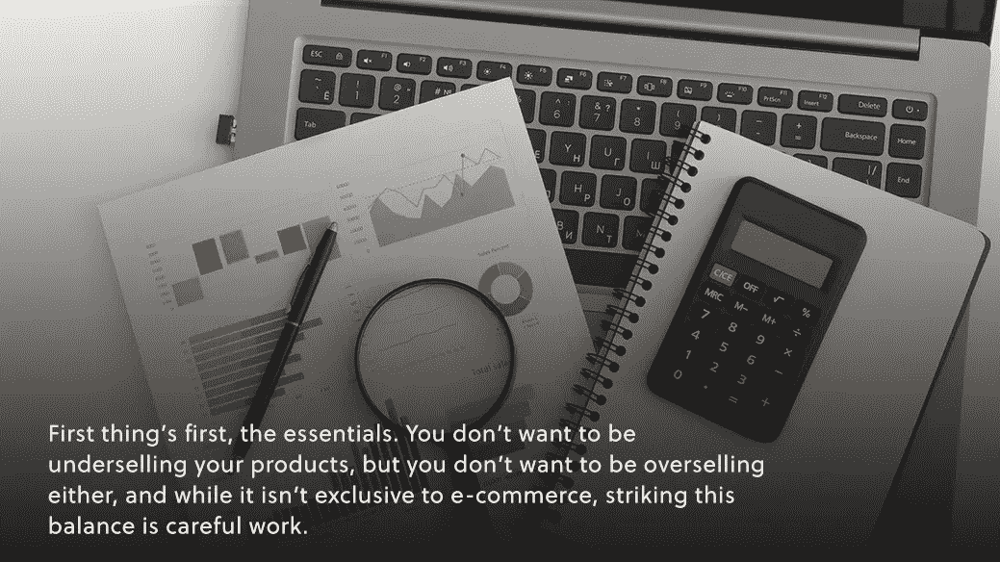
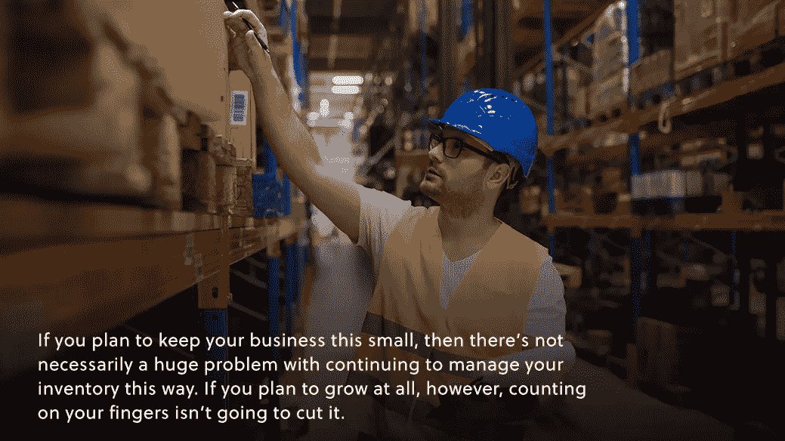

# 电子商务中的库存管理需要了解什么

> 原文：<https://medium.com/geekculture/what-to-know-about-inventory-management-in-e-commerce-337ad4d40f9b?source=collection_archive---------8----------------------->

## **电子商务库存管理**

进入疫情几年后，这已经不是什么秘密了:这个行业已经发生了变化。更确切地说，电子商务扶摇直上，在 3 个月内增长了那些著名的 [10 年。](https://www.linkedin.com/pulse/e-commerce-jumped-10-years-ahead-3-months-did-your-do-jon-cheney/)

虽然在线趋势肯定不是突然出现的，但隔离和社交距离使已经投资电子商务的品牌加倍努力，并迫使那些或多或少忽视电子商务的品牌争夺一席之地。

现在，这是一种新的规范，它是[在这里停留。](https://www.amberengine.com/blog-content/trends-in-online-sales-temporary-or-here-to-stay?utm_source=blog&utm_medium=referral&utm_campaign=medium-blogs)

尽管我们无论如何都不会迷失在黑暗中，但声称在现代电子商务领域取得成功可以不存在一点不确定性是不真诚的。

这也是为什么电子商务社区对[分享关于什么可行、什么不可行以及什么明天可能可行的见解和知识](https://anchor.fm/ecommercewithcoffee)如此重要的部分原因。

以库存为例。对于在电子商务繁荣之前做生意的人来说，这当然不是一个新名词，但现在有什么好知道的呢？你缺少什么工具？让我们仔细看看。

# 取得平衡是一项细致的工作

重要的事情先说，要点。你不想低价销售你的产品，但你也不想过度销售，虽然这不是电子商务独有的，但达到这种平衡是一项细致的工作。

低价销售无法支付账单。你不仅把钱留在了桌子上，而且如果你已经为存货付了款，你还将不得不支付储存**呆滞存货**的费用——并想出如何处理这些存货。

避免这个问题的一个方法是及时完成订单(JIT)，但是当客户为他们的产品付款时进行库存订单会很快导致另一个问题:过度销售。

乍一看，过度销售似乎不是什么大问题，对吗？你的产品如此受欢迎，以至于你跟不上订单！但这正是问题所在——客户体验并不会随着他们点击“购买”而结束。

亚马逊 Prime 已经让客户习惯于在订购后几天就期待他们的产品[，这意味着更长的交付期不会让客户特别高兴(如果他们收到订单的话)。](https://youtu.be/evTnsKuFScU)

没有必要的库存可能意味着无法跟上订单。充其量，这意味着你错过了销售机会。最坏的情况是，顾客会要求退款。

所以你不想过度销售，也不想抛售，你如何保持在最佳状态？简单来说:库存管理。但并非所有的库存管理都是平等的。

# 手动管理无法扩展

也许你已经在你的车库里，或者在一个租来的办公室里开始了你的生意。也许你开始每月只销售几十或几十件简单的产品，这意味着你可以亲自检查每一份订单，并可能用手指或在一张电子表格上或多或少地记录所有事情。

如果你计划让你的企业保持这么小的规模，那么继续以这种方式管理你的库存不一定会有很大的问题。然而，如果你打算种植 T1，指望你的手指是不够的。

随着你的品牌扩展，你的工具也需要扩展。这在电子商务中尤其如此，因为如今的品牌可能不得不在[多渠道](https://www.amberengine.com/blog-content/how-a-pim-drives-omnichannel-success?utm_source=blog&utm_medium=referral&utm_campaign=medium-blogs)和更大规模上销售。随着你的影响和意识的增长，可能有必要与全国各地的制造商和仓库合作，这将有助于你储存更多的库存，减少交货时间。

然而，一旦你开始谈论多渠道销售和与仓库合作，手动跟踪库存就不再是一个选项。

# 现代问题需要现代解决方案

这里的趋势很容易发现:时代在变，商业在变，这意味着挑战也在变。随着电子商务的突然快速增长，我们不得不面对的许多挑战看起来很熟悉，但虚拟空间的性质使它们的规模远远超过传统商业模式可能习惯的规模。

你以前不一定需要超人的视力来销售一个实体商店，但现在你需要在至少 3 个以上的渠道销售。你可能有一个了解你个人的忠实客户群，但现在你正在与多个渴望取代你的品牌竞争，这些品牌是一个电子邮件活动和一个有针对性的广告。幸运的是，不断发展的解决方案也会应对不断发展的挑战。

**集中跟踪**基础设施对于始终掌控库存非常重要。**库存审计**是一项重要的实践，可以帮助最大限度地减少人为和技术故障，并确保小的库存疏忽不会演变成大问题。使用现代的 [**人工智能**](https://www.amberengine.com/blog-content/ai-assistant-amber-is-live-in-beta-bringing-click-to-deploy-amazon-insights?utm_source=blog&utm_medium=referral&utm_campaign=medium-blogs) 和复杂的预测算法可以为你提供前所未有的最好的**需求预测**。即使是一个好的 ol' **PIM** 也是至关重要的，但是同样的旧工具已经不再管用了。

电子商务把我们带到了商业的新领域，但也带来了新的问题。在这个新时代，适当的库存管理需要新的工具；我们的首选工具和软件不能只做同样的老把戏。

一旦你管理了新常态带来的库存挑战，在多渠道销售时，围绕产品信息管理(PIM)会出现一系列类似的问题。一个真正的[下一代 PIM 软件](https://www.amberengine.com/)需要能够解决下一代问题，比如处理无法扩展、电子表格噩梦以及跨渠道的高效数据定制。长话短说:未来已经到来。你准备好了吗？