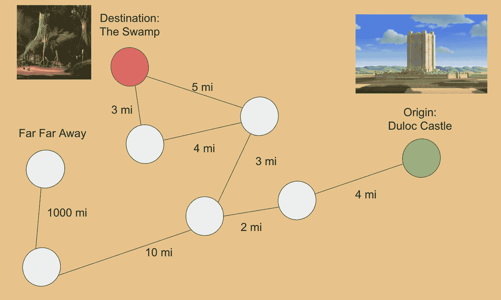

# 当 NLP 遇到史莱克

> 原文：<https://medium.com/geekculture/when-nlp-meets-shrek-d3aeaff9a97?source=collection_archive---------15----------------------->

## 驴子！让我们用马尔可夫链建立一个聊天机器人！

Made by me, the author.

我们生活在一个发明爆炸的时代。我经常想，任何一个有电脑和互联网连接的人都可以创造出以前从未想到过的东西，这是多么神奇啊。虽然现代计算使这一切成为可能，但我认为开源代码是这场运动的最大推动者。今天，我们将利用互联网的强大力量和过去几十年在自然语言处理(NLP)方面的研究来制作一些美丽的东西。我们要做一个怪物史莱克机器人。

## 但首先，一些背景…

我们需要一点 NLP 的速成课程。NLP 是计算机科学下的一个主题，它专注于计算机如何理解、处理和再现语言。这通常是通过一个模拟人类语言的模型来实现的。这些模型可以有不同的结构；然而，语言模型通常是在我们将源文档分解成其组成部分并从这些部分中提取含义时产生的。一旦意义或模式在这一低层次上被识别出来，这些部分就可以被重构，以产生人类语言中包含的更复杂的意义。

现在请听我说，我们将简单讨论一下马尔可夫链(没有听起来那么糟糕)。总而言之，当一个结果的概率仅由 *N* 个先前结果描述时，就产生了马尔可夫链。这对自然语言处理很有用。我们将使用马尔可夫链来构建我们非常简单的语言模型。NLP 是一个广阔的领域，有更多的深度可以探索，但希望这个简单的例子能激发你的好奇心，了解技术是如何创造更熟悉的聊天机器人和算法的。

为了建立这个模型，我们需要设计一个图表。图形是一种数据结构，用于定义结构中一个数据块和其他数据块之间的关系。这些数据块被称为“顶点”，它们通过“边”相互连接。顶点之间的边可能强度不同，或者根本不存在。在有向图中，顶点之间的关系只是单向的。换句话说，如果顶点 A“流向”顶点 B，那么顶点 B 就不能“流”回顶点 A。

## 故事时间！

让我们用一个类比来更好地理解图形。想象一下我们要离开法阔德勋爵的城堡去我们的沼泽。这是我们携带的地图上的两个点:分别是我们的起点和终点。现在让我们想象一路上还有其他的站——也许是女巫的小屋，也许是城镇广场，也许是教堂，也许是一座废弃的城堡。其中一些站点可能会帮助我们到达目的地，而另一些可能是死胡同——换句话说，与目的地无关。如果我们在沼泽的约会迟到了，我们的任务可能是最小化到达目的地所需的时间，在这种情况下，我们将沿着最快的路径或一组连接的站点行进到沼泽。

An example of an undirected graph, produced by me

这个类比是描述我们的语言模型如何工作的另一种方式。我们将把训练文本分解成单个的单词。这些词就像我们例子中的比喻性的句号，将成为图形的顶点。将单词彼此连接的边描述了在示例文本中单词 A 后面跟着单词 B 的可能性。请注意，此图不是有向的，因为我们还可以存储单词 B 后面跟着单词 a 的可能性。回到 Farquaad 类比，我们的原点将是句子的种子单词或提示。然后，我们的模型将根据与之相连的边的权重随机选择另一个单词。这将继续下去，直到我们到达我们的隐喻目的地。目的地可以由一些任意的条件决定；也许我们会在 20 个单词后或者当我们到达一个句号时结束这个句子。

让我们快速回顾一下到目前为止我们所拥有的。我们有一个起源，那就是我们的种子词。为了简单起见，这个单词将是我们句子的第一个单词，它将提示我们的模型生成句子的其余部分。我们也有未知的目的地，但它将由我们设定的一些条件决定。在我们的例子中，我们决定在 20 个单词之后或者当模型建议一个句号时结束句子。为了连接我们的起点和目的地之间的单个单词，我们有我们的加权边，它将在训练步骤中使用我们的马尔可夫模型来计算。考虑到这一点，让我们开始建设吧！

## 清理我们的数据

首先，我们需要建立一个训练集。这可以是我们想要的任何文本。然而，我们不希望仅仅训练任何单词的集合。记住，在我们的单词图中，顶点之间的边将由概率来定义。这些概率由训练集决定；通过调整我们的训练组合，我们可以创造出更连贯、更像史莱克的结果。这种成型过程可以按照我们想要的那样细化。我们可以决定我们想要的简单句总是以“[主语][动词][可选:介词短语/宾语/等等]”的结构出现。我们可以优化一定长度的逻辑句子。我们从训练集中省略了某些单词或短语，以此来控制我们完成的模型中的对话主题。然而，这些步骤需要一些公认的乏味工作，所以亲爱的读者，我将把这些决定留给你。

现在，让我们只写一些代码。你可以在这里克隆这个项目[。该文件包含三个关键文件， **api/scraper.py** 、 **api/markov.py** 和 **api/graph.py** 。我们将详细介绍它们各自的功能，以及它们是如何组合成最终产品的。首先我们需要数据。幸运的是，有人经历了改编电影《怪物史莱克》的麻烦。我已经把源文档放在了存储库中，但是让我们来讨论一下如果我们是从网上抓取的，我们将如何清理它。假设我们设法从某个网页上抓取了电影的脚本，我们会想要删除非对话文本。例如，我们不能让导演笔记、舞台指示或音效出现在训练数据中。我们可以编写一个快速脚本来删除这些短语。我们还想删除像圆括号、方括号、制表符、换行符和引号这样的字符。](https://github.com/Baloguna16/markov-chatbot)

虽然从技术上讲，对于我们的简单模型来说，删除包含这些字符的整个句子是更好的做法，但为了简单起见，我们将只删除字符本身(想想为什么我们可能要删除整个句子:如果我们删除这些字符，句子的含义难道不会改变吗？).清理完数据后，我们就可以开始构建模型了！

## 构建我们的单词图

首先，我们将清理文本，使算法可读。我们将从把源文本转换成单词数组开始，但是注意不要改变这些单词的顺序。我们可能决定不改变原始文档中单词的大小写。这意味着我们的图将包含一个“the”的顶点和一个“The”的顶点；但是也要想想这其中的含义。大写的“the”后面的单词类型与小写的不同吗？你可以玩玩这个，看看它对结果有什么影响。

接下来，我们将把单词图设计成邻接表。邻接表是表示图的一种方式，其中顶点和它的连接顶点之间的关系被表示为连接到数组的值。换句话说，我们可以给我们的数据结构一个值，然后得到一个数组作为回报。我们可以使用 hashmap(或者 python talk 中的字典)来存储这种关系。我已经在 **graph.py** 中构建了这些类。我们的单词图类将是我们训练集中所有单词的集合。每个单词将有一个相关的单词数组，数组中的每个单词将根据它直接出现在输入单词之后的次数进行加权。

既然我们已经定义了数据结构，我们要做的就是用数据填充它！这是训练过程，因为我们的语料库很小，所以会很快。一旦我们的模型被构建并存储在 WordGraph 的实例中，我们就可以为将来使用该模型，这样我们就不必重新训练了。

## 结果

现在我们有了史莱克文本生成器！如果您已经克隆了项目，只需打开终端，导航到项目的顶层目录。通过键入`virtualenv env`创建一个虚拟环境(但是，您可能首先需要安装带有`pip3 install virtualenv`的`virtualenv` 命令)。然后键入`source env/bin/activate && pip3 install -r requirements.txt`并按回车键。最后，运行`python3 run.py`，它将在终端中启动脚本！以下是我的一些结果:

**提示**:“驴”

**回应**:“驴，他们永远也做不到，怎么样？你知道，你必须这么做。”

**回应**:“驴。我是一个穿着肯普的女孩，一个精神上受虐待的遮阳女孩。”

**回应**:“驴，—哦，现在，他们？没有。我要去见他！."

如你所见，我们的模型*大部分是模仿人类语言的*；它缺乏正常人说话的连贯性。尽管如此，我们在如此低水平的提升中取得了如此大的成就！让我们想象一下改进这个模型的所有方法。如果我们用前面的两个字来衡量概率，而不是一个字，会怎么样？如果我们把我们的单词标记为名词、形容词、动词等等，会怎么样呢？？如果我们在计算我们的权重时考虑句子长度或某些单词的稀有程度会怎么样？如果我们添加更多的源文本(又名《怪物史莱克 2》的脚本)会怎么样？希望你觉得自己有能力继续探索这些概念！如果你做了什么酷的东西，请留下你的评论！