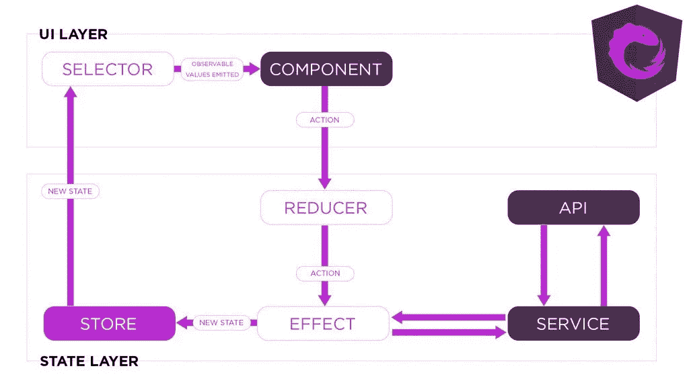

# 什么时候应该使用 NgRx(或 Redux)

> 原文：<https://medium.com/geekculture/when-should-i-use-ngrx-or-redux-9fd753c96a5?source=collection_archive---------20----------------------->

“我应该什么时候使用 NgRx”是一个问题，这个问题的答案多年来已经改变了几次，我个人认为在线提供的许多指导有点太“感觉对吗”和“其他东西可以处理你正在做的事情吗”。虽然这是了解一些新库的有用信息和很好的方法，但是对于决定何时说“是的，我将从这个项目中使用 NgRx 中受益”没有太大帮助。在过去的几年里，我试图提出一个思维框架来决定一个项目是否会受益于 NgRx，并决定分享我的想法，看看其他人的想法。

显然这是主观的，我很想听听其他人怎么说，看看社区会给这个列表添加或删除什么！

注意，虽然本文引用了 NgRx，但这种方法在很大程度上同样适用于 React 中的 Redux。

# **条件**

根据我的经验，NgRx 将被证明是一个有价值的附加项目，如果…

1.  有足够的信息从服务器返回，前端可以有效地模拟状态，并且前端除了存储服务器响应的内容之外，至少有一些重要的状态。
2.  有大量的状态不能完全由某个组件负责。这包括使用特定于组件的角度服务。
3.  可以用很少甚至没有模糊性来对状态进行建模，而不包括正在呈现哪个特定组件集的详细知识。

让我们更深入地讨论一下其中的每一项。

***从服务器*** 传回来足够的信息

这主要是为了设置一个前提条件，即在 API 为前端处理所有或大部分状态的情况下，您应该避免尝试使用 NgRx。如果你的 UI 只需要知道 API 调用的大部分状态(比如使用 [Apollo](https://apollo-angular.com/docs/) 或 [rx-query](https://github.com/timdeschryver/rx-query) )，那么 NgRx 可能不是一个好的选择。

这是由于 NgRx 以相同的方式处理所有状态，而不考虑来源。换句话说，NgRx 不关心您的状态是来自 HTTP 调用、一组复杂的多步骤用户交互、一个简单的表单，还是可以保存部分进度的多页复杂表单。因此，NgRx 对于处理像 HTTP 调用这样定义良好的状态来说并不是一个很好的工具，因为它是如此普遍和定义良好，以至于几乎总是值得使用一个特别了解 API 调用状态的库。这些工具的好处是它们提供的简单性，因为它们*知道它们处理的数据/状态的来源。*

***有大量的状态不能干净地由某个组件负责***

如今许多流行的前端库都是基于组件的，组件非常擅长处理页面上属于自己的 HTML 小区域的状态。此外，许多支持表单、模态、API 调用等功能的库非常擅长管理它们各自功能的状态，经常到了这样一种程度，即它们使得在实际使用状态附近处理状态变得微不足道。

当然，有时这种复杂性加起来仍然会远远超过您在单个组件中想要的，并且可能没有一种让您和您的团队满意的好方法来分解该组件。在这些情况下，我个人会首先使用特定于组件的服务，有时甚至会针对应用程序的每个特性使用多个服务。通过这种方式，组件可以关注 UI 状态，并充当特定于用例的服务的逻辑(例如表单验证、HTTP 调用、任何其他重要的东西)的方便挂载点。这使得所有的东西都在它实际使用的“邻居”中，但是仍然建立了大量的灵活性和抽象性。

***状态可以用几乎没有歧义的*** 来建模

这个条件可能是我在其他关于 NgRx 的文章和文献中提到最少的部分，但对我来说，这是决定 NgRx 是否适合您的应用程序的最重要的部分之一。

当应用程序不能保证某些属性或行为在所有情况下都存在和可用时，这个条件就变得很难满足。如果基于运行时参数它们是可选的，但是在某些情况下它们是必需的呢？例如，考虑这样一种情况，当一个特征被打开时，那么第二个特征也必须存在，否则第二个特征是可选的；我们如何定义这两个特性的状态？这对于默认/初始状态意味着什么？使用这些状态片段的组件会发生什么？你能保证给定的归约器或选择器中的类型定义保持良好的定义和清晰易读吗？

这些令人毛骨悚然的问题总是有答案的，但是这些答案经常会误入“比它们想要解决的问题更糟糕”的领域。

不是所有的应用程序都能保证某些行为总是会发生，或者它们会以同样的方式发生。例如，我目前的工作项目是可配置的多租户应用程序。这意味着我们有时会根据运行时条件和特性标志(来自一个配置对象，加上当前登录用户的特定数据)来更改呈现的组件或它们的行为方式。结果是，很难记住用户可以使用的所有可能的交互，检索和显示哪些数据，或者呈现数据时采用哪种格式。随着应用程序的发展，这变得更加困难，更多“有时有，有时没有”的特性被添加到每个页面。更复杂的是，许多这些问题开始时可能是全局的，现在已经变成特定于 UI 本身的条件(例如，哪些组件在哪里呈现，用什么选项呈现)，这将状态拉回到我们的组件(参见条件#2)。

简而言之，如果你的应用程序有很大的灵活性，有时最好选择正确的组件来呈现，让那个组件为自己和它自己的子组件处理事情。

***结论***

如果你的应用满足所有三个条件，我打赌你会发现 NgRx(或 Redux)是你前端项目的一个有价值的补充。如果它只满足一两个，我个人会非常不情愿，但每个规则都有例外(留下评论，告诉你经历了什么例外！)

我见过的一个例外的例子是第三点；大型可配置/动态表单。看起来如此动态可能意味着定义状态太困难，但是表单控件实际上总是有一个定义得非常好的接口。这有时会造成这样的情况，你可以很容易地*模型状态，而不需要提前知道单个表单控件的名称/属性，只要你知道它将始终是一个表单控件。*