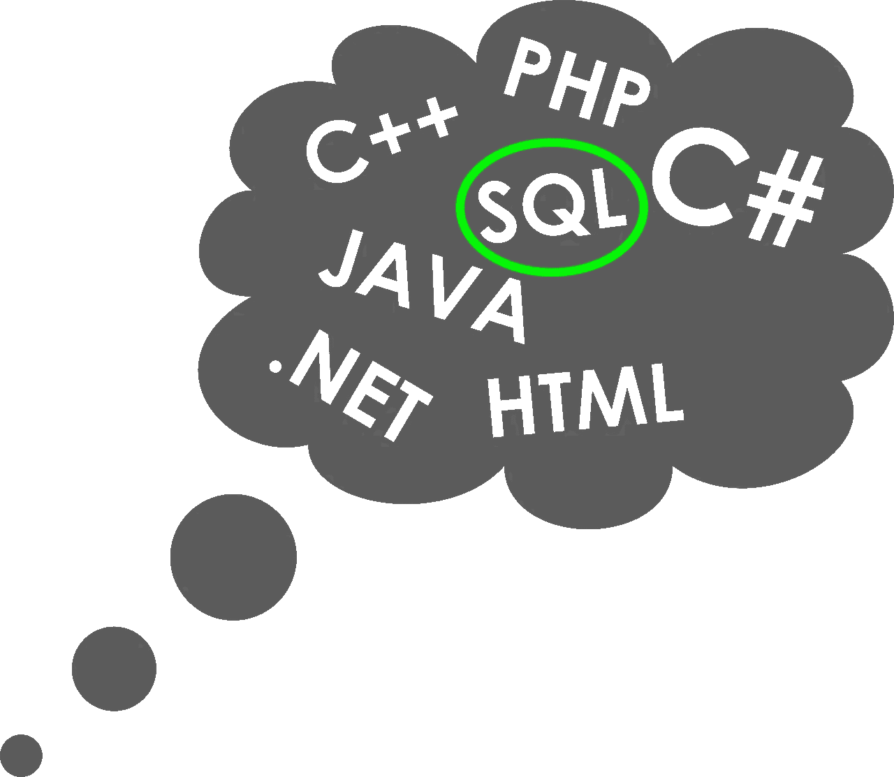

# 什么时候对代码使用 SQL？

> 原文：<https://medium.com/geekculture/when-to-sql-over-code-39047640269?source=collection_archive---------7----------------------->

## 在 SQL 查询中执行 ETL 转换和在 JAVA / Python 代码中执行 ETL 转换的优缺点是什么

Image by [Anna](https://pixabay.com/users/kropekk_pl-114936/?utm_source=link-attribution&amp;utm_medium=referral&amp;utm_campaign=image&amp;utm_content=1835333) from Pixabay

# 让我先打个比方

如果你想在印度买一条金项链，金匠可以坐在开普敦或新德里，这是一个技巧和品味的问题。但是你绝对不会为了这个把成吨的 T4 金矿从南非运到印度。矿石在矿区(或至少在附近)加工，只有黄金被运送。数据库和 ETL 也是如此！

就**SQL**而言，您几乎可以在查询服务器上做任何事情，非常高效。现代关系数据库系统，尤其是分布式查询引擎擅长执行复杂的查询。

SQL 的能力和表现力被严重低估了。自从[窗口函数](https://en.wikipedia.org/wiki/Window_function_%28SQL%29#Window_function)的引入，很多非严格面向集合的计算都可以在数据库中非常轻松优雅地执行。

Photo by [Zlaťáky.cz](https://unsplash.com/@zlataky?utm_source=medium&utm_medium=referral) on [Unsplash](https://unsplash.com?utm_source=medium&utm_medium=referral)

# 数据移动三元组

无论整个应用程序架构如何，都应该始终遵循三条经验法则:

*   保持数据库和应用程序之间传输的数据量较小(有利于数据库中的计算)
*   保持数据库从磁盘加载的数据量较小(有利于让数据库优化语句以避免不必要的数据访问)
*   不要用复杂的并发计算将数据库推到它的 CPU 极限(支持将数据拉入应用程序内存并在那里执行计算)。然而，根据我的经验，如果有一个不错的 DBA 和一些不错的数据库知识，您不会很快遇到 DBs CPU 限制

# 开发商做错了什么？

许多开发人员从数据库中获取结果集。使用地图、列表等数据结构。执行过滤和其他处理任务，这些任务可以在数据库级别轻松完成。在 SQL 中进行最大量的数据处理比在 Java 或 Python 代码中编写逻辑更高效、更快。

虽然这并不总是错的，但它取决于许多因素，但最重要的是:

*   **计算的复杂性**——更喜欢在应用服务器上进行复杂的计算，因为这样会扩大*的规模*；而不是数据库服务器，后者扩展了*和*
*   **数据量** —如果您需要访问/聚合大量数据，在数据库服务器上执行将节省带宽，如果聚合可以在索引内完成，还可以节省磁盘 IO
*   **便利性** —SQL 不是复杂工作的最佳语言——尤其是对程序性工作来说不太好，但对基于集合的工作来说非常好

## 一些决策建议

*   如果它涉及数据—SQL
*   如果是计算傅立叶变换—Java/Python 代码
*   如果是处理数据—SQL
*   如果是生成图形—Java/Python 代码
*   如果它针对数据执行任何大小、形状或形式的事务—SQL

alaa kaddour, via [Wikimedia](https://commons.wikimedia.org/wiki/File:Sql_data_base_with_logo.png) Commons

# 包裹

对于数据转换逻辑的哪些部分应该在 SQL 中执行，哪些部分应该在您的代码或应用程序中执行，并没有明确的规定。

然而，现代数据库是水平扩展的。这些系统已经实现了高可用性和容错。利用这一点，尝试简化您的应用程序空间并更有效地执行转换！

我希望，这篇短文对你有用。感谢您的阅读！

▶️ *请在下面的评论中提出任何问题/疑问或分享任何建议。*

▶️ *如果你喜欢这篇文章，那么请考虑关注我&把它分享给你的朋友吧:)*

▶️ *可以联系我在—*[*LinkedIn*](https://www.linkedin.com/in/garvitarya/)*|*[*Twitter*](https://twitter.com/garvitishere)*|*[*github*](https://github.com/GarvitArya/)*|*[*insta gram*](https://www.instagram.com/garvitarya/)|[*Facebook*](https://www.facebook.com/garvitishere)*(几乎无处不在:p*

Photo by [Towfiqu barbhuiya](https://unsplash.com/@towfiqu999999?utm_source=medium&utm_medium=referral) on [Unsplash](https://unsplash.com?utm_source=medium&utm_medium=referral)