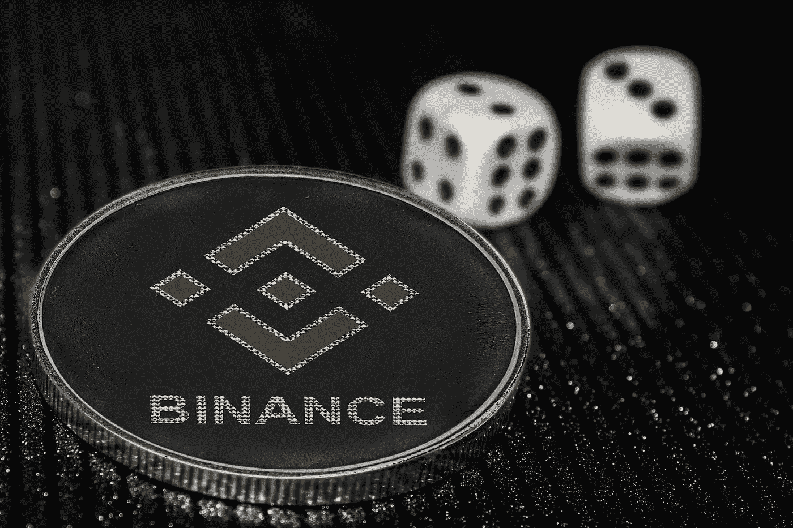
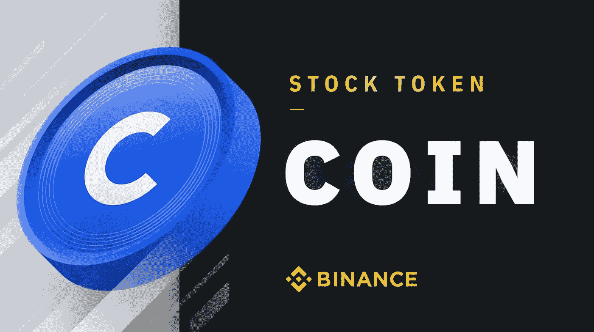

# 哪些加密货币会被美国禁止或监管？

> 原文：<https://medium.com/geekculture/which-cryptocurrencies-will-be-banned-or-regulated-by-the-united-states-c12d016231a2?source=collection_archive---------27----------------------->

过去几周，有许多报道称，美国高级官员呼吁对加密货币进行监管，并将加密货币归类为证券。虽然所有这些新闻可能看起来完全是负面的，但美国不太可能完全禁止加密，只有最明目张胆的违法者才会受到惩罚。

众所周知，美国有严格的法律法规来保护投资者。在过去的 13 年里，加密货币在这些指导方针之外运行，任何人都可以在没有任何监管问题的情况下购买、出售或交换。不幸的是，这种情况似乎正在改变，因为美国证券交易委员会主席加里·詹斯勒、参议员伊丽莎白·沃伦和众议员布拉德·谢尔曼等美国高级金融官员一直呼吁对加密货币领域进行监管。

在对加密货币领域进行监管的第一轮努力中，监管机构重点关注了几个特定领域。重点是管理在加密货币市场上自由交易的未注册证券。根据美国的定义，证券是一种资产，是“对普通企业的资金投资，并合理预期将从他人的努力中获得利润。”如果一项资产符合这四个标准，政府会将其归类为证券，这意味着它只能在纳斯达克和纽约证券交易所等注册交易所交易，任何持有该资产的人都必须在交易前通过严格的 KYC/反洗钱程序。

可以想象，任何被宣布为证券的加密货币都可能被摧毁并被遗忘，因为它们将从所有主要的加密货币交易所退市。现在， [XRP](https://en.bitpush.news/articles/tag/xrp) ，曾经市值第三大的加密公司，正与[证券交易委员会](https://en.bitpush.news/articles/tag/sec)打官司，后者认为 XRP 是一个未注册的证券，需要监管。幸运的是，XRP 赢了这场官司，看起来他们会和解，不会面临任何重大损失。这将为所有其他加密货币树立一个强有力的先例，SEC 将必须确保他们现在只关注最肯定是证券的加密货币。

很可能绝大多数加密货币都不是证券。事实上，比特币和以太坊早已被官方宣布为非证券。它们和大多数其他加密货币一样，出于税收目的被视为财产。希望美国证券交易委员会能够提供更清晰的加密货币监管，使其更适合购买。任何时候有人使用比特币购买东西，他们都必须将交易报告为应税事件，这是一个用现金无法体验的麻烦。如果美国证券交易委员会创造了一种被称为“数字货币”的新资产类别，那么投资者不仅可以投机比特币，还可以将其用作预期的数字现金。

有可能被宣布为证券的一类加密货币是交易所代币，如[币安](https://en.bitpush.news/articles/tag/binance)的 BNB 和 FTX 的 FTT。这些代币的价值严重依赖于其母公司，因此可以说它们是从其母交易所的成功中获得价值的证券。例如，币安将其部分季度利润用于回购 BNB 代币，还为 BNB 创造了一个用例，即当用户使用代币在平台上交易时，给予他们费用折扣。没有币安，币安硬币有什么用？这是监管者将会问的问题，并将影响他们关于 BNB 和其他交易代币是否是证券的决定。

监管机构的另一个目标领域是稳定的债券，特别是那些没有美元完全支持的债券。在国会大力游说的银行一直要求对稳定的信贷进行监管。这可能是因为 stablecoins 和 DeFi 有可能取代银行，而国会正在听取他们的请求。他们特别针对[系绳](https://en.bitpush.news/articles/tag/tether)，这在过去已经被审查，因为他们缺乏对 USDT 真正的 1:1 支持。他们持有的货币只够支持 77%的流通中的 USDT，这意味着它不是真正与美元挂钩的硬币。

十有八九，监管机构会要求稳定币发行者更加透明，并对其稳定币提供全面支持。稳定的硬币完全被禁止或被宣布为证券是可能的，但可能性不大。在最好的情况下，完全支持的稳定货币将被宣布为货币，这将在它们被兑换为其他加密货币或在 DeFi 中使用时产生较少的应税事件。

像戴这样分散经营的公司，未来更不确定，因为没有公司可以起诉，也没有服务器可以关闭。尽管它们被一篮子加密货币超额抵押，但 SEC 可能认为这还不够。然而，他们无法阻止戴的流通，因为它是完全分散的，不受任何一个实体的控制。阻止戴就像阻止整个以太坊一样困难。

令牌化股票极有可能受到 SEC 的监管。这些令牌是与股票价格挂钩的资产，通常通过使用像 Chainlink 这样的分散式 oracle 来实现。与传统股票相比，它们提供了许多好处，例如世界上任何地方的任何人都可以使用，而不仅仅是拥有银行账户的美国公民。

币安曾经在其平台上提供象征性股票，但最近取消了这些股票，以避免监管审查。镜像协议是一个分散的平台，允许发行令牌化的股票，类似于 Maker 如何发行 DAI 作为稳定的硬币。即使 Mirror 像戴一样发行未注册证券，如果不关闭整个分散且不可改变的，就不可能停止发行，因此任何监管都不太可能有所帮助。

尽管即将到来的加密货币监管可能会对选定的几个项目造成毁灭性的影响，但市场的大部分仍将不受影响。如果监管力度低于投资者的预期，一些项目甚至可能出现估值飙升，因为监管将为项目的成功减少一个障碍。加密货币在多次熊市和崩溃中幸存了 13 年，因此一些逾期的监管不会毁掉这个 1.6 万亿美元的市场。

林肯·穆尔