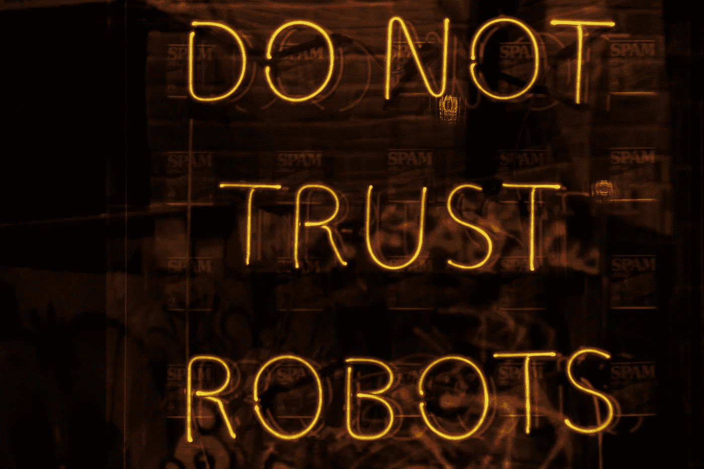
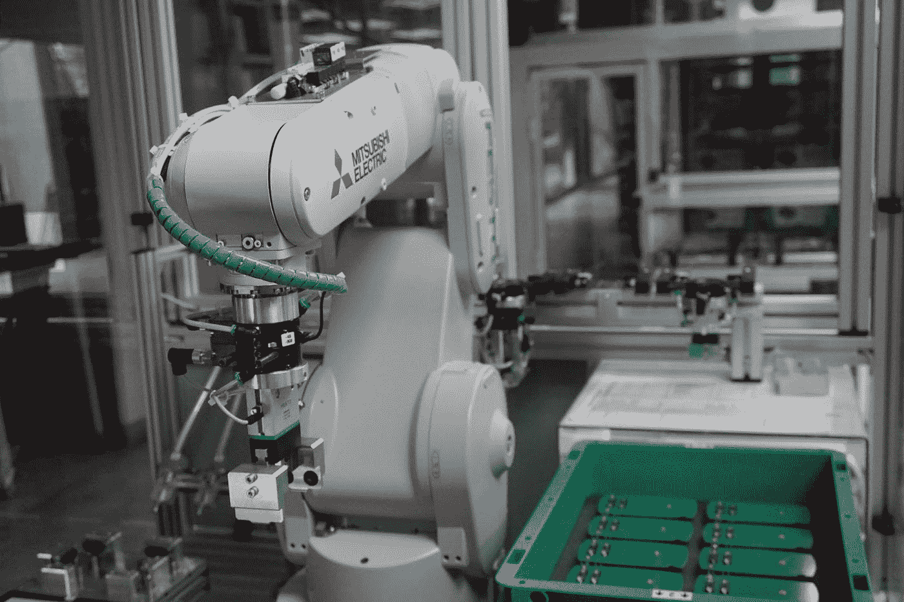
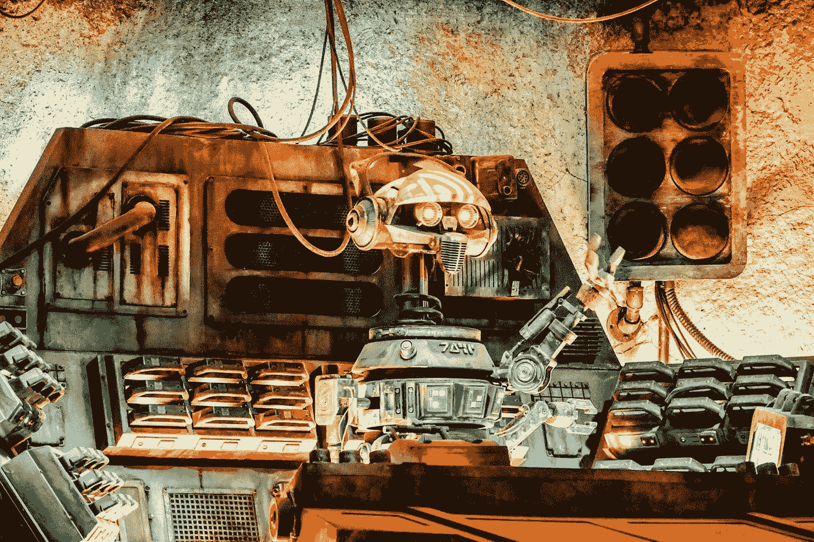

# 人为什么会害怕 AI？

> 原文：<https://medium.com/geekculture/why-are-people-scared-of-ai-75f9e527797?source=collection_archive---------5----------------------->

## 这篇文章是一系列关注人工智能以及我们如何利用它的能力和潜力来进一步优化我们的创造性实践的文章中的第一篇。

人工智能和机器学习最近一直是大辩论的话题，特别是围绕人工智能的潜在应用和当前使用面临的潜在问题。

人们普遍认为，人工智能技术已经证明了自己是技术史上最具变革性的开门式发明之一，更不用说人类历史了。但是权力越大，责任越大。它的变革性质意味着它打开的大门是双向的，为积极和消极的结果提供了机会。

那些不属于人工智能世界的人，或者那些没有与之密切合作的人，已经对人工智能产生了负面的看法，而这恰好是社会的一大部分。害怕、怀疑、警惕、不信任、犹豫——适用的术语数不胜数。

具有讽刺意味的是，这些人每天都在使用人工智能解锁他们的 iPhone，或者在应用程序上查看他们的银行账户，或者在他们的卫星导航上找到最佳路线。

# 为什么我们害怕人工智能？

我们可能害怕人工智能的原因有很多:

## 原因 1——坏人做坏事

斯蒂芬·霍金自己说，人工智能的未来发展“可能会导致人类的终结。”

在未来的某个时刻，人工智能可能会被武器化，这种想法不无道理。随着计算机科学每十年的进步，我们今天拥有的系统将无法与人类未来开发的系统相提并论，潜在的未来威胁也是如此。如果未来的人工智能技术落入不稳定的人手中，后果可能是灾难性的。

## 原因 2——没有共同的理解基础

不理解某事会导致对它固有的不信任。我们的自我保护本能会立即从最坏的角度看待任何新事物，只有当它被证明不是威胁时，我们的观点才会改变。对未知的恐惧是一种强大的东西，随着人类智能和人工智能领域的增加，不确定性也在增加。

人工智能是一个复杂的概念，许多人都很难完全理解，然而，如果你不知道如何解释或联系上下文，那么大量的数据和研究都是无用的。

## 原因 3——超级智能

这可能是对人工智能最经典的恐惧——有一天，世界上的计算机和机器人将会奋起反抗并超越人类。

Loops 的董事长安迪·霍布斯鲍姆说:“30 年前，未来学家彼得·科克伦说，如果计算机能让我们的飞机安全着陆，那是没问题的，但当计算机在国际象棋中击败我们时，我们会变得情绪激动。如今，随着机器变得越来越聪明，越来越多地开始像人类一样应用它们的智能，这些同样的恐惧正被人工智能大规模放大。”

人工智能是否会达到不再需要人类参与并学会自我发明和优化的地步，这仍然是个未知数。

人工通用智能(AGI)在这一点上仍然只是一个概念，但人类会发现自己落后于计算机，无法跟上快速发展的步伐吗？这将提出一些难以回答的问题，比如我们如何测量智力？

## 原因 4——我们不想被电脑取代

这种被告知计算机可以比我们做得更好，我们可以很容易被取代的威胁，可能比要求高的公司预期的更切中要害。在之前的自动化浪潮中，人类已经看到了这种接管的例子。

这是所有行业的员工都有的恐惧，从工程到营销到服务，但是关于人工智能和创造性职业之间的关系已经爆发了热烈的讨论，一些人工智能现在能够用增强技术创作音乐(意味着没有人类的输入)。

当你和其他人竞争时，就业市场的竞争会非常激烈——谁还想和机器竞争呢？

## 原因 5——娱乐业对人工智能的描绘

《2001:太空漫游》里的哈尔。奥创。来自《瓦力》的汽车。

毫无疑问，娱乐业在影响公众对人工智能的态度方面发挥了很大作用，在许多科幻电影中，它将计算机描绘成对人类的威胁。

虽然观众能够区分事实和虚构，但围绕人工智能的当前事实对大多数人来说仍然是模糊的，给我们留下了一个血腥而坚定的终结者的图像。

# 对人工智能恐惧背后的心理

恐惧是一种习得的行为，当面对克服恐惧时，我们可能是自己最大的敌人。

随着每天接触 Twitter 和抖音等应用程序，以及进入前 10 名名单等流行格式的内容，我们对易于消化的内容的需求增加了，而我们的注意力持续时间却缩短了。

人工智能和机器学习不是一个简单易懂的概念，也不容易理解。如果没有预先存在的兴趣，这使得它们成为可以随便了解的冷门话题。寻找有信誉的信息并理解它所需要的努力超过了偶然兴趣带来的好处，所以我们根本不去费心。

这种缺乏努力导致缺乏理解，最终导致缺乏控制，无论是概念本身还是个人对它的了解。人类本质上是有领地意识的，这意味着我们喜欢掌控一切以获得安全感。如果有些东西对我们来说是未知的，因此在我们的控制之外，比如人工智能，那么我们就会害怕它。

# 我们会克服对人工智能的恐惧吗？

Loops 的联合创始人斯科特·莫里森说:“(对人工智能的)恐惧最终将消退为谨慎，然后是合作，就像大多数事情一样，我们学会了并肩生活，并用人工智能的力量增强我们的生活。”。

有时候，我们在不可避免的事情中找到一些安慰。不管我们喜欢与否，人工智能已经在我们的日常生活中根深蒂固，不能简单地将其剔除。

# Loops 的目标是成为积极转变的一部分

人工智能可以在宏观层面上解决一些最具破坏性的问题——疾病、气候变化、恐怖主义，但这些问题都是通过循序渐进的方式解决的，通常不在公众眼中。这意味着人工智能的积极能力没有被大多数人观察到，因此不被欣赏和认可。

在 Loops，我们有兴趣应用机器学习来支持创意策略，为我们所称的“现代创意流程”奠定基础。

Loops 使用一种自然语言处理的形式来理解大量观众对一个想法的感受。想象一下一个巨大的焦点小组，你可以从你的笔记本电脑上与世界上任何一群人一起旋转，只需点击几下鼠标就可以了解共识、离群值和盲点。

这并不妨碍创造力，它使创造力成为可能，因为你有能力探索新的想法，测试勇敢的思维，变得古怪，所有这些都是零风险和最小的努力。

在本系列的下一篇文章中，我们将概述并讨论如何战胜对人工智能的恐惧，以及与它协同工作的好处。