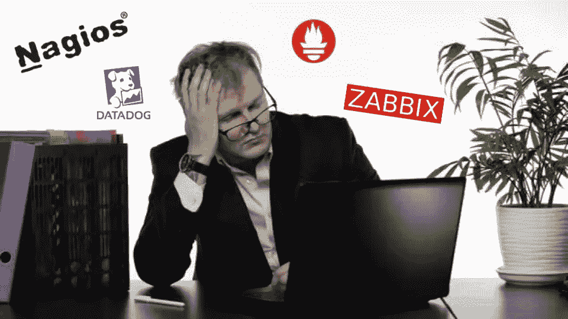
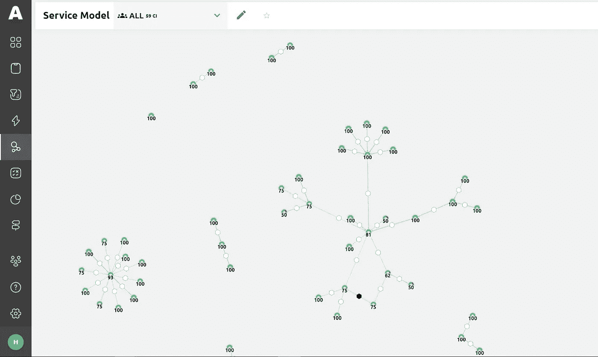

# 为什么银行家需要自动伞。一个 AIOps 实现的故事

> 原文：<https://medium.com/geekculture/why-bankers-need-automatic-umbrellas-the-story-of-one-aiops-implementation-ad189d127e26?source=collection_archive---------15----------------------->

显然，没有数据监控，银行是无法存在的。这里的难点与任何拥有复杂 IT 基础架构的大公司一样。这可能会导致错误和停机时间更长。即使自动化流程设置得很好，这对银行业的大型参与者来说也是不够的。他们不仅希望持续监控自己的系统，了解它们的存在和故障原因，还希望完全依靠人工智能来让系统进行自我监控、自我预测和自我纠正。此外，大量的技术部门和不同的系统产生了大量的警报，这些警报越来越难以控制。然后就该开伞了。和更好的自动化。

## **没有激活手册的手动操作**

对于我们的一个客户，一家大型东欧银行来说，尽管渴望自动化，但人的因素仍然发挥着巨大的作用。在 IT 基础设施或数字产品发生事故时，服务人员会对问题进行逐步手动诊断，并向负责的工程师发出警报。没有人关注知识库的更新，因此新员工在遵循说明时经常出错。尽管在银行业，几乎没有犯错的余地。当然，如此依赖一个人，SLA 吃了大亏，这不仅仅是银行的痛点，而是非常关键的时刻。

除此之外，拥有许多技术部门的分散的 IT 基础设施每个都至少有一个监控系统，这增加了复杂性。每个系统生成数百个警报，并轰炸所有负责它们的人(有时甚至在部门之间)。很难始终将控制重点放在每个通知上，由于通知数量巨大，它们的紧急性和重要性被分级。

所以我们有两个工作领域:

第一阶段是伞式监控，以提高事件解决的速度

第二阶段是手动流程的自动化，以降低扩展 IT 部门的风险和成本。

## **当它“下雨事件和警报”时，你需要一把伞**

> “处理来自 IT 基础架构各个组件的信息的 IT 监控解决方案可以针对整个基础架构进行扩展，就像一把收集和分析其范围内所有系统的数据的伞”。
> 
> ——HRE 专家谈保护伞的监控

[我们的 AIOps 解决方案](https://acure.io/)的一个特点是它可以与任何监控系统集成，并在一个窗口中获取关于 IT 复合体状态的数据。通过在银行中集成该解决方案，我们将来自不同监控系统的数据集中在一个“单一屏幕”上，以便处理数据的工程师能够了解正在发生的事情。基于这些数据，构建了一个单一的资源服务模型，实时显示整个组合系统的所有组件的运行状况。配置项之间的联系减少了查找问题根源和故障类型的时间。这解放并加速了专家解决事件的时间，然后浪费在寻找问题原因上。

The Resource Service Model

此外，新元素和它们之间的链接开始通过自动发现过程自动添加到资源服务模型中。也就是说，IT 专家不会花时间进行手动更新。

这仅仅是机器接管过程的开始。

然后配置了基于事件的自动化，减少了事件响应时间和执行指令时的错误数量。问题报告会自动发送给负责人，现在员工将工作时间用于解决实际问题。与知识库的交互也实现了自动化。工程师以自动模式从知识库中获得必要的条目。

此外，正如我在以前的文章中提到的，Acure 允许您配置自动规则和自动操作，直到自动修复脚本，在我们的案例中我们也没有绕过它，并为相同类型的重复事件设置操作脚本。

## **取得的成果和结论**

由于实施了我们的平台和流程自动化，我们取得了令人印象深刻的成果。我们将关键事件的处理时间从 25 分钟减少到 15 分钟，并将每个 SRE 工程师的通知数量从 110 个减少到 10 个。因此，这些数字最有力地回答了 AIOps 和伞式监控对业务和 IT 人员的好处。