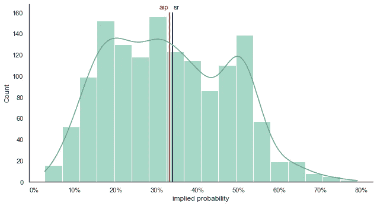

# 为什么击败博彩公司不是一个预测游戏

> 原文：<https://medium.com/geekculture/why-beating-the-bookmakers-is-not-a-prediction-game-195ac921363a?source=collection_archive---------6----------------------->

## 分析变得简单

## 这是关于发现价值

picture by Alex Motoc

# 介绍

体育赛事是随机的，即使是最好的球员或球队也可能经历厄运和糟糕的时期。这种**随机性**把打赌变成了估计事件的概率。

每个与庄家对赌的人都认为，如果你得到更好的预测，从长远来看，你会赚几百万。嗯，**错了**，**错了**，你会在这篇文章里用一个具体的例子找到原因。

为了更好地理解接下来的事情，你需要了解什么是赔率，公平赔率，为什么它们会移动，以及如何将它们转化为概率和预测。如果不是这种情况，请查看我们的文章主题。如果你想了解更多关于模型预测的信息，请访问我们的网站。

# 做预测就是寻找概率

这似乎是显而易见的，但是[建立预测模型](/geekculture/building-a-simple-football-prediction-model-using-machine-learning-f061e607bec5)，从赔率中计算隐含的概率，或者在每个结果中获得投票的百分比都有相同的目标:估计随机事件的每个可能问题的概率。这就是预测的意义所在，评估概率并推断出你希望押注的结果。

我们刚刚提到了三种估计概率的方法，那么我们如何比较它们呢？哪个最好？让我们来看看为什么我们会喜欢这个或那个。

## 预测模型

使用统计学/机器学习从数据中学习。主要的优势是，如果你有足够的数据，你可以预测任何事情。主要的缺点是你需要很强的计算机科学知识，处理异构数据，并知道编码。

## 博彩公司暗示了概率

它基本上是将几率转化为概率。当市场流动时，主要优势是准确性，这意味着当足够的资金投入时，你可以获得一个非常好的概率估计。也有缺点。首先，如果没有市场，就不可能有预测。第二，准确性取决于博彩公司和你如何去除保证金。第三，你不能用这些来击败庄家。

## 投票的百分比

从网站、论坛或社交媒体上收集，这是获得概率的最简单方法。如果有足够的投票，它也是非常准确的，但缺点是缺乏市场，很难从许多来源收集数据。

为了比较不同的技术，我们需要估计概率质量的度量。一个很好的选择是**对数损失。**损失衡量一个事件的估计概率的质量。如果你对几个事件的对数损失进行平均，你就会得到一个技术质量的估计。从数学上讲，平均原木损失为

The average log-loss formula

如果我们举一个单一事件的例子，比如一场足球比赛的获胜者，其概率如下:主场获胜(60%)，平局(30%)，客场获胜(10%)。如果主场获胜，对数损失为-0.51，但如果客场获胜，则为-2.30。正如你可以看到，如果客场获胜，我们的预测是非常错误的，所以日志损失是非常消极的。

这个度量总是负的。**平均对数损耗越接近零，预测就越准确。**这个度量(或衍生)也用于训练机器学习模型。现在，要比较模型，你只需要排列平均对数损失，并选择最好的一个。为了有一个准确的答案，我们将需要大量的事件(大 **n** )。

现在，为什么我们不能用那些预测来赚钱呢？答案很简单:因为这不是目标。假设所有方法都给出了准确的概率，那么通过群体效应，赔率将反映这种准确性，并收敛到它们的公允价值。由于博彩公司收取保证金，当你继续按照这些概率下注时，你将会损失保证金。即使概率是准确的，你也赚不到钱。

> 拥有一个好的预测模型并不意味着你可以击败庄家，它只是意味着你可以预测准确的概率。

从博彩公司的赔率推导出的隐含概率尤其如此。它们非常准确，大多数时候与其他两种方法一致，但是我们不能用它们来击败庄家。

# 击败庄家就是找到价值

价值下注是对抗博彩公司长期获胜的唯一途径，这不是秘密。博彩公司定价过高的价值赌注是很奇怪的。换句话说，隐含概率也远低于事件发生的真实概率。**真实的概率是未知的**，例如，必须使用前一部分中看到的方法进行估计。

问题是这些技术不是为寻找价值而设计的。机器学习模型被训练成具有最准确的概率，隐含的赔率对价值押注毫无用处，投票只是一项调查的结果。

为了找到价值，我们要么使用检测算法训练一个模型，要么让用户对他们认为有价值的赔率进行投票。这样做的话，你可能最终会选择较大的赔率和较低的命中率。

## 现实生活中的例子

一个很好的例子就是初创公司墨丘利。他们正在使用算法寻找足球的价值赌注。根据他们的网站(截至 6 月 21 日)，他们下注的平均赔率为 **3.97** ，他们的命中率为 **34.35%** ，而他们的收益率为 **2.46%** 。这些数字表明:

*   击败博彩公司很难，但却是可能的
*   准确率低并不意味着你赔钱
*   你需要准确有效的历史几率
*   价值下注检测与事件的不确定性有关

有趣的是，平均隐含概率为 **33.07%** (假设利润率为 0)，因此这实际上是一种专注于罕见事件的价值押注策略。履约率为 34.35%**对收益率的估算大致为**34.35% *(1/33.07%)-1 = 2.58%**。下图显示了算法检测到的值的隐含概率分布。如你所见，大多数检测发生在概率低于 50%的情况下。**

****

**Mercurius implied probability distribution**

**基本上，你需要一个比你的平均隐含概率(aip)大的成交率(sr)来获得正收益。**

> **要打败庄家，你需要专注于发现不确定性高的事件的价值。**

**这些准确性低的事件具有很高的不确定性水平，这可能与事件本身或下注数量有关，使赔率高于应有水平，从而产生可利用的定价不匹配。**

****那么如何使用概率呢？****

**我们可以用概率来建立价值检测器。例如，您可以使用这些概率作为另一个模型的输入，该模型是专门训练来产生长期利润的。**

**使用历史赔率，你可以模拟过去的策略。例如，我们可以测试开盘赔率是否更有价值，或者概率是否比大赔率的博彩公司更好。最重要的部分是在概率之间建立联系，这些概率被设计来正确预测和发现从长远来看可以击败博彩公司的事件。**

# **结论**

**在这篇文章中，我们展示了预测和击败庄家是使用概率的两种不同方式。预测的目标是产生准确的概率，而击败庄家是为了产生长期利润。**

**虽然它们都是相关的，但概率需要在一个补充步骤中与赔率数据一起处理，以便检测博彩公司的价格何时略有错误。**

**[1]我们与墨丘利没有任何关联、联系或任何方式的联系。**