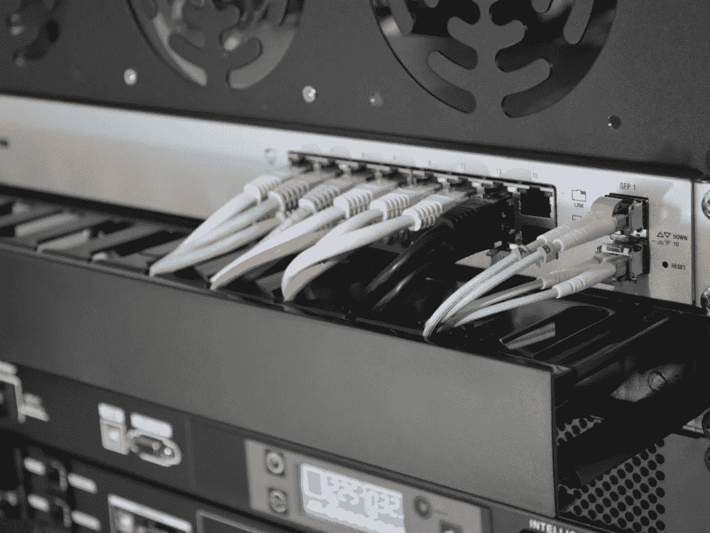

# 为什么企业从本地服务器迁移到混合云解决方案

> 原文：<https://medium.com/geekculture/why-businesses-migrate-from-on-premise-servers-to-hybrid-cloud-solutions-c894d985076a?source=collection_archive---------10----------------------->

Source: Unsplash

如今，许多公司都试图解决为标准本地服务器设计的解决方案如何适应云服务的问题。在这种情况下，公司将其基础设施、架构和服务迁移到 AWS 等云提供商。与物理本地服务器相比，云的主要优势是什么？大公司的迁移过程进展如何？请继续阅读，寻找答案。

# 云迁移要解决的业务目标

首先，让我们定义有 3 种全球类型的数据存储:本地服务器、云服务器和混合服务器。最后一种方法允许完全远程管理 IT 基础架构，没有安全风险、不便和维护本地硬件的成本。市场上有许多代表所有这些类型的服务器的服务和解决方案，它们都有自己的使用特点和业务优势。当您的办公室中有很多物理服务器时，您需要不断地维护它们并保持它们正常工作。但这就足够了吗？这是当今数据存储的最佳市场使用案例吗？显然不是，因为越来越多的公司，尤其是拥有海量数据的企业，决定使用云服务，进行迁移。

对于许多企业来说，成功的云迁移降低了成本，提高了可扩展性，并显著降低了可能导致企业脱轨的网络事故的风险。云迁移的复杂性取决于每个项目中涉及的资源数量。您可以将业务服务、企业数据库、web 和移动应用程序、边缘服务器、CRM 支持系统、物联网、生产力软件、远程桌面、网络管理工具等平台迁移到云中。

Source: Unsplash

通过从本地服务器迁移到云，可以解决标准的业务问题:

–安全性
–成本
–可扩展性

## 安全性

从传统服务器迁移到基于云的服务器解决了企业的安全性和弹性问题。当服务器在您的办公室时，您要对它们负责，因此，所有风险也由您承担(例如，停电)。这不仅是信息的安全，也是所有其他方面的安全—信息存储、资源访问、物理安全、基础架构风险等。

## 费用

一些组织不介意与基于场所的服务器相关的开销成本。企业越大，覆盖所有这些问题和风险的成本就越高。有必要让员工处理服务器及其配置、控制服务器场所等等。云服务器通常可以降低成本。 [TCO](https://www.investopedia.com/terms/t/totalcostofownership.asp#:~:text=The%20total%20cost%20of%20ownership%2C%20or%20TCO%2C%20includes%20the%20purchase,to%20a%20company%20or%20individual.) (总拥有成本)是显示您拥有所有资源的成本的指标。响亮的解决方案总是有助于降低这一指数。

## 可量测性

如果你有一个个人数据中心，有一天它会不够用，你会订购第二个。设置、测试、在服务器上共享服务——所有这些都需要时间和金钱。关于这一点，云解决方案可以在您需要的时候为您提供所需数量的服务器。这种对业务的控制可以让您节省维护大型数据中心的费用，因为这些数据中心很少实现其承诺和潜力。云迁移允许企业在现有基础架构内轻松扩展和增长。

如今，企业公司在各种云服务上逐一配置资源，如 [AWS](https://aws.amazon.com/) 、[微软 Azure](https://azure.microsoft.com/) ，或[谷歌云](https://cloud.google.com/)。服务的设置取决于具有不同说明和功能的提供商。所有这些配置都需要花费大量时间，并且需要具有特殊专业知识的专业人员来完成。这些解决方案在没有干预的情况下编排来自提供商的服务，并帮助客户使用简单的指令改变他们所涉及的资源的状态。

Source: Unsplash

云解决方案让企业避免了云锁定，因为可移植软件可以跨云移动其应用程序和数据，并获得跨私有和公共 IT 环境的一致消费模式，因此他们可以满怀信心地规划您的长期混合和多云战略，最大限度地发挥每个环境的优势。

# 混合云解决方案市场领导者的经验

让我们以本案例中领先的云计算软件公司为例— [Nutanix corporation](https://www.nutanix.com/) 。他们销售超融合基础设施(HCI)设备和软件定义的存储。Nutanix 为物理服务器开发了许多自己的软件，任何拥有大量服务器的公司都可以使用它。他们将公司的所有服务器组合成一个虚拟的大型服务器——公司办公室内的数据中心，并将其转变为可扩展的微云。但是，即使采用这种方法，仍然存在与物理服务器相同的风险。有了这个软件，你就可以充分利用资源。因此，他们的客户开始更多地关注 AWS 等解决方案。Nutanix 已经开始平稳地整合这些服务。现在，公司在办公室和云中使用他们的软件，所有这些软件将作为一个大服务器一起工作。他们将其命名为[混合云解决方案](https://www.nutanix.com/solutions/hybrid-cloud)。

为了在竞争中保持领先地位，IT 部门越来越多地被要求提供额外的功能，使其组织能够以新的、更快的方式进行创新。公共云通常被视为对现有内部环境的补充，但这会带来新的挑战，如管理复杂的网络、重新设计应用程序，以及为各种云使用多种基础架构工具。Nutanix 通过一个可以跨越私有云和公共云的单一软件平台解决了这些问题，使混合云和多云部署易于部署、使用和适应。无论您是将应用作为传统虚拟机运行，还是利用现代容器技术，它们都可以跨公共云和私有云自动执行基础架构操作和应用交付。Nutanix 混合云解决方案统一了跨云的管理，同时实现了应用程序和数据在不同环境之间的无缝移动，并从正确的云交付每个应用程序，但没有增加复杂性。

Source: Unsplash

在私有云和公共云上使用相同的软件平台，使企业能够从公共云(如 AWS)交付应用程序，就像他们使用数据中心基础架构一样。借助这些解决方案，公司消除了混合云的运营复杂性，并获得了将应用和数据扩展、爆发或迁移到他们选择的云中的能力。他们可以管理跨云的所有应用和 IT 资源，利用相同的运营实践和现有的第三方集成来获得共同的体验，无需为每个云环境单独开发和维护不同的运营和故障排除实践。

主要的显著特点是，它通过一个适用于所有应用、数据和云服务的单一平台来加速业务发展。在单一控制台中对数据中心基础架构、应用程序和云进行消费级管理是他们的主要目标之一。借助这些解决方案，IT 团队可以专注于业务关键型计划，而先进的机器学习技术可以将复杂的任务简化为一次点击。

# 云和混合解决方案的未来

根据 [research](https://www.alliedmarketresearch.com/hybrid-cloud-market) 的数据，2017 年全球混合云市场规模价值 361.38 亿美元，预计到 2025 年将达到 1719.26 亿美元，从 2018 年到 2025 年以 21.7%的 CAGR(复合年增长率)增长。到 2021 年底，大约 90%的企业将采用混合云基础架构。机器学习、人工智能和自动化融入混合云平台将继续创造技术突破。这些都是新的，无疑是重要的商业机会，将不断发展，每年越来越多。

Quantum 的经验包括与 Nutanix 和其他公司合作。阅读我们的[案例研究](https://quantumobile.com/case-studies/services-orchestrator)，了解我们如何设计和开发开源 SaaS 云解决方案，并查看[我们在 DevOps &云](https://quantumobile.com/expertise/devops)方面的经验。