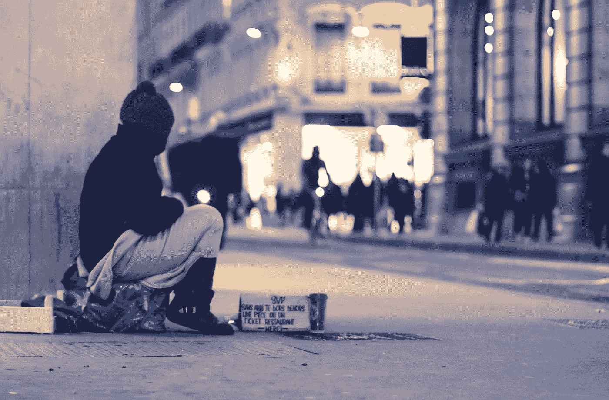

# 为什么需要阻止住房金融化

> 原文：<https://medium.com/geekculture/why-financialization-of-housing-needs-to-be-stopped-45d44852037e?source=collection_archive---------21----------------------->

Photo by [Ev](https://unsplash.com/@evstyle?utm_source=medium&utm_medium=referral) on [Unsplash](https://unsplash.com?utm_source=medium&utm_medium=referral)

近年来，金融化有利于确定新兴经济体和经济更发达国家的未来发展趋势。那么到底什么是金融化，这对房地产行业意味着什么？金融化被定义为*‘金融市场、金融动机、金融行为者和金融机构在国内和国际经济中日益增长的作用’(EP stein，2005)。*这一过程的特点是“*经济中的盈利趋势越来越多地通过金融渠道而不是生产活动发生”(Krippner，2011)* ，这在全球房地产市场变得越来越普遍，包括英国、澳大利亚、美国、中国等。

尽管这一进程带来了一系列经济利益，包括增加了房主的利润、增加了可提供的住房以及增加了这一部门的就业机会，但正如报告中正确指出的那样，这也导致了对获得适足住房权的有害影响。《世界人权宣言》第二十五条第一款规定，"人人有权享受为维持他本人和家属的健康和福利所需的生活水准，包括食物、衣着、住房、医疗和必要的社会服务；在遭到失业、疾病、残废、守寡、衰老或在其他不能控制的情况下丧失谋生能力时，有权享受保障"。住房金融化的行为导致住房现在被视为一种“商品”,而不是《世界人权宣言》所述的一种“权利”,因此质疑这一说法的可行性，这一点从大量为建造豪华住宅而进行的大规模驱逐和个人仅仅因为无法负担“豪华”生活而被迫离开自己的社区可以看出。

本文旨在探讨金融化在国际上带来的经济利益，及其对房地产行业的破坏性影响，并得出结论，即可以做些什么来解决这些目前的问题，特别是在新冠肺炎导致的日益扩大的社会差距中。

**金融机构的重要性**

Photo by [Diego Bernal](https://unsplash.com/@diego_ph?utm_source=medium&utm_medium=referral) on [Unsplash](https://unsplash.com?utm_source=medium&utm_medium=referral)

由于金融化和金融创新的增加，出现了许多积极的经济和社会变化，尽管这些变化在 2008 年金融危机后名声不佳。例如，金融机构不仅帮助个人投保以防财产损失、失业甚至死亡，还在允许政府快速筹集短期和长期资金以资助关键公共部门(包括医疗、教育、国防等)方面发挥了关键作用。根据 2016 年代表伦敦金融城发布的一份报告，英国金融服务业据称贡献了 714 亿英镑的纳税申报单，占当年英国税收总额的 11.5%。这一媒介凸显了金融机构对资本主义经济结构形成的日益重要性，以及围绕金融化的脆弱性和缺乏监管对更广泛人群的破坏性影响。

**金融化体系的后果**

Photo by [Jonathan Kho](https://unsplash.com/@halfbakedphotos?utm_source=medium&utm_medium=referral) on [Unsplash](https://unsplash.com?utm_source=medium&utm_medium=referral)

房主和金融机构本身是金融化体系的最大受益者。这方面的一个例子可以在澳大利亚家庭、收入和劳动力动态(HILDA)进行的一项调查中看到，该调查发现，在澳大利亚，“超过 50%的业主属于最富有的五分之一人口，超过四分之三的业主属于最富有的五分之一人口”。这证明了金融化给世界各地的房主带来的好处，因为住房金融化使房主能够进行翻新/建造新的豪华公寓，收取过高的租金(租金在上层/中产阶级中特别受欢迎)以及偿还抵押贷款，从而带来更高的收入。然而，这一行动带来了有害的后果，包括大规模驱逐可能无法负担“奢侈”生活水平的租户，为奢侈开发让路，以满足企业的贪婪，增加无家可归者。金融机构也从这一体系中受益。随着抵押贷款的增加(特别是在那些无法负担所说的“奢侈生活水平”的人中间)，这自然会导致个人进入越来越多的债务，从而使这些机构获利。

此外，随着新冠肺炎的出现，人们失去了工作保障，特别是考虑到在这个前所未有的时期，工作场所需要的工人越来越少，增加了房屋被驱逐的机会，从而迫使公民背上更多的债务。如果我们不能做出改变和复苏，一场更严重的经济危机可能会降临到我们头上。那么能做些什么呢？

**关闭思路**

虽然住房金融化带来了许多负面的社会效益，包括无家可归率上升、债务增加和缺乏家庭安全，这些都可能是有害的，特别是考虑到疫情目前的状况，但目前的住房金融化体系对我们目前的生活水平仍有许多好处。与其废除住房金融化，我不如建议实施更有力的立法，防止金融机构和房东危及其客户的权利。这包括:

对拥有空置房产的房东征税——通过对拥有空置房产一段时间的房东征税，这将最终阻止房东在必要时，特别是为建造“豪华公寓”而让房客搬出。

根据《世界人权宣言》第 25(1)条，为无家可归者推出住房计划和赠款，以提供家庭安全感。

*   保护客户的立法——在这个前所未有的时代，应该制定并执行诸如英国《冠状病毒法案 2020》之类的立法来保护租户。
*   (文章基于联合国人权理事会 2017 年关于住房金融化作为 2021 年 6 月 30 日金融市场课程认证的一部分的报告)[http://www . OHCHR . org/EN/Issues/Housing/Pages/annual reports . aspx/](http://www.ohchr.org/EN/Issues/Housing/Pages/AnnualReports.aspx/)