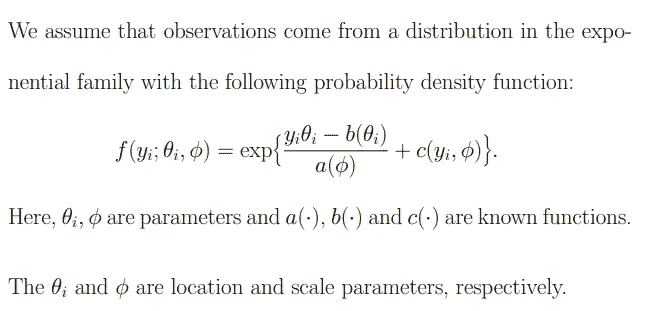
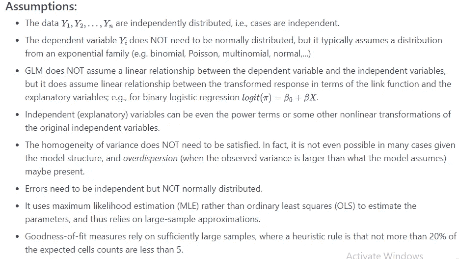

# 一般线性模型是广义线性模型(GLM)的保护伞吗？是的…那怎么做？

> 原文：<https://medium.com/geekculture/why-generalized-linear-model-glm-f0a72c131cda?source=collection_archive---------40----------------------->

大家好，我已经很久没有写关于媒体的文章了。但是现在我会试着多写一些。我将使用 GLM 作为广义线性模型的简称。

因此，我在这里的重点是给出一个关于为什么广义线性模型(GLM)成为应用统计学家的主要工具的基本想法。我相信我们很多人都听说过线性回归、多元线性回归、逻辑回归、泊松回归、二项式回归以及一般线性模型。请注意，当我使用术语一般线性模型时，我不需要包括线性回归、多元线性回归，因为线性回归和多元线性回归只是特定的线性模型。但是因为这些是更熟悉的术语，所以我用了它们。请注意，术语*一般线性模型*通常指给定连续和/或分类预测值的连续响应变量的常规线性回归模型。它包括多元线性回归，以及方差分析和协方差分析(只有固定效应)。

在去 GLM 之前要知道的一件重要的事情是了解反应的类型。注意下图:-

所以我想让你把注意力集中在那个突出显示的方框上，这意味着易应该遵循正态分布。因此，我们主要在下列情况下使用一般线性模型

1.  我们的响应变量和误差项遵循正态分布。
2.  响应和解释变量之间的关系是线性的。
3.  误差是同方差和不相关的。
4.  如果自变量不相关。

但是在现实生活中情况并不总是正常的对吗？那么如果情况变得不正常，我的意思是如果我们的反应和错误是不正常的，然后呢？我们可以进行适当的变换，但不能同时满足所有的假设。在转换一般线性模型中的数据后，我们还面临其他几个问题，但我不会在这里讨论它们。

因此，**广义线性模型(GLM)是广义线性模型的灵活推广，它允许响应变量具有正态和非正态分布的误差分布模型。它允许线性预测值(例如 b0+b1*X)通过称为链接函数的函数与响应相关联。**

我希望你到这里之前，对 GLM 有一个基本的概念。GLM 是一个更广泛的模型类别，允许处理正常反应和非正常反应，如分类反应，计数反应，比例反应等。所有这些类型的响应都使用一些已知的概率分布进行建模。它们都有一些共同的性质，属于指数家族。这里来看看指数族:-

如果你能写出上述形式的概率分布，那么你的分布将属于指数分布族，属于指数分布族的例子有二项式分布、泊松分布、正态分布、指数分布等。

术语 ***广义线性模型(*** GLM)指的是一大类模型，曾被麦库拉和内尔德使用。理解 GLM 框架有三个重要的概念。

1.  **随机分量**:-表示响应 yi 的概率分布。
2.  **系统成分** :-解释变量的线性组合。
3.  **链接功能** :-定义响应的期望值如何与解释变量的线性预测值相关联。

这些模型遵循以下假设。

**注意**当误差独立且服从正态分布时，一般线性模型是特定的 GLMS。并且链接函数是恒等式，因为在一般线性模型的情况下，我们直接对均值建模。

## **结论:-**

我在这里的目的是给出一个简短的概述，为什么我们需要 GLM，当已经有这么多的统计算法。因此，在本文中，我们首先了解了一些著名的统计算法，如线性和多元线性回归，方差分析，但我们意识到这些是一个更广泛类别的特定模型，称为一般线性模型。然后我们回顾了一般线性模型的假设，并意识到在现实生活中同时满足所有这些假设是相当困难的。然后我们简单介绍了另一个叫做 GLM 的类，它也可以处理我们正常和非正常的忧虑。后来，我们看到了一些重要的概念，以理解 GLMs 的框架，然后概述了这一大类模型所遵循的一般假设。最后我们认识到一般的线性模型是一种特殊的广义线性模型。

请留下您的反馈，如果您喜欢，请鼓掌并与您的家人分享。你的赞赏将激励我在这个主题上写得更深入。为了理解这个主题，我建议你浏览一下参考资料。

## **参考资料:-**

1.  广义线性模型导论，第二版。
2.  朱利安.拉远对线性模型的扩展。
3.  [https://www.ime.usp.br/~abe/lista/pdftGzimaFtH4.pdf](https://www.ime.usp.br/~abe/lista/pdftGzimaFtH4.pdf)
4.  [https://online.stat.psu.edu/stat504/lesson/6/6.1](https://online.stat.psu.edu/stat504/lesson/6/6.1)