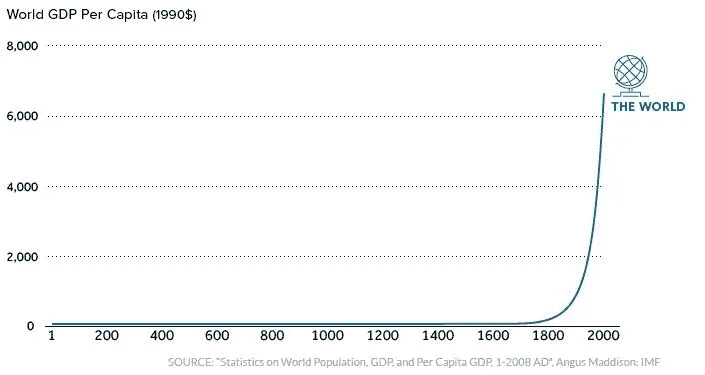

# 为什么人工智能在语言和艺术方面进步如此之快？

> 原文：<https://medium.com/geekculture/why-is-ai-advancing-so-rapidly-in-language-art-da4990fa76e7?source=collection_archive---------2----------------------->

## 机器智能指数增长的核心悖论。

当我第一次开始第二幅画[的时候，我知道艾已经越过了一条我们永远无法回头的线。](https://1secondpainting.com/)

随着时间的推移，机器的能力越来越强。然而，我(和大多数其他人)一直认为他们的能力会被归入简单、单调的任务。

例如，操作一条装配线，或者组装一辆汽车:这些都是人工智能“擅长”的事情，我对此一直都很满意。

但是 2020 年的事件改变了一切。

短短几个月内——人类与技术的长期关系中的一瞬间——现代人工智能*毕业了*。那年 6 月， [GPT-3](https://openai.com/api/) 向更广泛的公众发布。12 月，生成机器艺术中最具影响力的进步之一 [VQGAN](https://arxiv.org/abs/2012.09841) 引起了巨大的轰动。

人工智能第一次再现了人类的创造力。艺术、设计和语言，这些传统上被认为是人类本质的概念，不再被搁置。很少有人知道为什么。

然而，这种增加机器能力的模式实际上是在大约 40 年前*首次预测到的*。作为一个社会，我们可以用它来帮助告知我们下一步要去哪里。

# 莫拉维克悖论

20 世纪 80 年代末，计算机科学家和机器人专家汉斯·莫拉维克提出了一个有趣的悖论。

换句话说，计算机很容易做人类觉得困难的事情(智能)，而计算机很难做我们觉得容易的事情(感知和移动)。

例如，做高级数学的能力是人类敏锐智力的标志。大多数人发现这非常困难，需要多年的专注学习才能解决普通微积分教科书中的一小部分应用题。

但是机器可以毫不费力地完成任何层次的数学运算。无论是线性代数还是微分几何，对他们来说都只不过是简单的算术。

# 从计算到文化

这是一个你可能已经很熟悉的比喻:计算机总是擅长…嗯，*计算。这就是我们最初制造它们的原因。*

但是现在，它不仅仅局限于数学:莫拉维克悖论开始适用于所有的智能任务，而不考虑领域。包括语言、形式推理和艺术创造力。

[GPT-3](https://www.technologyreview.com/2020/08/14/1006780/ai-gpt-3-fake-blog-reached-top-of-hacker-news/) 已经可以比一般的大学毕业生写得更好了； [DALL-E 2](https://openai.com/dall-e-2/) 和 [Imagen](https://imagen.research.google/) 比一般艺人更娴熟；像 [LaMDA](https://blog.google/technology/ai/lamda/) 和 [Flamingo](https://arxiv.org/abs/2204.14198) 这样的一系列新语言模型现在正在解决复杂的推理问题，而这些问题是聪明的人类经常会遇到的。

再过几年，人工智能很可能能够创作出世界级的艺术作品、长篇书籍和白皮书，以及近乎无限复杂的歌曲。简而言之:它将是负责推进人类文化的机器。

但是为什么呢？人工智能是如何在短短几年内完成人类花了几千年才做对的事情的？

# 人类擅长感知和移动——除此之外别无其他

从进化史的角度来看就简单多了。人类大脑为了生存而进化的时间比我们为了逻辑、推理或艺术等深奥的追求而进化的时间要长得多。

与此同时，移动性——也就是行走、奔跑、抓取东西和保持平衡——对我们来说太容易了，以至于我们甚至没有想到它们。它们发生在潜意识中。数百万年来，我们的大多数大脑都在不断优化，以使它们变得正确，可以说，人类实际上是为运动而生的。

但是写下一个莫比·迪克，或者推理一个难题？这些在我们的历史时间线中相对较新，所以进化没有时间建立流线型的大脑结构来照顾它们。因此，它们需要大量的思考、专注和工作。

所以不一定语言、艺术、意义都是很难掌握的问题。在我们看来，它们更像是那样，因为人类总是用非常有限的一套工具来接近它们。当我们向现代人工智能提供这样的问题时，它不会像我们一样感觉到内在的困难，因为，就像莫拉维克认为的那样，*计算机很容易完成我们发现很难的任务*。

# 为什么机器人要和三明治做斗争

与此同时，仍然有一些人类做的非常简单的事情对机器来说非常困难。例如，考虑制作火腿和奶酪三明治这一不明确的任务。

人类这样做的“算法”包括 1)找到面包，2)把它放在柜台上，3)打开火腿和奶酪，4)组合原料。然后，你把其他东西放回冰箱，开始大嚼。

另一方面，计算机很难处理这样的任务，这主要是因为感知和移动性。

让我们假设现在是 2050 年，一种通用的“助手”机器刚刚被创造出来，用来帮助人们做家务。以下是做火腿和奶酪三明治需要考虑的一部分:

*   冰箱相对于我的身体在哪里？
*   当我试着开门时，会有多大的阻力？
*   在不影响重心的情况下，我能倾斜多远？
*   我要拿的容器大约有多重？
*   在抓住它的时候，我需要施加什么样的力来确保它不会滑动呢？
*   里面有什么样的物体？我的移动会如何影响它们——如果我移动得太快或太用力，我会压碎它们吗？
*   我应该多用力把它放在柜台上？

..这甚至是在*开始*把它放在一起之前！

光是让机器人走 T2 路(T3 路)就需要极大的工程创造力，更不用说做开门或做前面提到的三明治这样的普通任务了。与此同时，人类儿童可以不费吹灰之力就完成这些任务。

这就是莫拉维克所说的“很难或不可能让(机器)拥有一岁儿童的感知和移动能力”的核心意思。我们的大脑下意识地处理大量与感知和移动性相关的信息，以至于对我们来说，它们是世界上最简单的任务。

# 经济因素

这应该让你对为什么*智能模型*——那些专注于语言和推理的智能模型——相对于它们的机器人同行进步如此之快有所了解。

但它不止于此。除了范围的问题，还有巨大的经济力量在鼓励市场快速解决智能问题。

首先，这无疑是历史上最令人印象深刻的经济壮举。一个具有足够带宽的通用语言模型的金融价值将是任何民族国家的 10 倍:所有的娱乐、谈判、R&D 和商业都将是自动化的，每项任务的质量都将比人类的能力高出几个数量级。

[我已经在之前的帖子](https://nicksaraev.com/the-socio-economic-impact/)中详细说明了原因，所以我不会在这里赘述。但我只想说，如果你将一个超智能语言模型与一个三明治制造商的预期经济效用进行比较，很明显风险投资公司会选择哪一个。

此外，软件比硬件更容易迭代。前者只需点击一个按钮，就可以立即部署到数百万台设备上；后者需要物理升级、维护和后勤考虑。这些增加了成本、可口性以及随之而来的困难。

人类*最终将*转向感知和移动。但是在像语言、艺术和推理这样的智能任务大部分被解决之前。而且，到那时，人工智能更有可能成为研发的先锋

# 最后的想法

简而言之，[莫拉维克悖论](https://en.wikipedia.org/wiki/Moravec%27s_paradox)是人工智能在语言和艺术方面发展如此迅速的原因。这也是它在机器人和运动方面明显落后于我们预期的原因。

如果有足够的时间，很明显，人工智能最终将在每个相关领域超越人类智能。但与此同时，请记住，对我们来说最自然的技能往往是机器最难学习的——并为不久的将来做好计划，这就是情况。