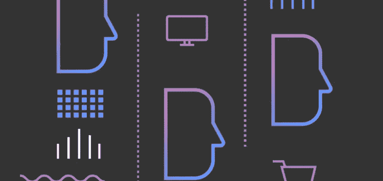

# 为什么营销、销售和产品团队使用的云 SaaS 工具会产生数据孤岛

> 原文：<https://medium.com/geekculture/why-the-cloud-saas-tools-used-by-marketing-sales-and-product-teams-create-data-silos-bd67aca485a4?source=collection_archive---------42----------------------->

在过去的 5 年里，云 SaaS 工具在许多方面使开发人员和数据工程团队的工作变得更加容易。最深刻的改进之一是团队能够“外包”核心功能的构建和基础设施管理。

Stripe 管理支付基础设施，Okta 负责 SSO，Algolia 提供强大的搜索等等，这是开发软件的好时机。

> ***谈到客户数据，尽管云 SaaS 明面上经常讲述一个不同的故事。***

不缺乏强大的软件来创造受众，运行用户分析和其他用例，所有这些对于营销和产品等下游团队都是有价值的。然而，大多数系统的构建方式给数据工程师带来了意想不到的后果:额外的数据孤岛，这几乎总是意味着某种集成项目或某种程度上的安全性讨论，或者至少是围绕平台间数据差异的挑战。

在本帖中，我们将探讨“云 SaaS 客户数据孤岛”问题背后的原因，然后讨论许多现代数据工程团队构建其数据堆栈以缓解挑战的方法。

# 面向客户数据的云 SaaS 工具如何制造额外的数据孤岛

大多数利用客户数据的云 SaaS 工具都是为最终用户构建的，通常是产品、营销或销售团队(这很有意义)。然而，对这些团队的关注意味着在平台本身内激活数据*的易用性是重中之重。*

其结果是，不被重视的或遗留的数据结构、数据收集方法和 API 使得将数据导入和导出平台变得既麻烦又耗时。任何使用 CRM、营销自动化工具或第三方 CDP 的数据工程师都经历过这种“集成地狱”形式的动态

集成地狱可以采取多种形式，但常见的抱怨包括用来自各种工具的 JavaScript 片段使站点过载，弄清楚如何导出和连接来自不同系统的数据以创建干净的表格来驱动报告，或者迁移的巨大痛苦，这需要大量数据，因为模式是如此不同。

有意设计用于集成到现有数据堆栈中的工具和下游团队使用的云工具之间存在显著的差异。对于数据工程师来说，这种差异往往会让营销和销售产品显得过时。

现在，好消息是有大量的新工具使这变得更加容易，但是我们将在后面的文章中谈到这一点。

首先，值得更深入地探讨这个问题——集成的痛苦是一种症状，但真正的问题对组织的危害要大得多。

# 云 SaaS 工具如何限制数据的数量、类型和丰富程度

在我们越过听起来像是在贬低真正令人惊叹的产品的价值的界限之前，我们想弄清楚，今天营销、销售和产品使用的系统确实令人难以置信。从个性化到产品分析，这些现代 SaaS 工具直接支持其用户实现令人难以置信的增长和洞察力。

大多数情况下，问题不在于工具本身，数据工程师面临的挑战是，它们是为了从数据中获取价值而构建的，而不是提供集成的数据基础架构。

以下是我们认为数据工程师面临的这一挑战的各种表现方式:

# 不完整数据

通常会有内部数据，其中大部分可能是敏感的(即事务性数据)，这些数据不会与下游工具共享，这意味着情况本质上是不完整的。

除此之外，许多系统无法处理各种类型的数据。依赖基于事件的数据结构的工具不管理结构数据，反之亦然。

# 捕获的数据

云工具面临的另一个挑战是，它们创造的价值经常“被困”在工具中。以群组分析为例:许多工具能够实现令人惊叹的报告，让您共享仪表盘，并允许您导出用户组，但底层数据集和逻辑并没有作为一个整体联合到数据堆栈，这意味着必须在其他领域重新创建工作。

# 供应商锁定

一些云工具确实有相当健壮的集成，甚至仓库导出，这非常方便。尽管如此，许多数据工程师面临的挑战是，利用下游团队用于关键客户数据基础架构的云工具存在风险。团队改变他们使用的工具，如果该工具也支持关键集成，这可能会将数据工程团队送回集成地狱。

# 仓库作为二等公民

最后但同样重要的是，许多工具提供的集成将数据仓库视为二等公民，优先考虑与其他云工具同步。这对下游团队来说很有意义，但是对于数据工程师来说却是一个棘手的问题。

# 解决方案:仓库优先的基础设施

现代数据工程团队正在通过以下方式解决围绕数据孤岛和数据收集的问题:1)重新思考数据仓库在其客户数据堆栈中的作用；2)将云工具与数据基础架构分离，并利用不会产生额外孤岛的管道工具。

首先，将*所有*的数据收集到数据仓库中是重中之重。这是通过 ETL 集成或在收集过程中(如事件数据)完成的，或者利用可以很好地完成这两者的工具。

即使你完成了无处不在的数据捕获，真正的力量还在于将仓库视为*源*，有效地将仓库转变为客户数据平台。

支持此功能的基础设施工具是为解决数据孤岛问题而特意构建的。例如， [Hightouch](https://www.hightouch.io/) 允许您根据您的仓库数据组织强大的营销活动。

更不用说[方向舵栈](http://www.rudderstack.debugme.in)了:我们被设计为*而不是*保存任何数据，并且可以直接将你的仓库变成你更大的数据管道的来源。我们推出了 [RudderStack Cloud](https://resources.rudderstack.com/rudderstack-cloud) ，让您不仅可以收集、转换和发送客户活动数据到数据仓库，还可以使用您喜欢的实时流媒体服务和云应用。

在这种新的范例中，高级数据工程团队正在使用开发人员优先的工具，这种工具通常是开源的，以从他们的仓库中获得非孤立的见解。([DBT 中心](https://hub.getdbt.com/)的车型就是一个很好的例子。)

# 展望光明的未来

数据孤岛仍然是大多数组织的一个主要问题，但好消息是，数据团队的重要性正变得越来越明显，随着仓库技术以及支持自有、集中式数据的工具的不断进步，利用云工具变得越来越容易，也越来越安全，而不必担心会产生更多的数据孤岛。

# 今天试试方向舵堆栈

开始构建更智能的客户数据管道。使用你所有的客户数据。回答更难的问题。向您的整个客户数据堆栈发送见解。今天就报名参加[舵栈云免费](https://app.rudderlabs.com/signup?type=freetrial)。

加入我们的 [Slack](https://resources.rudderstack.com/join-rudderstack-slack) 与我们的团队聊天，查看我们在 [GitHub](https://github.com/rudderlabs) 上的开源报告，订阅[我们的博客](https://rudderstack.com/blog/)，在社交上关注我们: [Twitter](https://twitter.com/RudderStack) 、 [LinkedIn](https://www.linkedin.com/company/rudderlabs/) 、 [dev.to](https://dev.to/rudderstack) 、 [Medium](https://rudderstack.medium.com/) 、 [YouTube](https://www.youtube.com/channel/UCgV-B77bV_-LOmKYHw8jvBw) 。不要错过任何更新。[立即订阅](https://rudderstack.com/blog/)我们的博客！

*原载于 https://rudderstack.com***。**