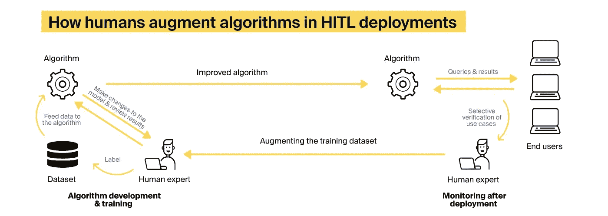
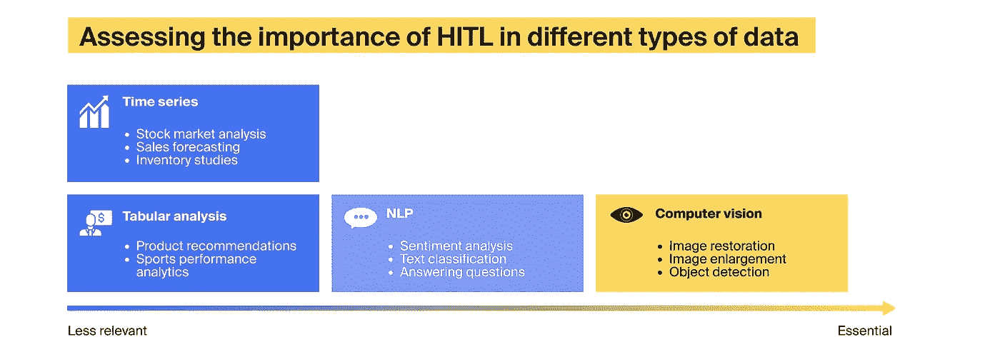
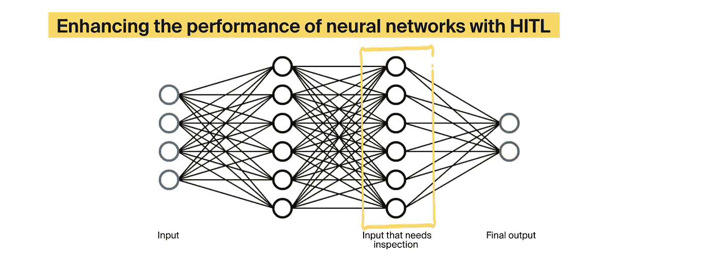

# 为什么要使用人在回路的机器学习方法

> 原文：<https://medium.com/geekculture/why-use-human-in-the-loop-machine-learning-approach-5f0e3dc5c571?source=collection_archive---------14----------------------->

你听说过在亚利桑那州撞死一名妇女的自动驾驶优步汽车吗？在另一个场合，一个面部识别解决方案将一名无辜的有色人种男子描述为新泽西州的一名罪犯，亚马逊的人工智能招聘工具显示出对女性候选人的偏见。

显然，人工智能会犯错误。重大的，甚至改变人生的错误。那么，我们如何才能在消除这种错误的同时，仍然获得人工智能的好处呢？一种选择是让人类专家在部署后培训、评估和监控人工智能商业解决方案。这个概念被称为人类在回路(HITL)机器学习。Gartner 预测，在某些行业，到 2025 年，HITL 人工智能解决方案将[占所有自动化产品的 30%左右。](https://www.gartner.com/en/newsroom/press-releases/2022-02-15-gartner-predicts-that-human-in-the-loop-solutions-will-comprise-30-percent-of-new-legal-tech-automatiotion-offerings-by-2025)

我们与我们的人工智能专家 [Maksym Bochok](https://www.linkedin.com/in/maxym-bochok-5b9496159/) 进行了交谈，以了解人类如何融入这个循环，他们带来了哪些好处，以及如何组织这个过程。

# 人在循环中的定义和好处

> 犯错是人之常情，真正把事情搞砸需要一台电脑。

——保罗·厄尔里西，德国医生，诺贝尔奖获得者

现在，埃利希的引用比以往任何时候都更有意义。随着人工智能处理关键应用程序，误差幅度越来越小。机器也不是完美的。他们基于接收到的训练数据建立对任务的理解，并且可能做出错误的假设。

这就把我们带到了人在回路中的机器学习术语。

> *Human in the loop 意味着将人类员工集成到机器学习管道中，以便他们可以持续训练和验证模型。这包括所有与模型及其训练数据打交道的人。*

# 人在回路中如何增加机器学习算法的价值

*   **保持高水平的精度**。这对于不能容忍错误的领域尤其重要。例如，在制造飞机的关键设备时，我们希望自动化和速度，但我们不能危及安全。HITL 在不太关键的应用中也是有益的。例如，在文件监管合规性方面严重依赖人工智能的大型咨询公司[让人类参与循环机器学习](https://analyticsindiamag.com/why-the-big-four-audit-firms-pwc-ey-deloitte-kpmg-are-investing-heavily-in-artificial-intelligenc/)，以验证他们的自然语言处理算法。
*   **消除偏见**。机器学习模型[在训练过程中会变得有偏差](https://itrexgroup.com/blog/ai-bias-definition-types-examples-debiasing-strategies/)。此外，在部署后，随着他们不断学习，他们可能会产生偏见。人类员工可以通过相应地纠正算法，在早期阶段检测并消除这种现象。
*   **确保透明**。ML 算法评估数千甚至数百万个参数来做出最终决策，而且往往无法解释。有了 HITL，就有了一个理解算法如何工作，并能证明算法所做决定的人。这叫做[可解释的 AI](https://itrexgroup.com/blog/explainable-ai-principles-classification-examples/) 。例如，当一个人申请贷款被拒绝时，他们可能会要求信贷员解释拒绝背后的原因，以及申请人可以做些什么来增加下次的机会。
*   **开启就业机会**。我们经常听到 AI 抢人饭碗的事情。有人类参与的机器学习提供了一个技术如何创造新空缺的例子。看看[印度数据注释器](https://www.dailyo.in/technology/data-labelling-artificial-intelligence-indian-ai-sector-facebook-technology-32396)市场就知道了。

# 人类在人工智能管道中的角色

Maksym 解释了人类如何成为人工智能管道的一部分，以增强其预测能力。机器学习模型在监督或无监督学习模式下运行。在*监督学习*的情况下，人们可以执行以下任务:

*   **标签和标注**。人类雇员标记训练数据集。根据所需的专业知识，这可以是领域专家或任何受过适当培训的员工。
*   **重新设计模型**。如果需要，ML 工程师和程序员可以对算法进行调整，以确保它可以从提供的数据集获得最佳效果。
*   **培训和再培训**。员工向模型提供带注释的数据，查看输出，进行更正，如果可能的话添加更多数据，并重新训练模型。
*   **监控模型部署后的表现**。在客户端部署人工智能解决方案后，人在回路中的机器学习生命周期不会停止。ML 工程师在客户同意的情况下继续监控其性能，并在需要时通过选择性验证其输出对模型进行调整。通过选择性验证获得的案例将扩充初始训练数据集，以提高算法的性能。

在*无监督机器学习*中，算法将未标记的数据作为输入，自行寻找结构。在这种情况下，人类不会注释数据集，也不会在初始训练中过多干预。但是他们可以通过执行上面的步骤 4 来极大地丰富模型。

# 当人在回路中时，机器学习是绝对必要的

Maksym 认为，人在循环的方法对大多数机器学习用例都是有益的。当在大型广泛的数据集上训练时，人工智能解决方案在做出最佳预测方面令人印象深刻，而人类可以从有限的低质量数据样本中识别模式。将两种能力结合在一起可以创建一个强大的系统。尽管在某些应用中，ML 模型可以在有限的人工干预下做得很好，但在某些情况下，完全成熟的人在回路系统中是必须的:

*   当算法的任何错误都可能代价高昂时，例如在[医疗诊断](https://itrexgroup.com/blog/artificial-intelligence-in-radiology-use-cases-predictions/)中。
*   当正确训练算法所需的数据不足时。更多的训练数据总是等于更好的模型性能。在后期制作模型监视的帮助下，您可以用相关的样本增加训练数据，为模型提供更多可以学习的示例。
*   在一次性学习的情况下，当算法在数百甚至数千个样本上训练以对一些对象进行分类时。然后添加另一个类，算法必须学会仅从几个训练样本中识别它。
*   在受到严格监管的行业中，解释算法如何得出结论至关重要。例如，当医生使用 [AI 建议个性化癌症治疗](https://itrexgroup.com/blog/ai-in-cancer-detection-treatment-applications-benefits-challenges/)时，他们需要向患者证明这个治疗计划。

当查看 ML 算法处理的数据类型时，HITL 人工智能对于[计算机视觉应用](https://itrexgroup.com/services/computer-vision/)和自然语言处理(NLP)来说将是必不可少的，特别是当涉及到对可能包含讽刺的文本进行[情感分析](https://itrexgroup.com/blog/ai-sentiment-analysis-in-customer-service-use-cases-benefits-expert-tips/)时。HITL 对于表格数据和时间序列分析不太重要。

# 关于通过人在回路实践增强人工智能的提示

Maksym 提供了以下关于如何在机器学习中成功实施人在回路方法的技巧:

*   当在部署后监控和分析算法的性能时，无论回路系统中的人有多好，人类参与者都不可能注意到算法处理的每个输入和它生成的每个输出。明智地选择你的案例。使用选择性验证来挑选值得您关注的案例。Maksym 建议采用以下方法进行明智的案例选择:
*   基于**置信水平**。例如，一个算法需要将每个输入图像分类为猫或狗。接受大约 48/52 或任何类似置信度水平的图像是混淆算法的图像，并且需要被适当地标记并用于重新训练模型。
*   **随机核查**的“琐碎”案例。让我们假设，就算法的性能而言，只有十分之一的情况包含有价值的信息。这种情况的一个例子是当模型对错误的预测过于自信时。您肯定应该考虑这种情况，但是您也需要从剩余的九种情况中随机选择一种，以确保算法不会因为错误的预测而变得过于自信或允许偏差。
*   在分析你上一步挑选的案例时，不要把自己局限在最后的结果上。不要查看神经网络中最后一组神经元的输出，而是检查前一层，如下图所示，并分析错误预测和算法做出的最接近的正确预测之间的距离分布。

*   鼓励算法的最终用户对其性能给出反馈。构建反馈表并提供给每个人，以便用户可以传达他们可能有的任何问题。
*   使用前面步骤中的数据点不断迭代扩充训练数据集。这样，即使客户端的操作发生了一些变化，您也可以确保您的算法仍然是相关的。

# 现成的 HITL 支持的人工智能工具

有一些现成的人在回路机器学习工具，允许您标记训练数据集并验证结果。然而，您可能无法用这些标准化的工具实现上面的提示。以下是几个人在回路工具示例:

[谷歌云 HITL](https://cloud.google.com/document-ai/hitl)

该解决方案提供了一个工作流和一个用户界面(UI ),人们可以利用它来标记、检查和编辑从文档中提取的数据。客户公司可以使用他们自己的员工作为贴标员，也可以雇佣谷歌 HITL 的员工来完成这项任务。

该工具具有某些用户界面功能，可简化贴标机的工作流程，并根据可信度阈值过滤输出。它还允许公司管理他们的标签池。

[亚马逊增强人工智能(亚马逊 A2I)](https://docs.aws.amazon.com/sagemaker/latest/dg/a2i-use-augmented-ai-a2i-human-review-loops.html)

这个人在回路中的人工智能工具允许人们回顾低置信度和随机的 ML 预测。与只对文本进行操作的谷歌云 HITL 不同，亚马逊 A2I 可以补充亚马逊识别，以提取图像并验证结果。它还可以帮助查看表格数据。

如果客户对提供的 A2I 工作流程不满意，他们可以使用 SageMaker 或类似工具开发自己的方法。

[DataRobot 卑微的 AI](https://www.datarobot.com/blog/introducing-datarobot-humble-ai/)

Humble AI 允许人们指定一组规则，ML 模型在进行预测时必须应用这些规则。每个规则都包括一个条件和一个相应的操作。目前，有三种操作:

*   **无操作**，此时人只是监控相应的情况而不干预
*   **超越预测**，这时人们可以用不同的值替换模型的输出
*   **返回错误**，完全放弃预测

# 那么，有人类参与的机器学习对你来说是最好的方法吗？

采用人工智能方法提高了预测的准确性、透明度和质量。在创造就业机会的同时，由于人为干预，它还增加了完成任务所需的成本和时间，这是一个积极的副作用。

尽管 HITL 人工智能有明显的好处，但在有些应用中，由于某些活动的风险，人不在回路中是一种更好的方法。想想自主武器开发和部署。

如果你觉得你的 ML 算法可以在循环中使用人类，但你不确定如何平衡运营成本和期望的准确性和可解释性，请联系[机器学习顾问](https://itrexgroup.com/services/machine-learning-development/)。他们会和你一起找到合适的。如果人类在回路中的机器学习不是你的最佳解决方案，还有其他 ML 技巧可以帮助你克服训练数据稀缺的问题:

*   **转移学习**，当你用自己的数据微调预先训练好的模型
*   **半监督学习**，当你使用一个大的未标记数据集和少量的标记样本时
*   **自我监督学习**，当你屏蔽每批训练样本中的随机部分，算法试图预测它

> *您是否正在考虑提高您的 ML 模型的准确性和可解释性？* [*取得联系*](https://itrexgroup.com/contact-us/) *！ITRex 人工智能专家将研究您的情况，并设计一种最佳的人在回路方法来满足您的需求。*

*原载于 2022 年 7 月 17 日*[*https://itrexgroup.com*](https://itrexgroup.com/blog/why-use-human-in-the-loop-machine-learning-approach/)T22。