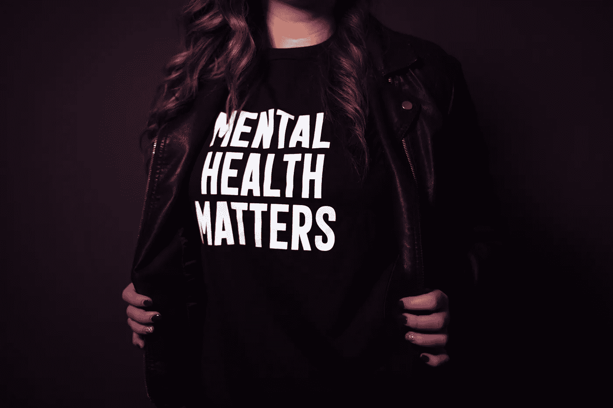
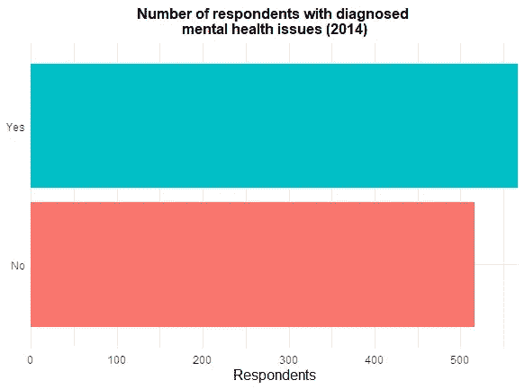
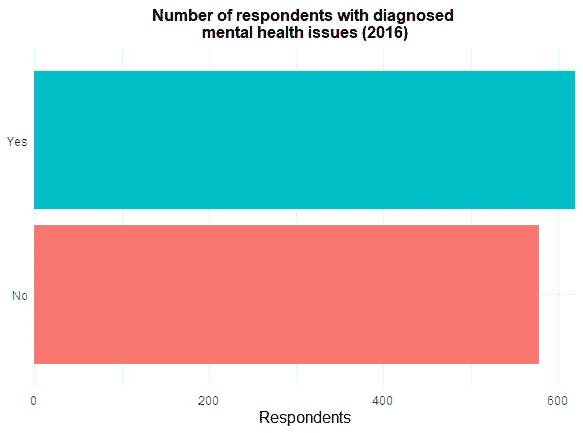
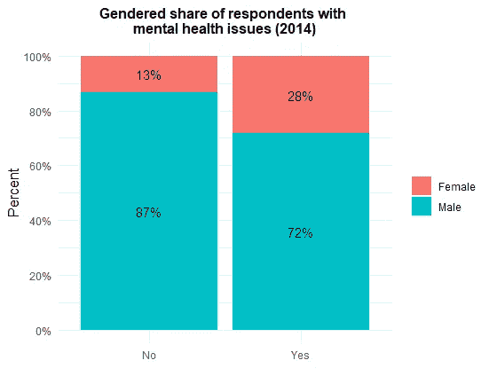
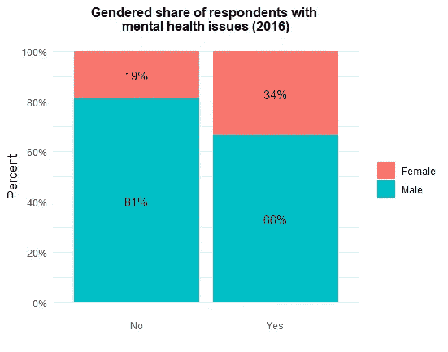
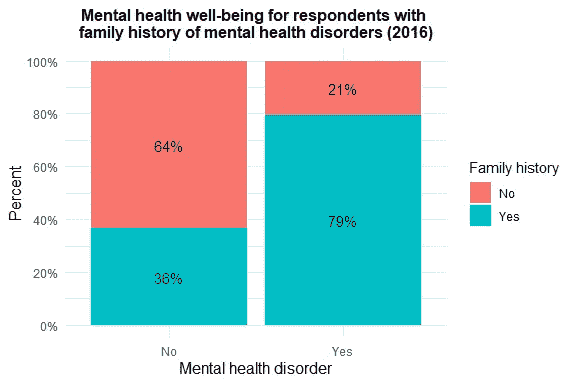

# 为什么职场心理健康需要更多关注

> 原文：<https://medium.com/geekculture/why-workplace-mental-health-needs-more-attention-4f102fbcfda7?source=collection_archive---------29----------------------->

2014 年和 2016 年，每 2 名员工中就有 1 人报告患有精神健康疾病

Photo by [Matthew Ball](https://unsplash.com/@tex450?utm_source=unsplash&utm_medium=referral&utm_content=creditCopyText) on [Unsplash](https://unsplash.com/s/photos/mental-health?utm_source=unsplash&utm_medium=referral&utm_content=creditCopyText)

五月是心理健康宣传月，自疫情开始以来已经过去了一年，心理健康仍然是迄今为止最紧迫和敏感的话题之一。众所周知，在疫情期间，社会孤立、恐惧和失去亲人只会进一步恶化全世界的心理健康状况。这导致卫生当局如疾病预防控制中心发布了关于如何[应对压力的指导方针。](https://www.cdc.gov/coronavirus/2019-ncov/daily-life-coping/managing-stress-anxiety.html)

精神健康最近受到更多关注的最大领域之一是工作场所。在疫情之前是这样，在疫情时期更是如此。一些 T4 公司努力确保员工在讨论和公开自己的心理健康时感到安全，以此来改善他们的工作体验和公司文化。远程工作看起来像是在工作中扔了一把扳手，因为它将同事转移到了孤立的空间，并导致一些人经历了“[变焦疲劳](https://en.wikipedia.org/wiki/Zoom_fatigue)”。

是的，疫情让事情变得更糟。但重要的是要明白，即使在疫情之前，工作场所的焦虑、压力和抑郁等心理健康问题也很普遍。在疫情之前，我分析了工作场所的精神健康趋势，重点是科技行业。众所周知，这个行业的员工存在严重的心理健康问题。使用来自[开源精神疾病(OSMI)](https://www.kaggle.com/anth7310/mental-health-in-the-tech-industry) 的数据集，该数据集在 2014 年、2016 年、2017 年、2018 年和 2019 年调查了受访者。

我分析了两件主要的事情:

1.疫情之前，科技行业的员工心理健康状况如何？

2.哪些个人因素可用于预测员工患精神健康疾病的风险？

## **员工已经在挣扎了**

在这两次调查中，超过一半的受访者被诊断患有精神健康障碍(2014 年受访者为 52.4%，而 2016 年为 51.7%)。这表明了工作场所精神健康障碍的严重性，以及雇主正面解决这一问题的必要性。

Bar Chart on Number of Respondents with Diagnosed Mental Health Disorders by [Fredrick Boshe](https://github.com/rickyboshe)

根据[医疗保健成本研究所](https://healthcostinstitute.org/images/pdfs/HCCI_2018_Health_Care_Cost_and_Utilization_Report.pdf)的一份报告，2014 年至 2018 年间，美国人均门诊精神病支出增长了 43%，而精神健康住院支出增长了 33%。2019 年完成的另一项[研究](https://www.kff.org/coronavirus-covid-19/issue-brief/the-implications-of-covid-19-for-mental-health-and-substance-use/)发现，在美国成年人口中，十分之一的人报告有焦虑或抑郁障碍的症状。在疫情期间，这一数字上升到约 40%的成年人。

报告的精神健康疾病水平因地区而异。由于这些调查是在选定的国家进行的，观察哪些国家的受访者患有精神健康疾病的比例最高是很有意思的。

65%的澳大利亚受访者被诊断患有精神健康疾病，这是被调查国家中的最高水平。德国最低，有 38%的受访者。

Map of Surveyed Countries by [Fredrick Boshe](https://www.linkedin.com/in/fredrick-boshe-238a3b32/)

## 精神健康障碍的可能性

纵观这些调查，有超过 100 个不同的问题是受访者自愿填写的。我选择了一个子集，我认为它可能有助于确定员工的心理健康。这些是年龄、性别、所在地、远程工作、精神疾病家族史和种族。

我的分析使用了**逻辑回归**、**决策树**和**随机森林**技术来预测调查中受访者的心理健康福祉。以下是突出的观察结果:

**性别:**与确定为男性的受访者相比，确定为女性的受访者报告精神健康障碍的可能性*是男性的两倍*。

Gendered response to Mental Health Diagnosis by [Fredrick Boshe](https://rickyboshe.github.io/Fredrick-Portfolio/)

**家族史:**如果被调查者有精神健康疾病的家族史，他们也有精神健康疾病的几率会增加 **2.7 倍。**

Family history of mental health disorders and respondent’s mental health well-being by [Fredrick Boshe](https://rickyboshe.github.io/Fredrick-Portfolio/)

**远程工作:**远程工作与受访者报告精神健康障碍的可能性有多大没有关系。

需要指出的是，调查的受访者(总共 2，282 名参与者)自愿提交了他们的回答，我使用这些信息来进行分析。更多信息和 [**完整代码**](https://rickyboshe.github.io/Machine-Learning/Mental.html) 可以在我的 [Github](https://github.com/rickyboshe) 上找到。

## 不重视心理健康的代价

与精神健康疾病相关的社会耻辱，以及由于缺乏认识和医疗费用上涨而难以寻求训练有素的专业人员的帮助，使得需要帮助的人更难得到治疗。一项[研究](https://healio.com/news/psychiatry/20190614/many-people-with-mental-health-disorders-do-not-receive-treatment)发现，由于前面提到的原因，10 个情绪障碍患者中有 6 个，10 个焦虑症患者中有 7 个没有接受医疗护理。

这影响了员工，增加了缺勤率，降低了他们的生产力，并导致大多数人离职。最近对美国 1500 名雇员的调查发现，60%的人认为他们的工作效率受到了心理健康的影响。而超过一半的人因为压力大的工作环境对他们的心理健康产生了负面影响而离职。这可能导致公司和整体经济的重大损失。在美国，每年有超过 2 亿个工作日因经济萧条而损失 170 到 440 亿美元。

如果你在一个高级职位上，读到这篇文章并认为你的工作场所很好，因为没有人提出心理健康幸福，请三思。大多数工作场所都存在泡沫，员工们为了不丢掉工作或职业道路而假装健康，尤其是在经济困难的一年。你的同事可能面带微笑，准时上班，从不错过会议或社交聚会，但在这一切背后，是脆弱的心理健康濒临崩溃。

显然，工作场所的心理健康影响的不仅仅是员工个人。是时候将心理健康放在组织的首位了。

## 前进的道路

疫情没有带来无尽的悲伤、忧郁和痛苦。但就像凤凰会痛苦地燃烧至死一样，这是一个从疫情的灰烬中重生的机会，也是一个重塑职场动态的机会。工作场所的心理健康支持不应该只是在心理健康意识月期间为了品牌和社交媒体影响力而提出来的。

无论员工的职位、背景和人口统计数据如何，它都应该深深地铭刻在工作场所文化中。我们需要打破车轮，努力避免被吹捧为继疫情之后的精神健康危机浪潮。

我们已经看到许多公司采用在家工作的模式，有些公司采用 4 天工作制。雇主需要投入更多的资源来降低工作场所引发精神健康障碍的风险，并将工作场所的精神健康作为其组织和文化的重要基石。

规范工作场所的心理健康对话，为有需要的人提供特殊支持和咨询，确保心理健康不会影响个人的职业机会。

更多的工作场所需要心理健康服务，以便能够识别、容纳和支持患有精神障碍的员工。提高员工的福利不仅能提升公司的品牌，帮助吸引和留住人才，还能提高员工的绩效，进而提高公司的绩效。据[估计](https://www.mentalhealth.org.uk/publications/how-support-mental-health-work)改善工作中的心理健康可以提高 12%的生产率。

像[疾病控制预防中心](https://www.cdc.gov/workplacehealthpromotion/tools-resources/workplace-health/mental-health/index.html) (CDC)和世界卫生组织(世卫组织)这样的全球性组织早就发现了工作场所精神健康紊乱的危险。世卫组织甚至制作了手册来帮助雇主和组织在他们的工作场所建立精神健康福利倡议。是时候我们意识到工作场所的精神健康需要占据中心位置了。

让我们重新想象我们如何处理工作场所的心理健康