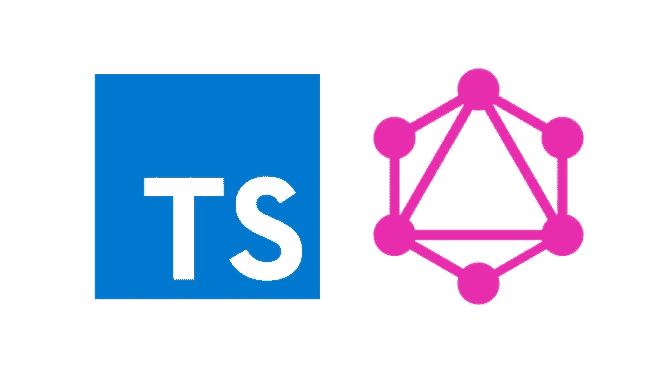

# 为什么应该使用代码优先的 GraphQL 开发(NexusJS)

> 原文：<https://medium.com/geekculture/why-you-should-use-code-first-graphql-development-nexusjs-422f3a507e47?source=collection_archive---------28----------------------->



如果您不熟悉构建 GraphQL 服务器，它需要两样东西:解析器和类型定义。简而言之，解析器是执行 API 调用的函数，类型定义是定义解析器输入(参数)和返回的内容的地方，然后将它们组合起来创建 GraphQL 模式。

创建这两个东西的标准方法是写出类型定义，例如，假设我有一个查询将返回我的所有用户，这些用户是具有用户名(string)、id (Int)和一个用于更改用户用户名的变体的对象。

在 GraphQL 中编写类型定义如下所示

这被称为模式优先开发。然后你可以用 Javascript 或 Python 等写一个解析器/函数。从数据库返回用户，另一个用于更新用户。

# 这样做有什么错？

当一个项目开始时，没有什么，我仍然喜欢模式优先，而不是用 REST API 开发。开始时，所有内容都在 schema.graphql 中，但是随着项目的扩展，您会将这个文件分割开来。然后，随着开发的进行，您可以更改查询返回的内容。这意味着找到你的类型定义中与你弄乱的函数相对应的部分，在 GraphQL 模式中改变它，然后测试解析器以确保 GraphQL 类型与返回的匹配，这变得…乏味。

拆分类型定义需要将文件合并在一起以创建一个工作模式，在 GraphQL 生态系统中有很多不同的方法可以做到这一点。最重要的是，当您创建一个 bug 时，Typescript 在查明 GraphQL 代码中的错误(同样，在任意数量的文件中)方面不是特别有用。

然后，您的解析器函数需要合并到一个如下所示的对象中。

```
{
    Queries{
        ReadUsers(){
        }
        ...All your other queries }
    Mutations{
        UpdateUser{
        }
        ... All your other mutations }}
```

同样，在 GraphQL 生态系统中有很多方法可以做到这一点，但以我的经验来看，这很快就变得一团糟。

# 另一种选择是代码优先

我上面提到的大多数问题来自于用两种语言创建模式并保持两者同步。TS/JS 的主包是 [Nexus](https://nexusjs.org/) 。有了 Nexus，你不用编写任何 GraphQL 代码，一切都是在 Typescript 中完成的。

这带来了多重好处:

*   您在同一个函数中编写类型定义信息和解析器。当您需要更改查询或变异时，它们都在同一个地方。
*   类型是强制的，但可以无缝更改。Nexus 有一个独特的开发设置，允许您编写的类型定义在解析器中实施类型安全。当您更改类型定义时，类型安全会在您保存后立即更新(当 ts-node-dev 重新启动时)。
*   错误在 Typescript 中。由于利用了 Typescript 的类型安全，95%的类型错误都被 VSCode 的智能感知所捕获，甚至当 Nexus 向您的终端打印某些内容时，它也会向您提供位置和可读的错误消息。
*   无需合并或模式拼接，只需将**所有内容**放入 Nexus 的模式中，它就会为您完成工作。

# Nexus 代码

对于设置，前往 nexusjs.org 的。相比之下，我将展示上面带有简单用户和查询/变异的示例。

上面的代码显示了类型定义信息与解析查询/变异的函数的集成。Nexus 最大限度地利用了 typescript，自动完成和智能感知带来了许多好处，这些好处只有通过编码才能看到。

我强烈建议你去看看，如果你用另一种语言编写代码，寻找代码优先的解决方案。

我发现远离编写 GraphQL 代码和类型定义是非常奇怪的，但是一旦我转换过来，我发现我的开发更快、更愉快。我担心尝试代码优先，主要是因为我使用的是 GraphQL 代码生成器，但是 Nexus 在没有 CLI 工具的情况下提供了 GQL 代码生成器的所有好处。展望未来，我看不到自己单独管理 GraphQL 代码。

感谢阅读。👍