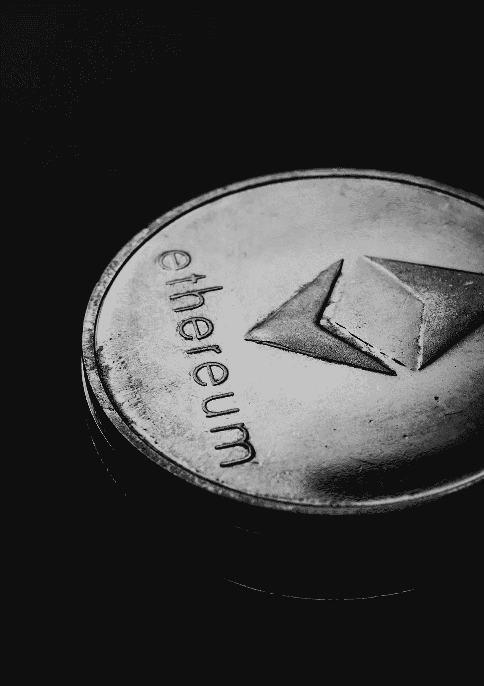
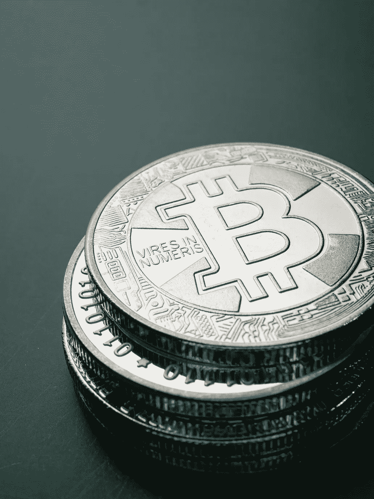

# 以太坊会超越比特币吗？

> 原文：<https://medium.com/geekculture/will-ethereum-dethrone-bitcoin-f11f7320aa38?source=collection_archive---------38----------------------->

## 以太坊可能比比特币更大的原因

如果你听说过比特币，很可能你也听说过以太坊。毕竟，按市值计算，它是第二大加密货币。以太坊是较新的，由一个开发团队在 2015 年成立，最著名的是 Vitalik Buterin 和 Gavin Wood。以太坊网络拥有大量活跃用户，并支持智能合约、非功能性交易和去中心化应用的创建——但这足以超越强大的比特币吗？让我们看一看。

# 翻转

以太坊通过市值超越比特币的想法已经存在了几年，它被称为“Flippening”。事实上，这个假设的事件有很多追随者，甚至有一个跟踪它的网站。如果你想知道为什么我对以太坊在市值上超过比特币感兴趣，那是因为市值是一种加密货币的采用和成功的更好指标，[这里](/geekculture/4-things-people-get-wrong-about-crypto-15a8fd6c8792)是我写的一篇文章，涵盖了这一点。作为世界上第一种加密货币，比特币具有先发优势，吸引了所有的注意力，并成为加密货币和区块链的代名词。在 2017 年牛市期间，比特币占加密货币总市值的 86%以上。尽管此后比特币的单价大幅上涨，但其市值却大幅下降，目前约为 43%。那么为什么比特币的市值大幅下跌，有可能跌破以太坊的呢？让我们看看过去发生的类似事情，类似于我们可以看到比特币在未来发生的事情。

# **雅虎和早期互联网**

在互联网的早期，雅虎是占主导地位的网站和搜索引擎。它的流量是其主要竞争对手 Excite 的三倍多。然而，随着时间的推移，雅虎被其他搜索引擎和网站超越，慢慢失去了市场份额。让雅虎在这个被称为“互联网”的新技术现象中独树一帜、走在前沿的东西，不再是雅虎的专利。越来越多的公司开始提供类似的服务和产品，一些公司做得更好，这意味着雅虎不再是独一无二的。我们会看到比特币发生类似的事情吗？比特币是第一个加密货币空间，并为其他加密货币的跟进铺平了道路，但它正在变老吗？是否有其他加密货币可以做比特币所做的事情，甚至更多？

# 对以太坊的探索

撰写本文时，以太坊的价格约为 2400 美元，市值为 2780 亿美元(第二高)。以太坊是一种类似比特币的去中心化、开源的加密货币。然而，以太坊的独特之处在于它的区块链。它是最活跃的区块链，有能力创建和运行智能合同和分散应用程序。以太坊的区块链让任何人都有可能创造自己的加密货币。此外，它还使通过其网络创建和交换 NFT 成为可能。有许多基于以太坊网络的加密货币，允许用户使用 Uniswap 等服务以分散的方式在它们之间进行交换。以太坊也在寻求从工作证明系统转变为股权证明系统(稍后讨论)，这将更加环保，赢得新的 Z 世代投资者的信任和尊重。

# 以太坊和比特币的区别

比特币是 2009 年由一个名为“中本聪”的匿名个人/团体创立的最大的加密货币。它完全是分散的和通货紧缩的，这意味着它没有中央权威来管理它，并且它的供应是有限的(准确地说是 2100 万)。随着时间的推移和对比特币认识的增长，加密专家们清楚地认识到，比特币的主要目的是作为价值储存手段。传统货币(法定货币)的问题是，大多数国家都有自己的货币，由他们的储备国家银行监管，通常这些国家可以印刷太多的货币，导致货币贬值，从而导致通货膨胀。仅在 2020 年，几乎 20%的美元被印刷出来，这肯定会对经济产生持续的负面影响。由于供应有限且没有中央权力机构管理，比特币避免了贬值的问题；本质上，作为一种对冲通胀的手段，很像黄金。

以太坊和比特币一样是去中心化的。然而，与比特币不同，以太坊没有有限的供应。有人提议在以太坊 2.0 中引入“燃烧”，这意味着以太坊的一定供应量将被烧掉，以解决通货膨胀的问题。虽然以太坊目前没有有限的代币供应，但它的效用、速度和采用程度是比特币无法比拟的。以太坊的区块链是最活跃的，比比特币的速度快得多。以太坊网络能够每 12 秒验证一次数据块，而比特币需要将近 10 分钟。它还能够创建和运行去中心化的应用程序、智能合同和非功能性交易。作为背景，NFT 市场在 2020 年增长了 299%,超过 2 . 5 亿美元，随着对 NFTs 的更多了解，这是一个不会消失的趋势。

因此，我们可以总结为，以太坊比比特币速度更快，在所有加密货币中拥有最活跃的区块链，并且由于其架构支持智能合约和去中心化应用程序，因此比比特币具有更大的效用。这比比特币更好吗？该不该开始挖比特币的坟墓？重要的是要认识到以太坊的用例与比特币的用例有很大不同。比特币的目的主要是像黄金一样作为价值储存手段。它不是为日常交易而设计的，所以它相当慢。块验证时间不一定是阻碍加密货币发展的一个问题。此外，还有针对比特币慢速网络的解决方案，如闪电网络，这将降低验证速度和费用。除了用例的不同，重要的是要注意以太坊也有一些问题，这些问题阻碍了它的发展。

# 以太坊完美吗？

虽然以太坊确实是人类创造力和创新的一个真正创新的作品，但像任何人类的创造一样，它并不完美。以太坊最大的问题之一是网络费用。[这里的](https://etherscan.io/gastracker)是一个记录网费的网站。这些费用可能变化很大，并且很容易受到流量的影响。通常情况下，在推出新硬币的过程中，用户对他们的交易收取更高的费用，以便网络优先处理。这些费用可能高达 500-600 美元(我真希望我是在夸大其词)。这个费用问题属于以太坊目前缺乏可扩展性的更广泛问题。以太坊 2.0 的推出正在解决这些问题。我在这篇文章中已经多次提到以太坊 2.0，所以让我们来看看它。

# 以太坊 2.0 —新的和改进的

当前的以太坊网络并不完美，但以太坊的开发者知道这一点，并正在努力解决这些问题。以太坊 2.0 旨在针对以太坊的一些弱点，并有望推动以太坊朝着正确的方向发展。以太坊 2.0 有两大变化/升级。

以太坊 2.0 的第一个变化是转向了利益相关系统。目前，以太坊使用工作证明，就像比特币一样。大多数加密货币使用工作证明或利益证明来验证交易。工作证明是加密货币中用于验证交易和挖掘新令牌的共识机制。其背后的主要思想是，它要求网络中的节点提供它们为解决密码问题集所做的计算工作的证明。如果你对这个概念不确定，看看这篇文章，它更详细地讨论了采矿。另一方面，利害关系证明不要求节点提供其工作的证明，而是通过个人持有的令牌数量来验证块和事务。利害关系证明被认为比工作证明更环保，因为不需要解决需要大量能量和计算能力的复杂密码问题。此外，对于利害关系证明系统中的攻击者来说，攻击者必须持有至少 51%的令牌，以便改变恶意行为的区块链。这使得股权证明成为加密货币非常安全的选择，尤其是以太坊，因为它是最活跃的区块链，这意味着几乎不可能获得 51%的令牌。

以太坊 2.0 的第二个变化是引入了分片。目前在以太坊网络中，任何数据都必须经过网络中所有参与节点的验证。虽然这有利于确保一致性和透明性，但这意味着整个网络的速度会受到最慢的参与者的限制。这造成了一个瓶颈，进而导致更高的交易费用，并降低了系统的效率。分片将通过将验证任务分解成更小的部分，并将其分配给不同的节点集来解决瓶颈问题。这允许网络利用并行处理，因为每组节点将在同一任务内的不同子任务上工作。这两个提议的改变将对以太网产生积极的影响，使其更快，更有效，并降低交易费用。

# 结论

以太坊绝对是一个伟大的项目，但我最喜欢的是它背后的团队。他们知道以太坊当前面临的问题，并积极解决这些问题，为网络和最终用户寻找最佳解决方案。是的，以太坊确实更新、更快，并为非功能性金融服务、去中心化应用和智能合约提供了一个平台——但它并不直接与比特币竞争。这两种加密货币有不同的用途，如果以太坊在未来几年取代比特币，我不认为这是比特币的死亡。比特币的主要用途是对冲通胀，以太坊并没有威胁要夺走比特币的这一功能。我确实认为以太坊有可能最终超过比特币的市值，但是，我认为这需要几年时间，如果这种情况发生，这两种硬币的市值肯定会达到数万亿美元。我希望你喜欢这篇文章，并了解更多关于以太坊以及它与比特币的不同之处。请在评论中告诉我你的想法，并关注更多文章。

本文仅供参考，仅代表我个人观点。不应将其视为财务或法律建议。在做任何重大财务决定之前，先咨询财务专家。