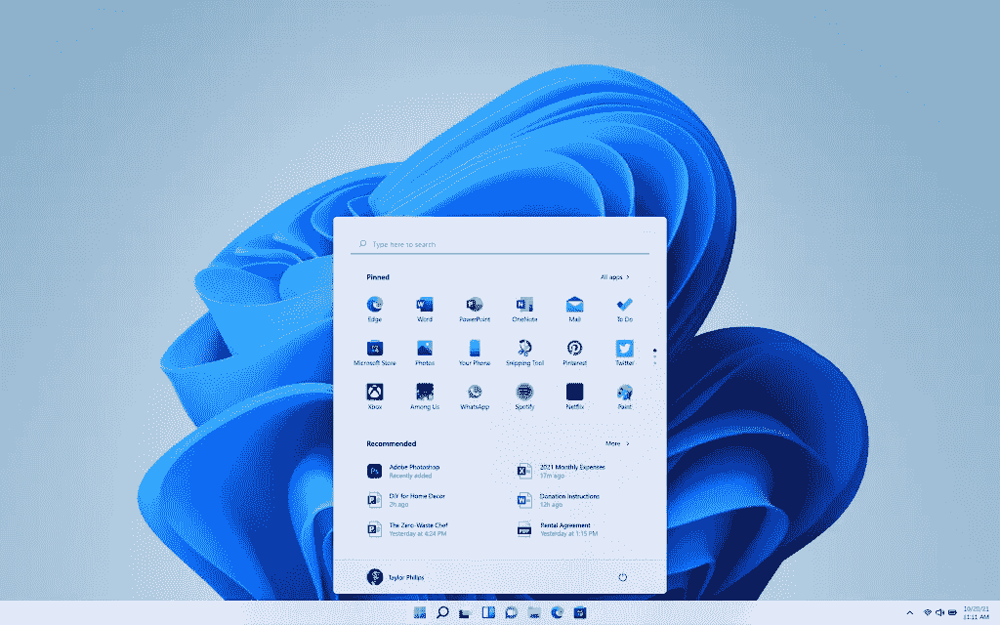

# Windows 11 的安全推动可能会伤害更多的用户，而不是帮助他们

> 原文：<https://medium.com/geekculture/windows-11s-security-push-may-hurt-more-users-than-it-helps-bb68c15a4f14?source=collection_archive---------41----------------------->

## 在疫情时代硬件短缺的情况下，微软在新硬件上的赌博令人惊讶

Official Windows 11 marketing image from Microsoft.

前几天，微软[发布了一个免费工具](https://www.microsoft.com/en-us/windows/windows-11)，让你检查你的电脑是否有资格升级到 Windows 11，用户马上就注意到有问题了。简而言之，只有近几年生产的 CPU 才能升级到微软最新的操作系统。您的机器中有比第八代英特尔芯片更老的产品吗？不好意思，该买升级了。

这让我的社交媒体时间轴*爆炸了。余波仍未停止。*

在前疫情时代，这可能不会如此严重。但是现在，计算机设备很难得到。对在家工作系统的巨大需求，加上一些制造失误，对市场造成了前所未有的巨大冲击。虽然一些部件刚刚开始再次进入商店，但现在似乎不是在主流电脑市场上强制升级的时候。当然，并不是每个人*都有*在今年晚些时候升级到微软的新操作系统，但随着 Windows 10 的截止日期已经列出，营销机器也在全力以赴，这种推动已经开始。

如果你想知道更多细节，而不是我在这篇文章中所能提供的，关于为什么会发生这种突然的破坏钱包的举动， [The Verge 已经对此做了很好的调查](https://www.theverge.com/2021/6/25/22550376/microsoft-windows-11-tpm-chips-requirement-security)。简而言之，微软希望他们所有的客户都更加安全。他们希望使用一种叫做 TPM 2.0 的架构将 Windows 转变成一个更像控制台的平台，使恶意软件更难在用户的机器上运行。

Photo by [Jp Valery](https://unsplash.com/@jpvalery?utm_source=medium&utm_medium=referral) on [Unsplash](https://unsplash.com?utm_source=medium&utm_medium=referral)

Windows 10 在计算机市场上相当普遍，微软总是喜欢吹嘘它在超过 10 亿台设备上运行。如果超过 20%的人运行的是与 Windows 11 兼容的硬件，我会感到惊讶。我们确实生活在一个黑客和勒索软件每天都在肆虐的世界，我可以理解为什么在理论真空中，设计一个新的操作系统平台，通过硬件和软件的完美协同来消除其中的许多东西，会很有吸引力。

然而，向更像控制台的平台的转变让我感到紧张，因为我们真的不知道微软计划在未来施加多大的控制。个人电脑的优势之一是它的灵活性和开放性。我可以在我自己的硬件上安装我自己的软件，我可以从我选择的任何一家数码商店购买游戏，我可以推动我的机器去做它们不一定“被设计”去做的事情。Windows 11 给人的感觉是向控制 Windows 用户行为迈出了重要的第一步。有一天微软会强迫我只从 Windows 商店购买应用吗？如果我选择不安装特定的更新，他们会关闭我的机器吗？他们会像积极地将新硬件列入白名单一样开始将程序列入白名单吗？AMD 和英特尔从这种突然的升级需求中捞了一大笔钱，这难道不令人着迷吗？

在 PC 世界中，安全性是一个滑坡。保护我的个人数据和机器是件好事，我对此没有异议。游戏控制台环境非常适合坐下来享受娱乐。但是，个人电脑是一台庞大、昂贵、复杂的多功能机器，通常是由热情的用户用零件组装而成的。这种类型的人可能不愿意仅仅为了被告知他们能运行或不能运行什么软件而经历所有这些 PC 的束缚。我在咖啡店里用来写文章和玩云端游戏的微型笔记本电脑，真的需要多高的安全性吗？

我知道微软最近对维护不同版本的 Windows 内核不太感兴趣，但这种安全性/新硬件的推动使企业和商业市场更有意义。大型科技公司有预算每隔几年进行一次滚动升级，而且通常会存储黑客追求的那种数据。在这个领域建立端到端的硬件和软件安全链更有意义。如果 Windows 11 有一个需要这些现代安全芯片和系统的企业版，但让消费者多花几年时间才能完全实现这些保护，这对我来说更有意义。

绝大多数普通电脑用户不像商务或游戏用户那样渴望升级。游戏玩家是一个怪异且有利可图的异常群体，他们每两年购买一次新硬件，以跟上游戏开发的速度。通常我会把自己算在这个群体中，但过去 16 个月的疯狂和当前的硬件危机让我对升级犹豫不决。我的主台式机有一台 i7 6700 和一台 GTX 1070。它完全能够在高设置和现代分辨率下运行大多数游戏，但由于其“古老”的六年处理器，它将无法运行 Windows 11。在计算世界中，六年似乎是一段很长的时间，但由于英特尔产品线中真正创新的放缓，这仍然是很快的时间，这使得 AMD 公司突然进入并赢得了大量的市场份额。

事实上，在我亲密的家庭范围内，只有我正在输入的基本的第十代英特尔驱动的 Surface 笔记本电脑 Go 和我最近送给我女朋友在家工作的戴尔 G5 游戏笔记本电脑 T1 能够升级到微软更安全的 Windows 11 平台。只有当你把所有的细枝末节都绑起来时，安全推动才是有效的，由于这些系统要求，将会有大量易受攻击的 Windows 10 机器仍然存在。其中两个会在我自己的家里，另外几个会在我朋友的家里和他们工作的地方。

Photo by [FLY:D](https://unsplash.com/@flyd2069?utm_source=medium&utm_medium=referral) on [Unsplash](https://unsplash.com?utm_source=medium&utm_medium=referral)

我也不知道 Windows 11 本身是否会提供足够的好处来推动人们快速升级硬件。作为“新的默认设置”,它当然会随着时间的推移越来越受欢迎，但在今年晚些时候更多的机器上使用它之前，我们不会知道它真正提供了什么。Windows 10 仍然是一个如此伟大和强大的平台，就像之前的 Windows 7 和 XP 一样，它似乎正在过早地死去。还记得微软说 Windows 10 会“[成为最后一个 Windows 吗？](https://www.theverge.com/2015/5/7/8568473/windows-10-last-version-of-windows)

现在，这可能只是一场公关混乱。硬件短缺*可能会在明年*解决，也许 Windows 11 会非常棒，以至于人们会冲出去购买新电脑，加入一个更安全、可能不那么开放的平台。不过，在这个时刻，微软似乎确实在推动消费者在经历了难以置信的困难时期后，立即花钱购买昂贵且难以找到的升级产品。

这里的信息传递是如此之差，微软没有采取任何措施来解决这个问题。“这是免费的超酷升级，大家快去拿吧！但前提是你得有新硬件！”当它实际上需要一台新电脑时,“免费”升级更难推销，尤其是在当前的消费世界。PC 平台一直是安全性和开放灵活性之间的平衡，但其开放性是其最大的优势之一。

我希望微软首先在企业端推动这种安全，并在几年后让它渗透到消费者中，那时硬件市场不会如此拥挤。由于这种使 Windows 更加安全和更加封闭的推动，许多有能力的 PC 将被留在数字时代。至少当 Windows 95 几年前这么做的时候，它提供了一个全新的令人印象深刻的平台，而不仅仅是 Windows 10，它增加了一些新功能，开始菜单移到了屏幕中间。