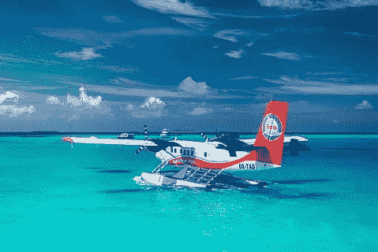

# 由波音公司支持的 Wisk 公司与 Blade 公司签署协议，运营飞行出租车

> 原文：<https://medium.com/geekculture/wisk-backed-by-boeing-signs-deal-with-blade-to-operate-flying-taxis-2fd3459d63ff?source=collection_archive---------13----------------------->

Photo by [Patrick Tomasso](https://unsplash.com/@impatrickt?utm_source=unsplash&utm_medium=referral&utm_content=creditCopyText) on [Unsplash](https://unsplash.com/s/photos/helicopter?utm_source=unsplash&utm_medium=referral&utm_content=creditCopyText)

飞行出租车离在美国城市成为现实又近了一步。Wisk Aero 是一家由波音公司和小鹰公司支持的初创公司。他们与[刀锋航空公司](https://www.blade.com/)签署了一项协议，运营自主飞行器。Blade 和 Wisk 的合作将加速空中出租车成为主流的努力。

总部位于纽约市的 Blade 主要提供直升机和水陆两用飞机的独家乘客体验。这家初创公司此前与 Beta Technologies 达成了一项协议，将空中出租车加入其包机网络。根据该协议的条款，Blade 同意在 2025 年前向该网络添加 20 架有人驾驶的电动垂直起降飞机。

Wisk 是自主 eVTOLs 的建造者。它计划向 Blade 的移动航线提供多达 30 架电动垂直起降飞机。2019 年，波音公司和小鹰公司成立了一家合资公司，创建了 Wisk。这家初创公司的总部位于硅谷。谷歌联合创始人拉里·佩奇和小鹰公司的首席执行官巴斯蒂安·特龙创立了这家公司。

“我们一直专注于开发高效、便捷、最重要的是安全的飞机和客户体验，”Wisk 首席执行官 Gary Gysin 表示。“我们作为自主电动垂直起降飞机制造商和运营商的专业知识与 Blade 的运营专业知识相结合，将有助于实现更高水平的安全和服务。”

## **解决法律和合规问题**

运营空中交通网络需要监管机构的大力参与。Blade 和 Wisk 正在组建一个工作组，以促进与城市、州和联邦各级监管机构的讨论。

其他公司在几起知识产权诉讼中卷入了风险。2021 年 4 月，Wisk 对 [Archer Aviation](https://www.archer.com/) 提起联邦诉讼，指控竞争对手公司“厚颜无耻地窃取”其技术。Archer Aviation 提起反诉，要求 Wisk 向其支付超过 10 亿美元。在一份发布的声明中，Archer Aviation 表示，它打算“让 Wisk 为其对 Archer 造成实质性损害的虚假和恶意的法外诽谤活动负责。”

让空中出租车变得普遍需要对现有的交通基础设施应用新的思维。在设计可容纳空中出租车的空中交通管制系统时，必须考虑城市噪音水平和安全问题。由于电动垂直起降飞机是零排放，噪音污染是一个比环境污染更大的障碍。

Wisk 通过 Blade mobility network 部署电动垂直起降飞机的计划取决于获得联邦航空管理局(FAA)的认证。美国联邦航空局必须批准空中出租车进行商业运营。

Wisk 的总法律顾问 Greg Bibbes 处理与公司交易、知识产权、诉讼和房地产法相关的法律问题。Bibbes 先生之前是硅谷另一家自主系统公司的内部律师。

在 Blade，法律部门由 Melissa Tomkiel 领导。作为城市空中交通网络的总裁兼总法律顾问，Tomkiel 女士负责监督法律职能以及业务运营的许多方面。汤姆基尔于 2015 年加入 Blade，当时该公司刚刚推出。她带领 Blade 公司推出了飞往汉普顿、威彻斯特、楠塔基特和迈阿密的航空服务。

Image credit: [Piqsels](https://www.piqsels.com/en/public-domain-photo-oxwvj)

## **Wisk-Blade 合作关系的未来发展**

两家公司都对 Wisk-Blade 的合作持乐观态度。对于 Blade 来说，合作伙伴关系是其从主要经营传统旋翼机和水上飞机的移动网络发展到现在的关键。Rob Wiesenthal 是 Blade 的首席执行官。他说，他们“期待与 Wisk 合作，帮助加速 Blade 从传统旋翼飞机向安全、安静、无排放的电动垂直飞机的转变。”

“Wisk-Blade 的安排非常适合我们的轻资产模式，”Blade 的首席财务官兼企业发展主管威尔·海伯恩(Will Heyburn)说。“凭借波音深厚的航空航天经验，Wisk 将拥有、运营和维护他们的飞机，作为我们网络的一部分，使 Blade 专注于为我们的飞行员提供出色的体验。”

Wisk 的首席执行官 Gary Gysin 也表达了这种乐观态度。“这一安排证明了城市空中交通是交通的未来。迄今为止，我们一直专注于开发高效、便捷、最重要的是安全的飞机和客户体验，”Gysin 说。“我们作为自主电动垂直起降飞机制造商和运营商的专业知识与 Blade 的运营专业知识相结合，将有助于实现更高水平的安全和服务。”

根据德勤的估计，到 2025 年，客运和货运电动汽车将占据 40 亿美元的市场。德勤预计，到 2035 年，eVTOLs 将成为一个 570 亿美元的市场。鉴于该领域未来的潜力和日益激烈的竞争，Wisk-Blade 的合作将为两家公司打开新的机遇之门。