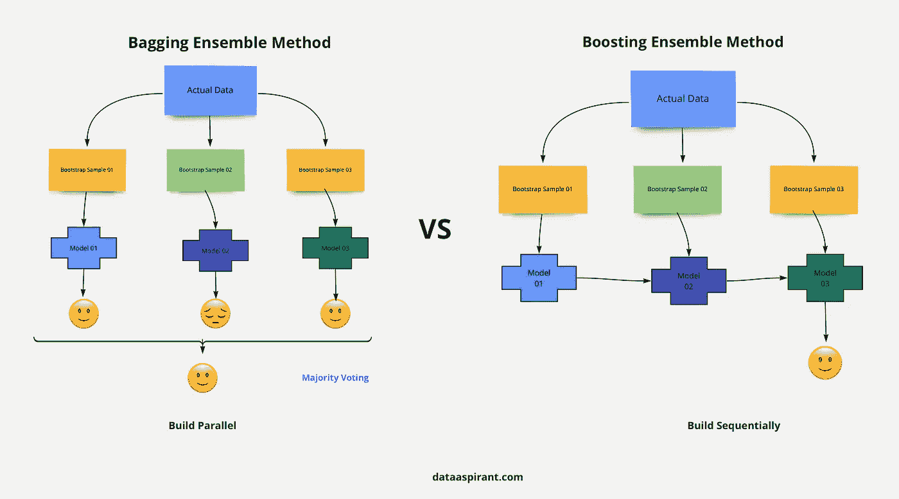

# XGBoost 与随机森林

> 原文：<https://medium.com/geekculture/xgboost-versus-random-forest-898e42870f30?source=collection_archive---------0----------------------->

Image Credits: [https://dataaspirant.com/](https://dataaspirant.com/)

我最近在研究一个市场组合模型，在这个模型中，我必须根据印象来预测销售额。在研究它的一个方面时，我遇到了在随机森林和 XG 提升之间选择的问题。这导致了本文的开始。

在我们开始讨论支持任何一种算法之前，让我们简单地理解一下这两种算法背后的基本思想。

术语梯度增强由两个子术语梯度和增强组成。梯度提升将提升重新定义为数值优化问题，目标是通过使用梯度下降添加弱学习器来最小化模型的损失函数。梯度下降是一种一阶迭代优化算法，用于寻找可微函数的局部最小值。由于梯度增强是基于最小化损失函数，因此可以使用不同类型的损失函数，从而产生可以应用于回归、多类分类等的灵活技术。当弱学习器在强学习器的剩余残差(即伪残差)上训练时，梯度增强不修改样本分布。通过对模型的残差进行训练，它赋予错误分类的观察值更多的重要性。直觉上，新的弱学习者被添加来集中于现有学习者表现差的领域。每个弱学习器对最终预测的贡献基于梯度优化过程，以最小化强学习器的整体误差。

随机森林是一种装袋技术，它包含给定数据集的各种子集上的许多决策树，并取平均值来提高该数据集的预测准确性。“随机森林不是依赖于一个决策树，而是从每棵树中获取预测，并基于预测的多数投票，它预测最终输出。森林中的树的数量越多，精度越高，并且防止了过度拟合的问题。
一个随机森林有两个随机元素——
1。特征的随机子集。
2。数据的引导样本。

# 比较竞争者

Image Credits: [https://www.everypixel.com/](https://www.everypixel.com/)

Boosting 恰好是迭代学习，这意味着模型将在最初预测一些东西，并作为预测工具自我分析其错误，并在下一次迭代中给它做出错误预测的数据点更多权重。在第二次迭代之后，它再次自我分析其错误的预测，并对在下一次迭代中被预测为错误的数据点给予更大的权重。这个过程循环往复。因此，从技术上讲，如果一个预测已经完成，那么最多只能保证它不是随机发生的，而是通过对数据的透彻理解和模式而发生的。这种防止随机预测发生的模型在大多数时候是可信的。

随机森林只是一个树的集合，其中每棵树都给出一个预测，最后，我们收集所有树的输出，并根据数据的性质(连续或分类)将该集合的平均值、中值或模式视为该森林的预测。从高层次上看，这似乎没问题，但大多数树很可能以一些随机机会做出预测，因为每棵树都有自己的情况，如类别不平衡、样本重复、过度拟合、不适当的节点分裂等。

现在让我们根据下面的论点对这两种算法进行评分。

## XGBoost (1)和随机森林(0):

在进入实际的建模目的之前，XGBoost 直接用一个叫做“相似性分数”的分数来修剪树。它把一个节点的“增益”看作是该节点的相似性得分和子节点的相似性得分之差。如果发现来自节点的增益最小，那么它就停止构建更深的树，这可以在很大程度上克服过拟合的挑战。同时，如果随机森林中的大多数树都具有相似的样本，则随机森林可能会使数据过拟合。如果树是完全成长的，那么一旦测试数据被引入，模型就会崩溃。因此，主要考虑将样本的所有基本单位以近似相等的参与度分配给所有的树。

## XGBoost (2)和随机森林(0):

**XGBoost 对于不平衡的数据集是一个很好的选择，但是在这种情况下我们不能信任随机森林。**在伪造或欺诈检测等应用中，类别几乎肯定是不平衡的，真实交易的数量与非真实交易相比将是巨大的。在 XGBoost 中，当模型第一次未能预测异常时，它在即将到来的迭代中给予它更多的偏好和权重，从而增加它预测低参与类的能力；但是我们不能保证随机森林会用一个适当的过程来处理阶级不平衡。

## XGBoost (3)和随机森林(0):

**XG Boost 和随机森林最重要的区别之一是，在降低模型成本时，XG Boost 总是更重视功能空间，而随机森林则试图给予超参数更多的偏好来优化模型。**超参数的微小变化会影响森林中几乎所有的树木，从而改变预测。此外，当我们预期测试数据具有如此多的实时变化时，这也不是一个好方法，因为我们对整个森林的超参数具有预定义的思维模式，但是 XG boost 超参数在开始时仅应用于一棵树，当迭代进行时，该树预期会以有效的方式进行自我调整。此外，与随机森林相比，XGBoost 只需要非常少的初始超参数(收缩参数、树的深度、树的数量)。

## XGBoost (4)和随机森林(0):

**当模型遇到类别数量不同的分类变量**时，随机森林可能会给参与较多的类别更多的偏好。

## XGBoost (5)和随机森林(0):

**XGBoost 在泊松回归、秩回归等情况下**可能更可取。这是因为树是通过优化目标函数得到的。

## XGBoost (5)和随机森林(1):

随机森林比 Boosting 算法更容易调整。

## XGBoost (5)和随机森林(2):

随机森林**比 Boosting 算法更容易适应分布式计算**。

## XGBoost (5)和随机森林(3):

如果**数据经过整洁的预处理和清理**，随机森林几乎肯定不会过度拟合，除非对大多数树木重复进行类似的采样。

叮…叮…叮…！！
这场争论的赢家是 **XGBoost！**

*免责声明:以上为我个人观点。这些观点与算法的选择在很大程度上取决于手头的数据这一事实无关。*

感谢阅读！注意安全！