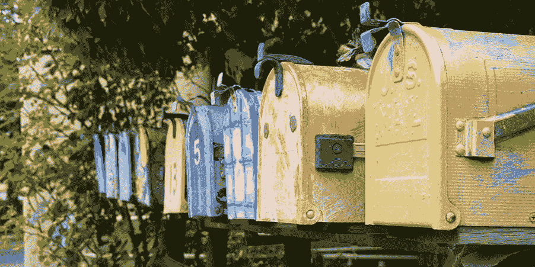
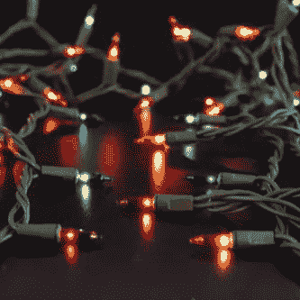
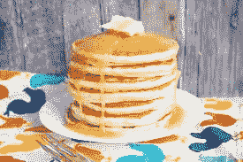
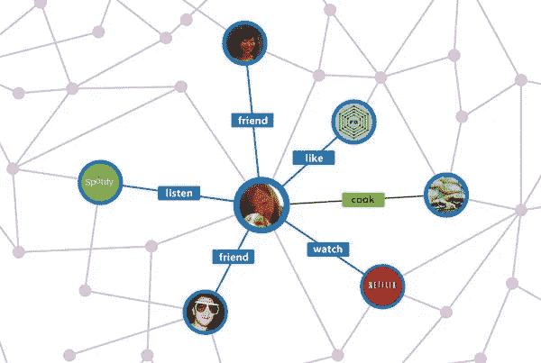
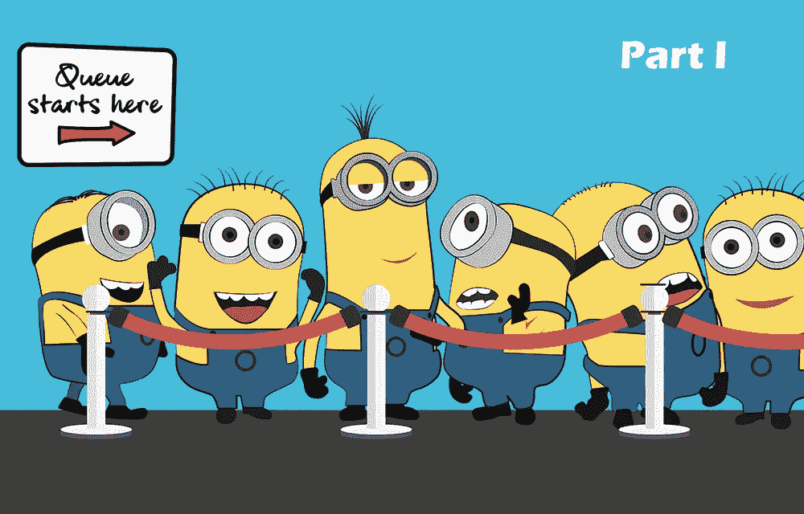
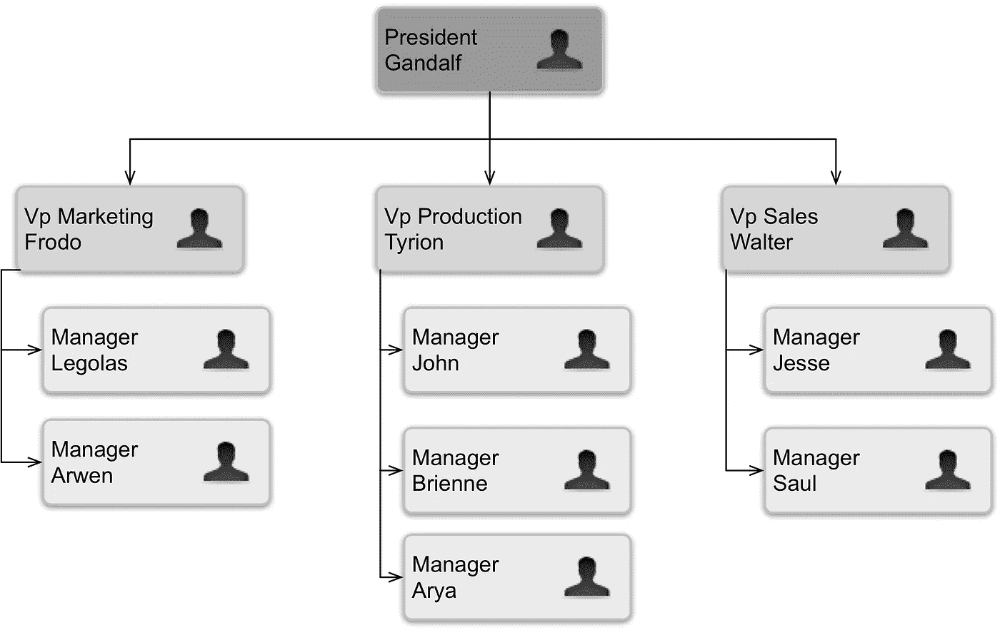

# 是的，弗吉尼亚，这是一个真实的数据结构的例子！

> 原文：<https://medium.com/geekculture/yes-virginia-there-is-a-real-life-example-for-that-data-structure-9101ef541c2d?source=collection_archive---------56----------------------->

from geeksforgeeks.org

我承诺我会在我的上一篇博客(真实世界的算法示例)的基础上，用一些具体的真实例子来可视化基本数据结构。事不宜迟，并配有大量图片，我们开始吧！

~weird modem noises~ YOU’VE GOT MAIL!

数组

可以把一个数组想象成一组邮箱——不像这些邮箱那样丰富多彩，但是每一个都代表集合(索引)中的一个位置。数组是数据的集合，数组中的每个元素(字母)都有一个相应的索引(用数字表示它在集合中的位置)。数组有很多功能(映射、排序、按字母或数字顺序排列)，无论你用什么语言编程，数组都是一种非常常见的结构。

FINE! YOU RIG UP THE LIGHTS!

单向链表

链表是数据元素的线性集合，其中每个元素指向下一个元素(按顺序排列的节点集合)。一旦它们最终被解开，一串节日灯的功能就像一个单链表——电流沿着绳子沿着一个方向移动，从灯泡(节点)到灯泡。如果有一个灯泡熄灭，电流停止(不再有数据流)。

Like it says, keep workin’, we just got started!

双向链表

就像音乐播放器上的下一个和上一个按钮一样，如果你忽略随机洗牌的算法本质，列表只能以线性方式移动。在我为拳击制作的播放列表中，公敌乐队的《带来噪音》和 Run-DMC 乐队的《很棘手》以及猫王的《燃烧的爱》都融合在一起。如果我在听猫王的时候按了后退键，我将永远享受到嘻哈大师 Run DMC。这就是(双向)链表的简单性。

STACK. OVERFLOWING.

堆

大多数例子将使用一叠盘子，但作为一名厨师，如果我演示没有煎饼的堆叠的概念，我将是失职。堆栈遵循“后进先出”的原则。在我们接触到下面的那个之前，上面的那个必须先脱落。与队列不同，我们将很快讨论队列，队列中没有第一个——堆栈只能从上往下访问，因此如果您需要数据/流程的底部，您必须首先遍历(拆分)它上面的所有内容。

photo from Business Insider

图表

图是由节点(或顶点)和连接任意两个节点的边(线或弧)组成的非线性数据结构。上图使用图表来表示中心用户的社交媒体联系。例如，他们在网飞上观看一些东西——这些数据(他们在那个平台上流式传输的事实，观看的材料)将他们与使用网飞或观看那个特定节目的其他用户联系起来。社交媒体联系的更详细的图表开始看起来像一个巨大的棉花糖云，其中散布着一堆点。

长队

队列是一种线性数据结构，遵循特定的顺序(FIFO，即先进先出)。这就是排队买电影票、试图在市场结账、在车管所更新驾照——任何按照物品到达顺序处理等待物品的队伍都是队列。

I just don’t think the culture here is a good fit for my goals…of staying alive…

树

树是节点的集合，所有这些节点都可以追溯到一个根节点，可以存在多个分支，但一切最终都源于一个点。许多公司的结构如上例，其中有一个主要的(总裁/CEO/所有者)“根”，其余的结构从那里向下分支。追溯家族历史的家谱“树”是另一个很好的树型结构的例子。

Ruh-Roh! This part is hard!

哈希表

散列表是我到目前为止遇到的最复杂的结构，也是最难分解成真实世界的例子的，但是我会尝试一下。我们去滑旱冰吧！

我们到了溜冰场，因为我没有自己的溜冰鞋，所以我一到那里就去租一双。我询问我的尺码(钥匙)，作为回报，我得到了一双溜冰鞋(价值)和一张上面有唯一号码的认领单(散列)。认领单/散列是一个唯一的标识符，作为我们添加到表(租赁柜台)中的数据的索引，并确保当我想要拿回我的紫色匡威时，服务员知道在哪里可以找到它们。

我希望这有助于您为开始使用数据结构背后的概念打下基础。如果你自己有什么好的例子，请告诉我！最好的学习方法是在你身后有一个优秀的支持系统——所以我留给你一个绝对可爱的支持系统。编码快乐！

