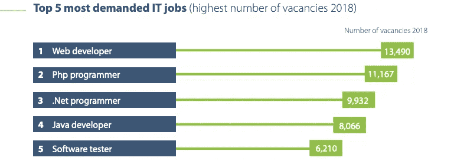

# 昨天的进步=今天的挑战？

> 原文：<https://medium.com/geekculture/yesterdays-progress-today-s-challenge-3b9af094561d?source=collection_archive---------25----------------------->

## 技术技能差距

在过去的几年里，我一直在 IT 行业工作(我也是从我的父亲那里听到这个行业的变化的——感谢父亲！！！)我一直对这个行业，尤其是软件开发(方法)的发展速度着迷。与之相伴的是人民。

有时，要跟上我们在更快地交付高质量软件所涉及的一切方面的持续进展，可能会感到力不从心。新的流行语随时随地都在涌现。新技术需要学习。新技能正受到追捧。相应的技术人才供不应求。

我每天都看到、感受到和听到它，通过与我的网络交流，与客户一起工作，或者在虚拟咖啡上与同事聊天(或者……；-) ).在过去几十年中，随着软件开发的发展，出现了大量的机会和挑战——与可扩展性、自动化需求、通信、安全性相关的工具和流程标准化，特别是管理团队超增长和入职流程(特别是在过去 18 个月中，每个人都远程工作，COVID 是数字化转型的首席执行官)。

Source: [“IT Labour Market Monitor 2019”, Sterksen](https://sterksen.com/wp-content/uploads/sites/131/IT-Labour-Market-Rapport-Juni-2019_definitief.pdf)

现在，有人可能会说，当我在像 Tarmac.io 这样的公司工作时，我写一篇关于这个主题的博客文章并不奇怪(tarmac . io 可以很好地支持这项挑战；-)但这不是本文的重点！).相反:我的 IT 出身是在一家提供软件解决方案的公司( [Digital.ai](https://digital.ai/) )。随着时间的推移，我学到的是，组织今天试图解决的挑战不仅仅是他们的工具。他们正在努力寻找(正确的)资源，以最大限度地发挥他们所购买工具的优势。所以我决定更深入地研究这个问题。

*我确实把最近的研究重点放在了荷兰，不仅因为我住在这里，还因为荷兰的科技行业正在蓬勃发展。在所进行的研究中，我想强调 3 点，说明为什么公司在努力填补他们的 IT 职位，我认为这可以跨国应用。*

# 团队超增长的挑战

## **荷兰(及其他地区)的技术技能差距**

Sterksens(位于 Randstad 地区的专业 IT 招聘公司)的报告 [IT 劳动力市场监测 2019](https://sterksen.com/wp-content/uploads/sites/131/IT-Labour-Market-Rapport-Juni-2019_definitief.pdf) 中的调查结果指出

> “荷兰的 IT 劳动力市场正面临严重短缺。…IT 职位空缺数量大幅增加。不仅仅是在 Randstad，在所有其他省份，网上发布的五分之四的职位空缺都不能被积极的求职者填补。…由于无法填补 IT 职位空缺，许多公司都在为自己的核心业务苦苦挣扎。”

阿姆斯特丹经济委员会在另一份报告中认为“技术专业人员的短缺会阻碍当地经济的发展”。目前，阿姆斯特丹的科技行业包括 700 多家公司，雇佣了近 52，000 人，自 2017 年以来，仅金融科技行业的就业岗位就增长了 35%”。

真正令人大开眼界的是最近在 G20 insights 中提到的预测:[估计到 2030 年欧盟将有 70 万名信息技术工人的潜在缺口。](https://www.g20-insights.org/policy_briefs/delivering-workforce-productivity-growth/)

## **权力转移给员工**

不用说，这种不平衡导致员工方面的权力增加。Bloom 博客[最近的一篇文章](https://bloomcollective.medium.com/why-is-everyone-quitting-their-tech-job-right-now-28da97e33d89)进一步推动了这一点:
疫情为受欢迎的人才打开了一个充满机会的全新世界——被置于在家工作的情况下，许多人现在不希望每天回到办公室工作。此外，公司已经找到了使远程工作、工作(复制单词的意图；-) ).对当前环境不满意的员工现在有机会更容易地跳槽，甚至跳槽到位于不同国家或完全不同大陆的公司。

## **大型全球玩家**

似乎前两点还不够，许多公司看到了像网飞或微软这样的全球大公司的竞争。由于财力雄厚，他们倾向于支付虚高的薪水，迅速从市场上抢走高质量的人才。你会拒绝一个比你目前收入高出€ 4 万英镑、€ 5 万英镑的报价吗？随着大型全球企业努力跟上薪酬军备竞赛，构成我们经济主体的初创企业和大型企业将何去何从？

# 迎接挑战

从技能*和*文化的角度来看，找到适合你团队的合适人选是一项复杂的挑战。虽然政府和行业正在投资开发所需的技能，IT 研究的受欢迎程度也在不断提高，[应用 IT 科学的辍学率也在不断上升](https://sterksen.com/wp-content/uploads/sites/131/IT-Labour-Market-Rapport-Juni-2019_definitief.pdf)。与其他任何学术研究相比，技能发展的辍学率最高，为 58%，这显然是一个长期的解决方案。

我认为，我们需要跳出框框思考，找到填补日益扩大的技术技能缺口的方法，以确保我们现有的团队发挥最佳水平，并使我们的业务作为一个整体能够开展核心活动，满足最终用户的需求。

你打算如何克服更迫切的需求？你是否考虑过扩大人脉，挖掘全球人才库？

感谢阅读！