# YOLOv4-darknet 在您的系统上的安装和使用(Windows 和 Linux)

> 原文：<https://medium.com/geekculture/yolov4-darknet-installation-and-usage-on-your-system-windows-linux-8dec2cea6e81?source=collection_archive---------1----------------------->

# 我在 YouTube 上的视频！

## 对于 Windows

## 对于 Linux

## 内容

*   [**(一)在 Windows 上安装**](#6caf)
*   [**(B)节 YOLO 在 Windows 上的用法**](#db4e)
*   [**(C)节在 Linux 上安装**](#a59a)
*   [**(D)节 YOLO 在 Linux 上的用法**](#569f)

(但首先✅Subscribe 到我的 YouTube 频道👉🏻[https://bit.ly/3Ap3sdi](https://bit.ly/3Ap3sdi)😁😜)

# (A)在 Windows 上安装 YOLOv4

**(安装方法** : **使用** `**CMake**` **)**

## 步骤 1)下载暗网

下载 Darknet zip-archive 并解压缩它: [master.zip](https://github.com/AlexeyAB/darknet/archive/master.zip)

## 步骤 2)安装 MSVC(微软 Visual Studio)

去 MSVC:[https://visual studio . Microsoft . com/thank-you-downloading-visual-studio/？sku =社区](https://visualstudio.microsoft.com/thank-you-downloading-visual-studio/?sku=Community)。这将为您下载 MSVC 社区版安装程序可执行文件。运行它。选择如下所示的“*c++*桌面开发”包，点击安装。


## 步骤 3)安装 CMake

接下来，我们需要为 Windows 安装 CMake GUI。(下面给出了链接)

CMake GUI:`Windows win64-x64 Installer`https://cmake.org/download/

为您的系统选择安装程序。我用的是 Windows (64 位)。下载安装程序，运行并安装它。


## 步骤 4)在您的系统上安装 CUDA、cuDNN 和 OpenCV。

**注意:**在运行 CMake GUI 之前，我们需要在我们的系统上安装 CUDA、cuDNN 和 OpenCV。我们希望在我们的系统上安装和配置 CUDA、cuDNN & OpenCV，以便 darknet 可执行文件能够与 GPU 一起工作。

**参考** [**本博客**](https://techzizou.com/install-cuda-and-cudnn-on-windows-and-linux/) **学习如何在 Windows 上安装和设置 CUDA 和 CUDNN。**

**您可以使用下面提到的两种方法中的任何一种在 Windows 上安装 OpenCV。**

**方法 1:** 使用 Windows installer 安装 OpenCV(这适用于 OpenCV 4.5.5)

*   从 https://opencv.org/releases/[下载 OpenCV 最新发布的 Windows installer。](https://opencv.org/releases/)
*   运行 exe 文件，解压到 c 盘安装。
*   最后，在**路径**环境变量中为您的系统变量给出以下路径。

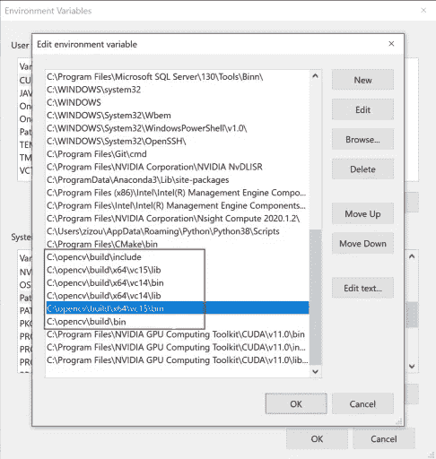

*   **C:\opencv\build\include**
*   **C:\ opencv \ build \ x64 \ vc14 \ bin**
*   **C:\ opencv \ build \ x64 \ vc14 \ lib**
*   **C:\ opencv \ build \ x64 \ vc15 \ bin**
*   **C:\ opencv \ build \ x64 \ vc15 \ lib**
*   **C:\opencv\build\bin**

**方法 2:** 使用 CUDA 后端支持从源代码构建 OpenCV，以启用 **OpenCV-DNN-CUDA** 模块

**注:**使用方法 1，您将能够安装 OpenCV，这样使用 CMake 创建的 darknet.exe 文件将与 OpenCV 兼容，并在 GPU 支持下运行。

方法 2 然而，即**使用 CUDA 后端支持**从源代码构建 OpenCV，启用了 **OpenCV-DNN-CUDA** 模块，使得推理速度更快。有一个单独的过程来设置 OpenCV-DNN-CUDA 模块，我们从源代码构建 OpenCV。下面看看我的博客。

[](https://techzizou007.medium.com/setup-opencv-dnn-module-with-cuda-backend-support-for-windows-7f1856691da3) [## 使用 CUDA 后端支持设置 OpenCV-DNN 模块(适用于 Windows)

### 在本教程中，我们将使用 CUDA 后端支持从源代码构建 OpenCV(OpenCV-DNN-CUDA 模块)。

techzizou007.medium.com](https://techzizou007.medium.com/setup-opencv-dnn-module-with-cuda-backend-support-for-windows-7f1856691da3) 

## 步骤 5)运行 CMake GUI

一旦你设置好 CUDA、CUDNN 和 OpenCV，我们必须运行 CMake GUI 并编译 darknet。请遵循以下步骤。

**在 Windows 中:**

*   开始(按钮)->所有程序-> CMake -> CMake (gui) ->
*   [在 CMake 中查看图片](https://habrastorage.org/webt/pz/s1/uu/pzs1uu4heb7vflfcjqn-lxy-aqu.jpeg):输入暗网源码的输入路径，输出路径到二进制- >配置(按钮)- >生成器可选平台:`x64` - >完成- >生成- >打开项目- >

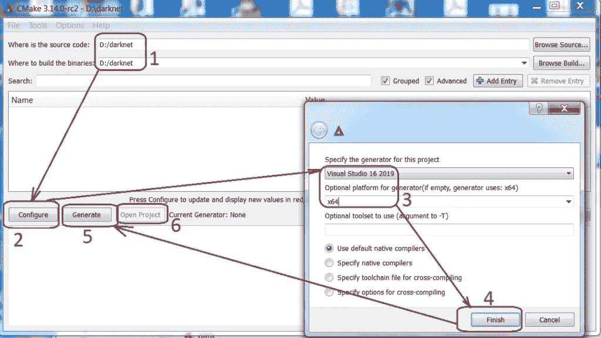

## 步骤 6)运行 MSVC 来构建暗网

*   在 MS Visual Studio 中:单击“构建”->“配置管理器”，并在“构建”选项下的“安装项目”框中打勾。剩下的 5 个已经被选中了。这只是确保您不必为此再次运行构建解决方案。这将同时运行所有 6 个步骤。
*   接下来，在 MS Visual Studio 中:选择:x64 并发布->构建->构建解决方案
*   在您指定的二进制文件的输出路径中找到可执行文件`***darknet.exe***`。


## 步骤 7)设置暗网目录

**下载并复制所需文件到设置暗网目录**

*   在我们从命令行运行 darknet.exe 之前，您需要从***darknet-master 3 rdpartypthreadsbin***文件夹中复制**pthreadVC2.dll**，并将其放置在**darknet.exe**文件旁边的***darknet-master***主文件夹中。
*   最后，从[这里](https://github.com/AlexeyAB/darknet/releases/download/darknet_yolo_v3_optimal/yolov4.weights)下载 YOLOv4 权重文件，并将权重文件与**darknet.exe**文件放在***darknet-master***主文件夹中。

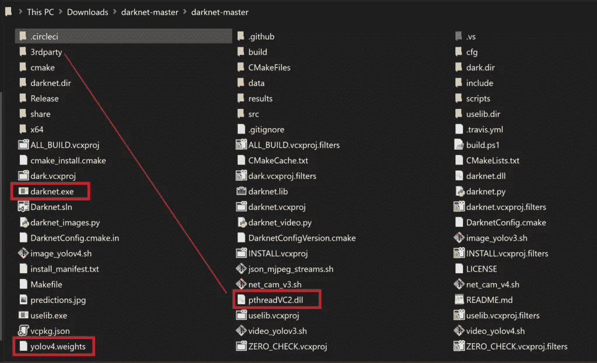

就是这样。我们已经成功地在 windows 系统上安装了 YOLO。我们可以在 Nvidia GPU 上运行，因为它是在 CUDA 支持下安装的。

# (B) YOLO 在 Windows 上的使用

## 对图像运行检测器

要运行图像检测器，请使用以下命令之一

```
**darknet.exe detect cfg/yolov4.cfg yolov4.weights data/dog.jpg**
```

运筹学

```
**darknet.exe detector test cfg/coco.data cfg/yolov4.cfg yolov4.weights data/dog.jpg**
```

输出将如下所示


**。**

**。**

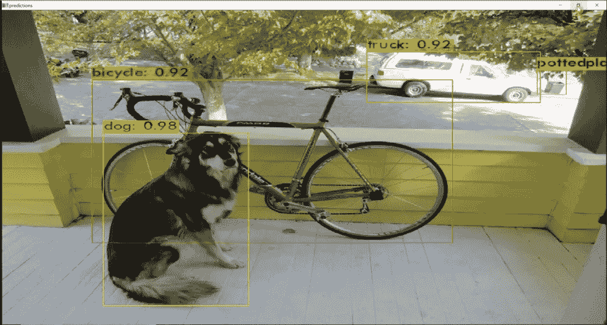

## 对于多个图像

您可以不在命令行上提供图像，而是将其留空，以连续尝试多个图像。相反，当配置和权重加载完成时，您会看到一个提示:

一旦完成，它会提示你更多的路径来尝试不同的图像。完成后，使用`Ctrl-C`退出程序。

```
**darknet.exe detect cfg/yolov4.cfg yolov4.weights**
```

输出如下所示:


输入一个类似于`***data/horses.jpg***`的图像路径，让它预测该图像的框。

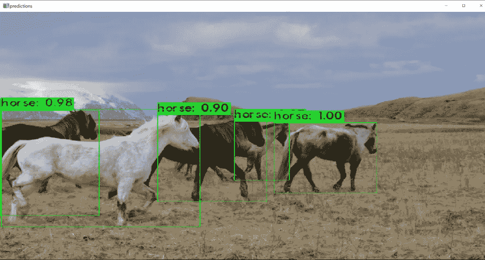

## 更改检测阈值

默认情况下，YOLO 仅显示置信度为. 25 或更高的检测到的对象。您可以通过将`-thresh <val>`标志传递给`yolo`命令来改变这一点。例如，要显示所有检测，您可以将阈值设置为 0:

```
**darknet.exe detect cfg/yolov4.cfg yolov4.weights data/dog.jpg -thresh 0**
```

它产生:

！[][全部]

这显然不是很有用，但是你可以把它设置成不同的值来控制模型的阈值。

## 网络摄像头上的实时检测

如果看不到结果，在测试数据上运行 YOLO 就没什么意思了。与其在一堆图像上运行，不如在网络摄像头的输入上运行！

要运行这个演示，你需要用 CUDA 和 OpenCV 编译 [Darknet。我们已经在上面的 A 节中使用 CMake 用 CUDA 编译了 darknet。](https://pjreddie.com/darknet/install/#cuda)

现在，要在实时网络摄像头上运行检测器，请运行以下命令:

```
**darknet.exe detector demo cfg/coco.data cfg/yolov4.cfg yolov4.weights**
```

YOLO 将显示当前的 FPS 和预测类，以及顶部绘制有边界框的图像。

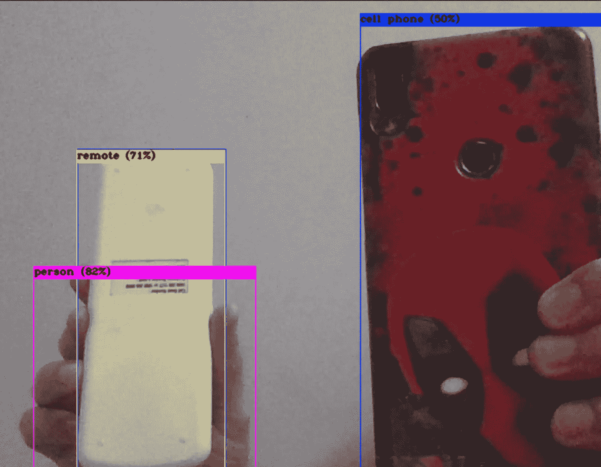

你需要一个网络摄像头连接到 OpenCV 可以连接的计算机上，否则它将无法工作。如果您连接了多个网络摄像头，并且想要选择使用哪一个，您可以传递标志`-c <num>`来选择(OpenCV 默认使用网络摄像头`0`)。

## 视频检测

如果 OpenCV 可以读取视频，您也可以在视频文件上运行它:

```
**darknet.exe detector demo cfg/coco.data cfg/yolov4.cfg yolov4.weights <video file>**
```

您也可以使用以下命令保存视频文件的输出。

```
**darknet.exe detector demo cfg/coco.data cfg/yolov4.cfg yolov4.weights <video file> -out_filename <output_video file>**
```

要阅读更多关于 YOLO 命令和用法的内容，请访问 [pjredde 的网站](https://pjreddie.com/darknet/yolo/)和 [AlexeyAB 的 GitHub](https://github.com/AlexeyAB/darknet) 。

**你也可以在下方的“我的 YouTube 视频”部分观看我在 YOLO 的 YouTube 视频，以了解更多关于 YOLO 安装和使用的信息。**

# (C)在 Linux 上安装 YOLOv4

(**使用** `**make**` **在 Linux 上编译)分以下 5 步完成:**

## 步骤 1)打开终端并克隆 darknet

使用以下命令克隆 darknet git 存储库。访问官方 [AlexeyAB 的 GitHub](https://github.com/AlexeyAB/darknet/) 了解更多关于 darknet 的信息。

```
**git clone** [**https://github.com/AlexeyAB/darknet.git**](https://github.com/AlexeyAB/darknet.git)
```


## 步骤 2)在您的系统上安装 CUDA、cuDNN 和 OpenCV。

**注意:**我们需要在我们的系统上安装和配置 CUDA、cuDNN & OpenCV，以便 darknet 可执行文件与 GPU 一起工作。

**参考** [**本博客**](https://techzizou.com/install-cuda-and-cudnn-on-windows-and-linux/) **学习如何在 Linux 上安装和设置 CUDA 和 cud nn**。

您可以使用下面提到的两种方法中的任何一种在 Linux 上安装 OpenCV。

**方法一:**从 Ubuntu 库安装 OpenCV。

以下使用 apt install 的命令将安装旧版本的 OpenCV。目前使用它的可用版本是 3.2，而官方的 OpenCV 版本是 4.5.3。

```
sudo apt update
sudo apt install python-opencv
sudo apt install libopencv-dev
```

**或**使用 **pip 安装**。这将在您的系统上安装最新的 OpenCV 版本。您需要在系统上安装 pip。(如果 python3 和 pip3 与 python2 一起单独安装，请使用 pip3。)

```
**pip install opencv-python
OR**
**pip3 install opencv-python**
```

**方法 2:** 使用 CUDA 支持从源代码构建 OpenCV，以启用 OpenCV-DNN-CUDA 模块

**注**:使用方法 1，您将能够安装 OpenCV，这样使用 make 命令创建的 darknet.exe 文件将与 OpenCV 兼容，并在 GPU 支持下运行。

然而，方法 2，即**使用 CUDA 后端支持**从源代码构建 OpenCV，启用了 **OpenCV-DNN-CUDA** 模块，这使得推理速度更快。有一个单独的过程来设置 OpenCV-DNN-CUDA 模块，我们从源代码构建 OpenCV。你也可以参考我下面关于如何在 Ubuntu 18.04 上用 OpenCV-DNN-CUDA 模块从源代码构建 OpenCV 的博客:

[](https://techzizou007.medium.com/setup-opencv-dnn-module-with-cuda-backend-support-for-linux-1677c627f3bd) [## 使用 CUDA 后端支持设置 OpenCV-DNN 模块(适用于 Linux)

### 在本教程中，我们将使用 CUDA 后端支持从源代码构建 OpenCV(OpenCV-DNN-CUDA 模块)。

techzizou007.medium.com](https://techzizou007.medium.com/setup-opencv-dnn-module-with-cuda-backend-support-for-linux-1677c627f3bd) 

## 步骤 3)在`Makefile`中进行修改

根据您的要求在 Makefile 中进行更改。如[链接](https://github.com/AlexeyAB/darknet/#how-to-compile-on-linux-using-make)中所述，您可以在 Makefile 中进行各种更改。

**新手只需将 GPU、CUDNN、CUDNN_HALF、OPENCV 设置为 1 即可。**

```
**GPU=1
CUDNN=1
CUDNN_HALF=1
OPENCV=1**
```

接下来，将拱门设置为您的 GPU 架构。你可以在这里找到你的 GPU 架构(计算能力)[。例如:我的 Nvidia GPU 的 CC 是 6.1，所以我将使用以下行:](https://developer.nvidia.com/cuda-gpus)

```
**ARCH= -gencode arch=compute_61,code=[sm_61,compute_61]**
```

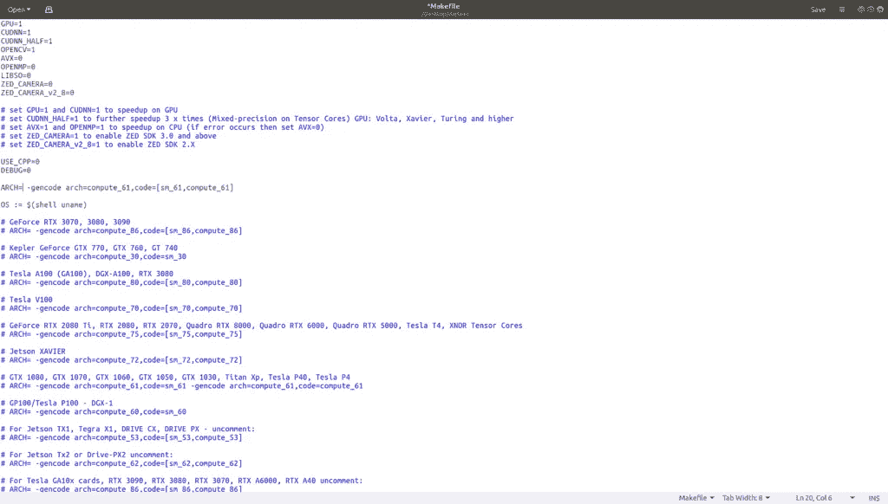

## 步骤 4)运行 make 命令

导航到 darknet 目录并运行 make 命令。

```
**cd darknet
make**
```


输出如下所示:


这将在 ***darknet*** 目录下创建一个名为 **darknet** 的可执行文件。

## 步骤 5)下载 YOLOv4 砝码文件

使用以下命令下载 YOLOv4 权重文件。

```
**wget** [**https://github.com/AlexeyAB/darknet/releases/download/darknet_yolo_v3_optimal/yolov4.weights**](https://github.com/AlexeyAB/darknet/releases/download/darknet_yolo_v3_optimal/yolov4.weights)
```

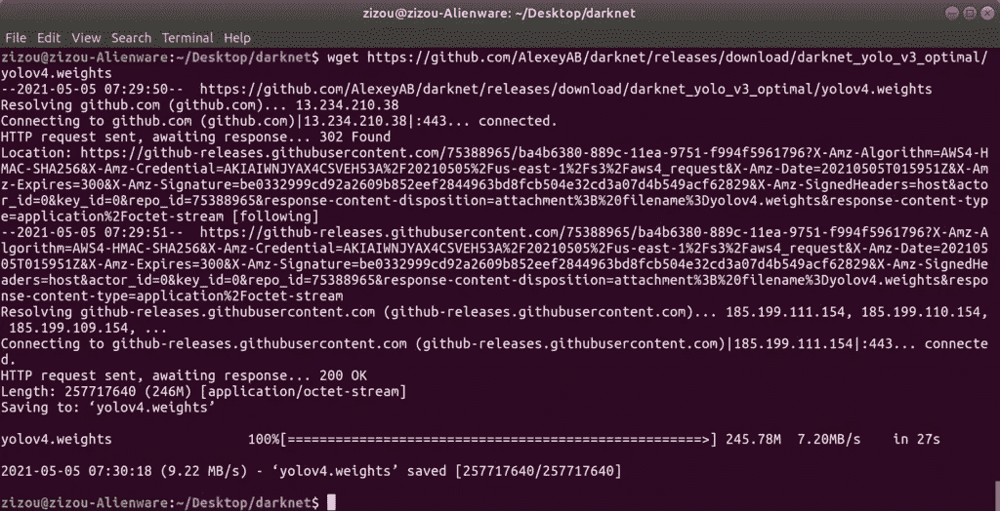

现在我们已经建立了我们的 Yolo-darknet 环境。通过设置 **Makefile** 中的参数并运行 **make** 命令，我们已经创建了 **darknet** 可执行文件。我们还下载了 yolov4.weights 文件。 ***darknet*** 文件夹的内容如下图所示:


# (D) YOLO 在 Linux 上的使用

除了下面提到的以外，YOLO 在 Linux 上的用法与在 Windows 上的用法相同。

要在 Linux 上运行 Darknet，使用本文中的例子，只需使用`./darknet`而不是`darknet.exe`。

## 对图像运行检测器

要运行图像检测器，请使用以下命令之一

```
**./darknet detect cfg/yolov4.cfg yolov4.weights data/dog.jpg**
```

运筹学

```
**./darknet detector test cfg/coco.data cfg/yolov4.cfg yolov4.weights data/dog.jpg**
```

输出如下所示:


**。**

**。**

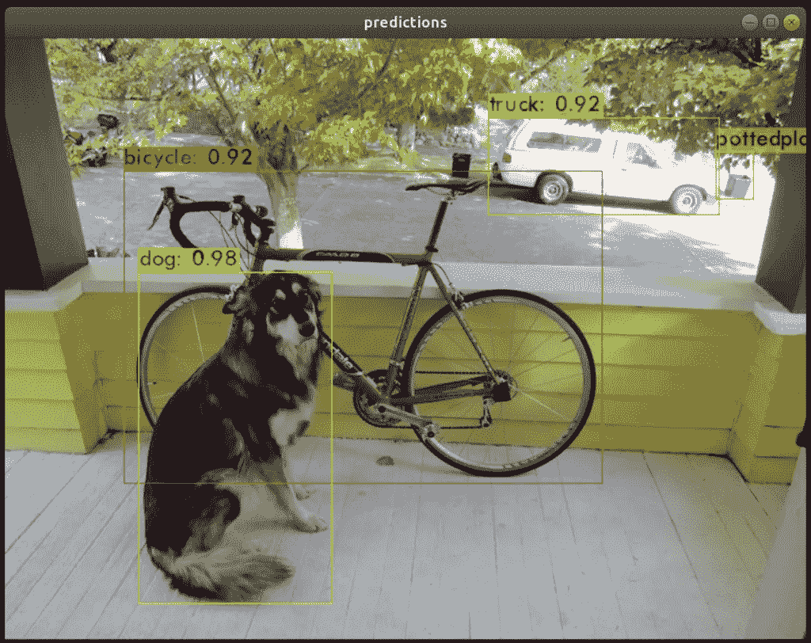

## 对于多个图像

您可以不在命令行上提供图像，而是将其留空，以连续尝试多个图像。相反，当配置和权重加载完成时，您会看到一个提示:

一旦完成，它会提示你更多的路径来尝试不同的图像。完成后，使用`Ctrl-C`退出程序。

```
**./darknet detect cfg/yolov4.cfg yolov4.weights**
```

输出如下所示:


输入一个类似于`***data/horses.jpg***`的图像路径，让它预测该图像的框。

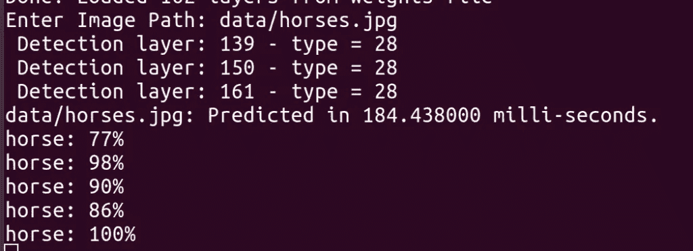

## 更改检测阈值

默认情况下，YOLO 仅显示置信度为. 25 或更高的检测到的对象。您可以通过将`-thresh <val>`标志传递给`yolo`命令来改变这一点。例如，要显示所有检测，您可以将阈值设置为 0:

```
**./darknet detect cfg/yolov4.cfg yolov4.weights data/dog.jpg -thresh 0**
```

它产生:

！[][全部]

这显然不是很有用，但是你可以把它设置成不同的值来控制模型的阈值。

## 网络摄像头上的实时检测

如果看不到结果，在测试数据上运行 YOLO 就没什么意思了。与其在一堆图像上运行，不如在网络摄像头的输入上运行！

要运行这个演示，你需要用 CUDA 和 OpenCV 编译 [Darknet。我们已经在上面的 A 节中使用 CMake 用 CUDA 编译了 darknet。](https://pjreddie.com/darknet/install/#cuda)

现在，要在实时网络摄像头上运行检测器，请运行以下命令:

```
**./darknet detector demo cfg/coco.data cfg/yolov4.cfg yolov4.weights**
```

YOLO 将显示当前的 FPS 和预测类，以及顶部绘制有边界框的图像。

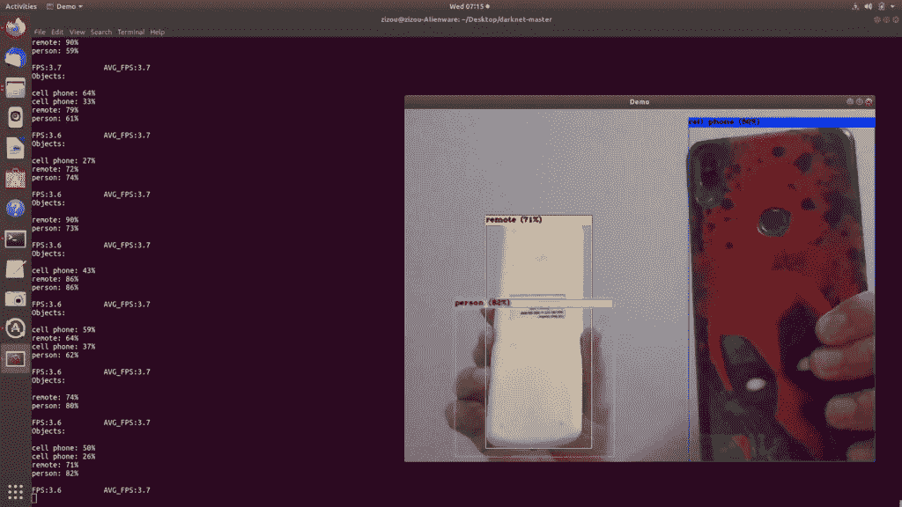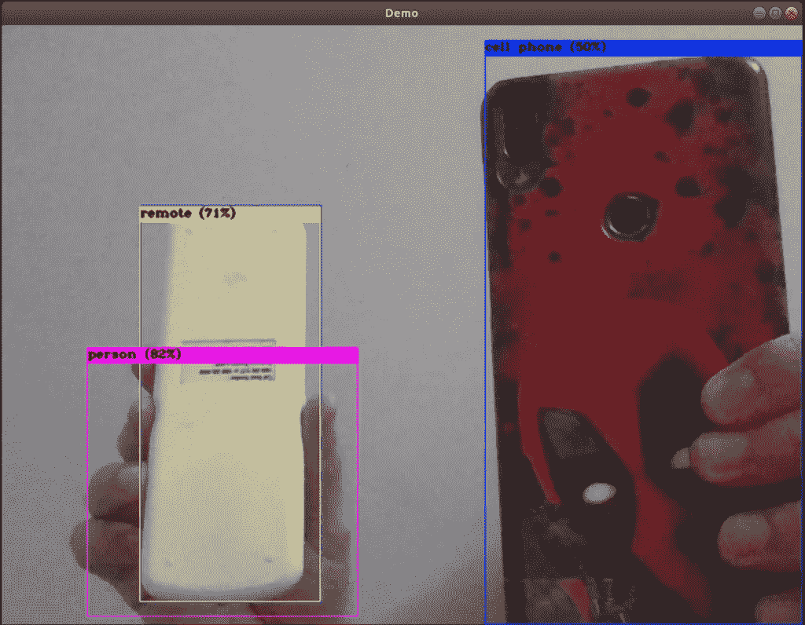

你需要一个网络摄像头连接到 OpenCV 可以连接的计算机上，否则它将无法工作。如果你连接了多个网络摄像头，并且想要选择使用哪个，你可以通过标志`-c <num>`来选择(OpenCV 默认使用网络摄像头`0`)。

## 视频检测

如果 OpenCV 可以读取视频，您也可以在视频文件上运行它:

```
**./darknet detector demo cfg/coco.data cfg/yolov4.cfg yolov4.weights <video file>**
```

您也可以使用以下命令保存视频文件的输出。

```
**./darknet detector demo cfg/coco.data cfg/yolov4.cfg yolov4.weights <video file> -out_filename <output_video file>**
```

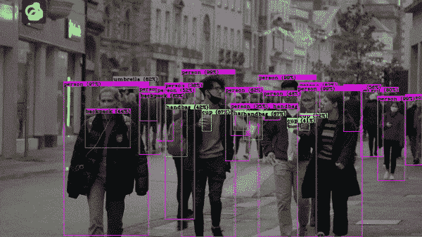

要阅读更多关于 YOLO 命令和用法的内容，请访问 [pjredde 的网站](https://pjreddie.com/darknet/yolo/)和 [AlexeyAB 的 GitHub](https://github.com/AlexeyAB/darknet) 。

**您还可以在“我的 YouTube 视频”部分观看我在 YOLO 的 YouTube 视频，了解更多关于 YOLO 安装和培训的信息。**

# 我的 YouTubes 视频

# 信用

# 参考

*   [**AlexeyAB GitHub**](https://github.com/AlexeyAB/darknet)
*   [**pjreddie 网站**](https://pjreddie.com/darknet/yolo/)