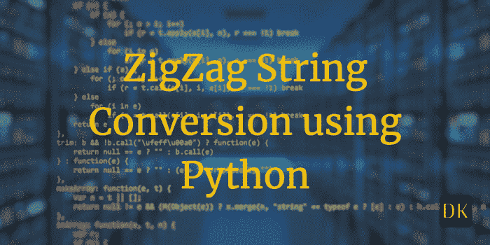

# python 中的之字形字符串转换

> 原文：<https://medium.com/geekculture/zigzag-string-conversion-in-python-8983c6cc0a28?source=collection_archive---------7----------------------->

## 如何在 python 中将你的字符串转换成之字形字符串



# 简介:

这篇文章讨论了在 [leetcode](https://leetcode.com/problems/zigzag-conversion/) 中锯齿形字符串转换的解决方案。请注意，这个问题可能有多种解决方案，这里讨论的解决方案只是其中之一。欢迎任何替代或更好的解决方案。

# 问题陈述:

给定一个字符串，将该字符串转换为 zigzag 格式并打印输出。

字符串`"PAYPALISHIRING"`以之字形写在给定数量的行上，如下所示:(为了更好的易读性，您可能希望以固定的字体显示这个模式)

```
P A H N A P L S I I G Y I R
```

然后逐行读取:`"PAHNAPLSIIGYIR"`

根据给定的行数，编写接受字符串并进行转换的代码:

**例 1:**

```
**Input:** 
s = "PAYPALISHIRING", 
numRows = 3
**Output:** 
"PAHNAPLSIIGYIR"
```

**例 2:**

```
**Input:** 
s = "PAYPALISHIRING", numRows = 4
**Output:** 
"PINALSIGYAHRPI"
**Explanation:** 
P I N A L S I G Y A H R P I
```

**例 3:**

```
**Input:** 
s = "A", 
numRows = 1
**Output:** 
"A"
```

# 头脑风暴:

我们得到了一个长度为 n 的字符串和显示该字符串的行数。这里的想法不是以之字形格式打印字符串，而是打印输出*如果*是以之字形格式编写的。

例如，字符串`PAYPALISHIRING`必须写成`PAHNAPLSIIGYIR`，这里的理念是，字符`PAHN`出现在第 1 行，`APLSIIG`出现在第 2 行，`YIR`出现在第 3 行。

当我们看到这个问题时，我们本能地想到在连续的行中一个字符一个字符地打印字符串。相信我，我最初就是这么做的。但是，如果您仔细阅读问题陈述，我们所需要的只是打印输出，就像它被转换为 zigzag 格式一样。

# 解决方案:

假设行数为 3，创建一个空字符串等于所提供行数的列表。我们创建这个列表的原因是，之字形字符串中的每一行都对应于这个列表中的一个索引。

现在，第一行应该有字符`PAHN`，这意味着它们应该被添加到列表的第一个索引中。类似地，分别在列表的索引 2 中的`APLSIIG`和索引 3 中的`YIR`。当然，我们在求解之前可能不知道字符的顺序，除非我们在一张纸上逐字写下之字形的顺序。

我们只有字符串和行数。我们应该利用行数字段来得出这个解决方案。

# 代码:

zigzag step 1

# 输出:

```
['PAYPALISHIRING', '', '']
```

嗯！！嗯！！我们已经迈出了解决这个问题的第一步。我们已经初始化了一个`line_no`变量，将字符串中的字符添加到相应的索引中。然而，这里的一个陷阱是所有的字符都被添加到第一个索引中。我们需要拆分字符，并将它们添加到不同的索引中。

要做到这一点，我们需要一个变量在索引之间来回移动。基本上遍历了正负指标。现在我们将引入第二个变量来做这件事。

zig zag step 2

我们引入了一个 switcher 变量来遍历列表。当我们到达第 0 个索引或最后一个索引时，我们将它乘以-1。为了给出一个更清晰的画面，我为每个迭代添加了打印语句。现在来看看输出。

```
['P', '', '']
['P', 'A', '']
['P', 'A', 'Y']
['PP', 'A', 'Y']
['PPA', 'A', 'Y']
['PPAL', 'A', 'Y']
['PPALI', 'A', 'Y']
['PPALIS', 'A', 'Y']
['PPALISH', 'A', 'Y']
['PPALISHI', 'A', 'Y']
['PPALISHIR', 'A', 'Y']
['PPALISHIRI', 'A', 'Y']
['PPALISHIRIN', 'A', 'Y']
['PPALISHIRING', 'A', 'Y']
['PPALISHIRING', 'A', 'Y']
None
```

现在，我们仍然没有达到预期的产量。然而，基于 switcher 变量，我们看到字符被添加到列表中相应的索引中。最后，我们需要做的就是将字符串中的字符连接起来，并处理 2022 年 6 月 9 日最初发布在[*【https://dock2learn.com】*](https://dock2learn.com/tech/leetcode-challenge-zigzag-string-conversion-in-python/)*的行< 1.*

Below is the final and complete code.

zigzag final code

# Output:

```
PAHNAPLSIIGYIR
```

If you wish to see the intermediate output, add print statements like we did in the previous code.

```
['P', '', '']
['P', 'A', '']
['P', 'A', 'Y']
['P', 'AP', 'Y']
['PA', 'AP', 'Y']
['PA', 'APL', 'Y']
['PA', 'APL', 'YI']
['PA', 'APLS', 'YI']
['PAH', 'APLS', 'YI']
['PAH', 'APLSI', 'YI']
['PAH', 'APLSI', 'YIR']
['PAH', 'APLSII', 'YIR']
['PAHN', 'APLSII', 'YIR']
['PAHN', 'APLSIIG', 'YIR']
```

# Summary:

*   The zigzag leetcode challenge is of difficulty medium.
*   If you get an index error while solving in an interview, check if you are adding 【 with the 【 variable or whatever you call it and not with primitive 1\. I've personally made this mistake.
*   The time complexity of this solution is O(s) where s is the length of the string.

Please feel free to propose alternative solutions. All the very best.

*的角格。*