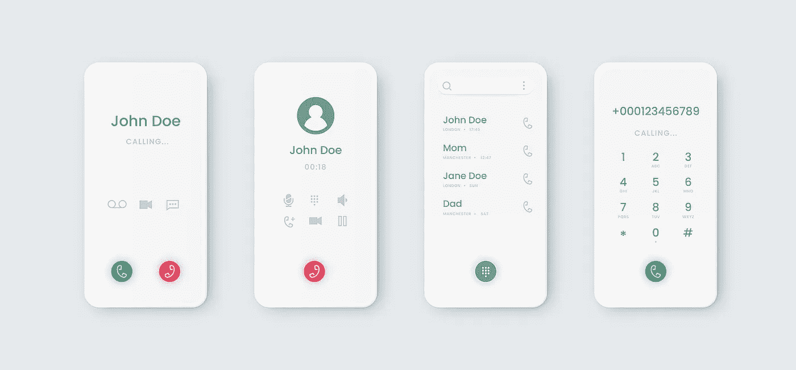
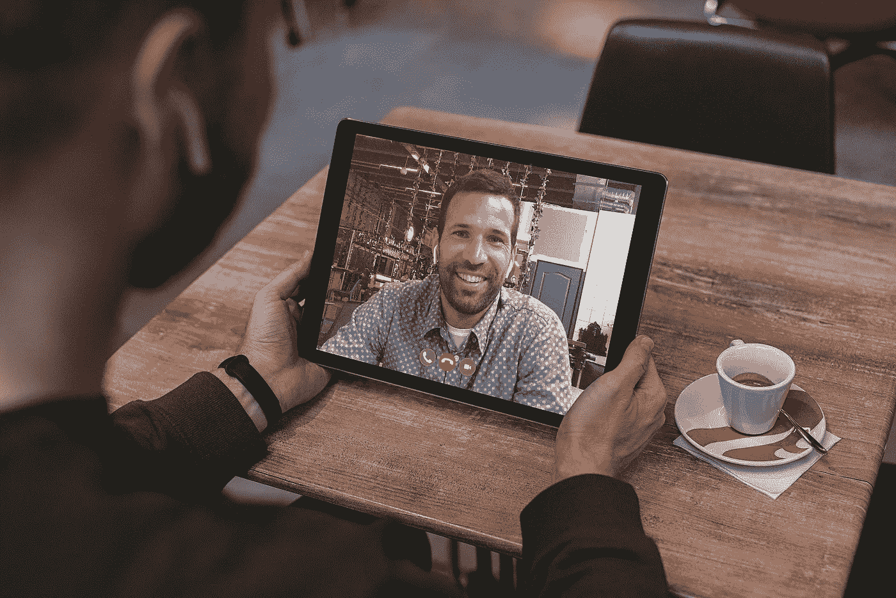
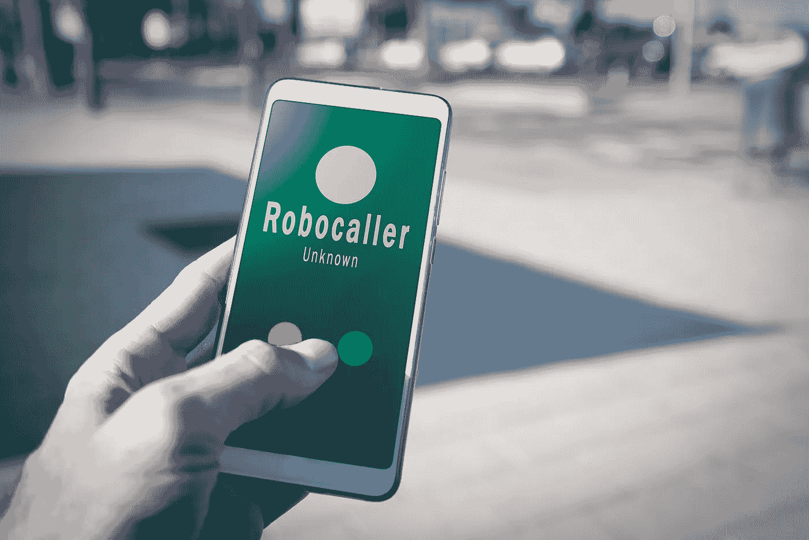

# Zoom 取消了电话号码

> 原文：<https://medium.com/geekculture/zoom-killed-phone-numbers-3b44ab1a2325?source=collection_archive---------20----------------------->

# 他们只是还不知道

Image licensed from BigStock

去年，从学生到退休人员，每个人都学会了一种新行为:点击链接加入视频直播。

行为改变是困难的——但是一旦一种新的行为出现，围绕它建立新的技术是容易的。新行为为创业公司和企业家带来了机遇。

我们习惯的改变*已经发生*将杀死电话号码。让我们仔细看看。

# 三个行为变化

自从 COVID 锁定以来，我们在三个关键方面改变了我们的行为。以下是新规则:

1)不要拿起电话，除非你知道是谁打来的

2)单击日历链接以安排稍后的视频会议

3)单击缩放链接加入视频通话或在线会议

这些变化跨越三个不同的产品类别——缩放会议、日历链接和传统电话服务。这就是为什么像 Zoom、Calendly 或美国电话电报公司这样的供应商很难看到迅速到来的变化。

Image Licensed from BigStock

# 电话网络效应正在崩溃

一个世纪以来，电话一直主导着实时通讯，这是基于一个优势:你可以通过拨打他们的号码联系到几乎任何人。

网络效应非常强大——每个人都有一个电话号码，几乎每个人都接了电话。一个拥有数十亿活跃节点的网络，每个节点为所有其他节点提供[指数值](https://en.wikipedia.org/wiki/Metcalfe%27s_law)。

今天，人们只有在知道是谁打来的时候才会拿起电话。网络不再是“每个有电话号码的人”，而是“每个在联系人列表中有我名字的人。”**我的有效人脉不是十亿人，只是一百人。**

梅特卡夫定律告诉我们，电话号码的价值正在以指数形式下降。

而且是不可修复的。一个 10 位数的号码从根本上来说是一种不安全的方式来获得对人类的实时访问，因此毫不奇怪，今天的大多数电话都是机器人试图引起人类的注意。

与过去 100 年的任何时候都不同，电话号码现在很容易受到干扰。

Image Licensed from BigStock

# 你说话的方式是得到一个链接

以下是我如何获得日历上最近 12 次会议中 9 次会议的联系信息的:我从某人的网站、社交资料或电子邮件中获得了日程安排链接。我点击了“日程安排”链接，并预约了与他们的会谈——在 Zoom 会议上。

这是一个分两步走的过程，Calendly 和 Acuity 等供应商专注于日程安排部分，Zoom 和 GoToMeeting 等供应商专注于视频通话。你必须缩小才能看到整个过程。(双关语)。

如果我真的想和你实时聊天，我需要一个链接。如果我试着用一个电话号码，我只会进入一个全是机器人电话的语音信箱。

# 他们看不到它的到来

像 Zoom 这样的在线会议供应商并不认为他们从事电话业务。像美国电话电报公司和威瑞森这样的电话公司没有把 Zoom 和 Calendly 视为竞争对手。

日历链接供应商有一个惊人的盲点。在接受*TechCrunch**采访时，Calendly 的首席执行官托普·阿沃托纳表示他们不可能提供视频会议。他说，“你不会希望因为 Zoom 而引发第三次世界大战。”*

*所有的供应商都将这些视为完全独立的工具:在线日程安排、视频会议、电话呼叫。*

*但是看看人们实际上是如何使用这些工具的。如果我想与你实时交谈，我会从你的网站或 LinkedIn 个人资料中抓取一个日程安排链接。从那里，我得到一个会议链接。我点击一个链接，而不是拨打你的电话号码。*

*当客户以不同于供应商的方式看待市场时，客户总是赢家。*

**

*Image Licensed from BigStock*

# *为什么电话和电子邮件挥之不去*

*从 Skype 到 WhatsApp 再到 Signal，专利供应商都试图让他们的平台成为默认选择。但他们所有人的市场份额都不到 25%，这意味着我想交谈的大多数人都没有和我一样的应用程序。我不能为了和我说话就要求你加入一个新的应用。*

*电话和电子邮件之所以幸存下来，很大程度上是因为它们是通用的，不受任何一家厂商的控制。每个人都可以使用这些工具，没有人认为它们是一种威胁。*

# *浏览器和 URL 是未来*

*但是有一个更明显的工具是通用的，每个供应商都可以使用，并且可以支持实时语音通信— **web 浏览器和 URL。***

*这里有一个简单的例子:Join.me 让你[建立一个永久的会议室](https://help.join.me/s/article/joinme-jm-faq-personal?language=en_US)，人们可以在任何时候加入。这几乎就像一个电话号码一样好——我可以给你我的网址，你可以用它在任何时候，从任何设备上与我交谈。都在浏览器里，不需要下载。*

*永久性会议室并不是全部解决方案。如果你在一个随机的时间加入会议，他们不会给我发一个通知说你想和我谈谈，我也应该加入会议。他们不能处理两个不同的人同时想说话的情况。他们不让你留言。它们不太安全——任何人都可以对你进行变焦轰炸。*

**

*Image Licensed from BigStock*

# *我们可以想象未来*

*但是从这里，我们可以想象一个解决方案会是什么样子:*

*每个人的联系信息都是一个 URL，由不同的供应商提供。通话和会议在浏览器中进行，这是每台设备上的通用工具。*

*通过这个网址，我可以立即发送语音或视频电话，或者安排以后打电话。我可以用文本、语音或视频留言。*

*当我点击你的网址并给你打电话时，你手机上的通讯应用程序就会响起来。让浏览器 24/7 开着接听电话是不可行的，所以应用程序和应用程序通知是解决方案。*

# *结论*

*人们只有在知道是谁打电话时才会接电话——所以电话系统的网络价值已经崩溃，电话号码被颠覆的时机已经成熟。*

*如今，我们与陌生人交谈的方式是点击日历链接来安排会议，然后点击缩放链接来接通电话。*

*换句话说——**我们点击一个链接，而不是拨打一个电话号码**。聪明的技术专家将利用这些新行为作为构建未来的基础。*

***未来是一个有多个厂商的开放系统**，而不是像 WhatsApp 或 Signal 那样的封闭系统。*

*人们将拥有一个 **URL 作为他们的永久地址**，任何拥有浏览器的人都可以从该 URL 向用户口袋中的应用程序发送呼叫。*

*我们可以告别每年 420 亿个机器人电话。*

**

*Image Licensed from BigStock*